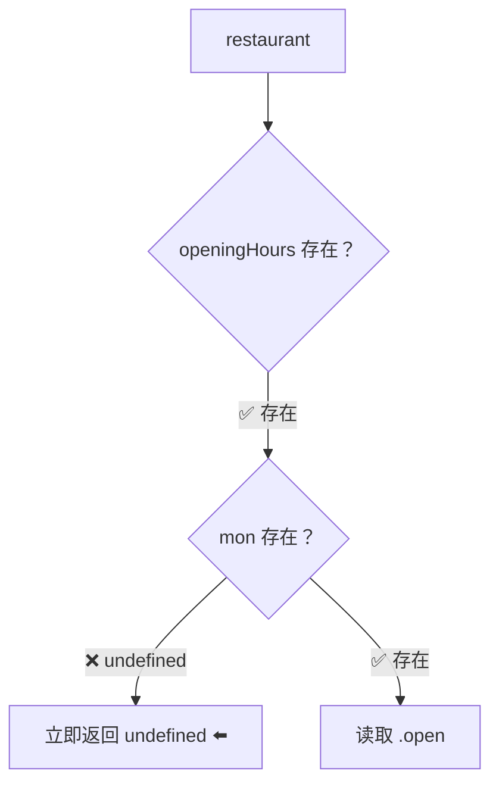
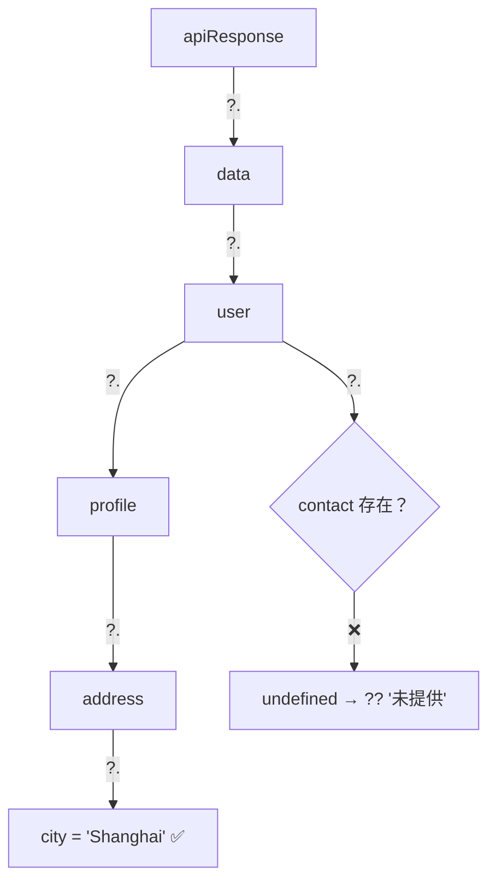

# 可选链（Optional Chaining `?.`）

> 📺 来源：014 Optional Chaining (.).en.srt
> 📂 章节：第 09 章

## 📌 知识脉络
- **前置知识**：空值合并运算符（`??`）、Nullish 概念、属性访问（`.` 和 `[]`）
- **后续扩展**：遍历对象（`Object.keys/values/entries`）、`Map` 和 `Set` 数据结构

## 🎯 概述

可选链（Optional Chaining `?.`）是 ES2020 引入的语法，当访问对象的深层嵌套属性时，如果中间某个属性不存在（`null` / `undefined`），会**立即返回 `undefined`** 而不报错。它常与 `??` 配合使用，一对黄金搭档。

## 核心知识点

### 1. 基础用法

> 🧩 **生活类比**：可选链就像带安全绳的攀岩——每爬一步先检查抓手是否存在，如果不存在就立刻停下（返回 `undefined`），而不是直接摔下去（报错）。

```js {runnable} {title="optional_chaining.js"}
const restaurant = {
  openingHours: {
    thu: { open: 12, close: 22 },
    fri: { open: 11, close: 23 },
  },
};

// 没有可选链 — 可能报错
// console.log(restaurant.openingHours.mon.open); // ❌ TypeError!

// ✅ 有可选链 — 安全返回 undefined
console.log(restaurant.openingHours.mon?.open); // undefined
console.log(restaurant.openingHours?.mon?.open); // undefined（多层保护）
```



> 💡 `?.` 基于 **Nullish 概念**：属性为 `null` 或 `undefined` 时才停止。`0`、`''`、`false` 都算"存在"。

**🔍 执行追踪：**

| 表达式 | 步骤 | 结果 |
|--------|------|------|
| `restaurant.openingHours.mon?.open` | `mon` 是 `undefined` → 停止 | `undefined` |
| `restaurant.openingHours.fri?.open` | `fri` 存在 → 读取 `open` | `11` |

---

### 2. 与 `??` 搭配设置默认值

```js {runnable} {title="with_nullish.js"}
const restaurant = {
  openingHours: {
    thu: { open: 12, close: 22 },
    fri: { open: 11, close: 23 },
    sat: { open: 0, close: 24 },
  },
};

const days = ['mon', 'tue', 'wed', 'thu', 'fri', 'sat', 'sun'];
for (const d of days) {
  const open = restaurant.openingHours[d]?.open ?? 'closed';
  console.log(`On ${d}, we open at ${open}`);
}
// On mon, we open at closed
// ...
// On thu, we open at 12
// On fri, we open at 11
// On sat, we open at 0  ← ?? 正确处理了 0！
```

> ⚠️ 这里用 `??` 而非 `||` 是因为周六的 `open: 0` 是合法值。`||` 会把 `0` 当假值返回 `'closed'`。

---

### 3. 调用方法前检查存在性

```js {runnable} {title="method_check.js"}
const restaurant = {
  order(starterIdx, mainIdx) {
    return ['Focaccia', 'Bruschetta'][starterIdx];
  },
};

// 方法存在 → 正常调用
console.log(restaurant.order?.(0, 1) ?? 'Method not found');
// "Focaccia"

// 方法不存在 → 返回 undefined → ?? 触发
console.log(restaurant.orderRisotto?.() ?? 'Method not found');
// "Method not found"
```

---

### 4. 数组元素检查

```js {runnable} {title="array_check.js"}
const users = [{ name: 'Jonas', email: 'hello@jonas.io' }];

// 检查第一个元素是否存在
console.log(users[0]?.name ?? 'User array empty'); // "Jonas"

// 空数组测试
const empty = [];
console.log(empty[0]?.name ?? 'User array empty'); // "User array empty"
```

:::code-comparison
```js {title="🚨 传统写法（繁琐）"}
if (users.length > 0) {
  console.log(users[0].name);
} else {
  console.log('User array empty');
}
```
```js {title="✨ 可选链 + ??"}
console.log(users[0]?.name ?? 'User array empty');
```
:::

---

## 🛠️ 代码实战与真实场景

> **💼 业务场景**：安全访问深层嵌套的 API 响应数据。

```js {runnable} {title="api_safe_access.js"}
const apiResponse = {
  data: {
    user: {
      profile: {
        address: { city: 'Shanghai' },
      },
    },
  },
};

// 安全访问深层数据
const city = apiResponse?.data?.user?.profile?.address?.city ?? '未知城市';
console.log(city); // "Shanghai"

// 某个中间层不存在
const phone = apiResponse?.data?.user?.contact?.phone ?? '未提供';
console.log(phone); // "未提供"
```



**📊 输入输出示例：**

| 访问路径 | 是否存在 | `?.` 结果 | `?? 默认值` 后 |
|---------|:-------:|----------|:----------:|
| `data.user.profile.address.city` | ✅ | `'Shanghai'` | `'Shanghai'` |
| `data.user.contact.phone` | ❌ | `undefined` | `'未提供'` |

---

## 💡 关键要点
- ✅ `?.` 在属性不存在（`null`/`undefined`）时立即返回 `undefined`，避免 TypeError
- ✅ 可用于属性访问、方法调用、数组元素
- ✅ 几乎总是与 `??` 搭配使用，提供安全的默认值
- ✅ 基于 Nullish 概念——`0` 和 `''` 算"存在"
- ✅ ES2020 引入，与 `??` 同年同源

## ⚠️ 常见误区
- ⚠️ **过度使用**：不要在每个 `.` 前都加 `?.`，只在你**不确定**属性是否存在时使用
- ⚠️ **误用 `||` 替代 `??`**：`?.` 返回的 `0` 或 `''` 会被 `||` 错误跳过，用 `??`

## 🐛 报错实验室

**❌ 没有可选链时的错误：**
```js
const obj = {};
console.log(obj.a.b.c); // ❌ TypeError: Cannot read properties of undefined
```
**✅ 有可选链的安全写法：**
```js
console.log(obj.a?.b?.c); // undefined（不报错）
```
**🔑 解读**：`obj.a` 是 `undefined`，继续读 `.b` 会报错。加了 `?.` 后，`undefined` 直接返回。

---

## 📖 词汇速查表 (Cheat Sheet)

| 中文术语 | 英文术语 | 简明释义 | 速查代码 | 📚 官方文档 |
|---------|---------|---------|---------|-----------|
| 可选链 | Optional Chaining | 安全访问可能不存在的属性 | `obj?.prop` | [MDN](https://developer.mozilla.org/zh-CN/docs/Web/JavaScript/Reference/Operators/Optional_chaining) |
| 空值合并 | Nullish Coalescing | 配合 ?. 设默认值 | `val ?? default` | [MDN](https://developer.mozilla.org/zh-CN/docs/Web/JavaScript/Reference/Operators/Nullish_coalescing) |

---

## 🧪 学习验证

### 📝 动手练习

**练习 1：安全读取嵌套配置**
```js {runnable} {title="exercise1.js"}
const config = { db: { host: 'localhost', port: 5432 } };
// 安全读取 config.db.credentials.password，默认值为 'no password'
```
<details><summary>💡 参考答案</summary>

```js
const password = config.db?.credentials?.password ?? 'no password';
console.log(password); // "no password"
```
</details>

### ❓ 理解检测

:::quiz {correct="C"}
**1. `obj?.a?.b` 在什么情况下返回 `undefined`？**
- A) 当 `obj.a.b` 的值为 `0` 时
- B) 当 `obj.a.b` 的值为 `false` 时
- C) 当 `obj` 或 `obj.a` 为 `null`/`undefined` 时

> **解析**：可选链基于 Nullish 概念，只在 null/undefined 时短路。0 和 false 不触发。
:::

:::quiz {correct="B"}
**2. `?.` 通常应该和哪个运算符配合使用？**
- A) `||`
- B) `??`
- C) `&&`

> **解析**：`?.` 和 `??` 都基于 Nullish 概念，天生搭配。`||` 会误判 0 和 ''。
:::

:::quiz {correct="A"}
**3. 可选链可以用在以下哪些场景？**
- A) 属性访问、方法调用、数组元素
- B) 仅属性访问
- C) 仅方法调用

> **解析**：`?.` 支持三种用法：`obj?.prop`、`obj?.method()`、`arr?.[index]`。
:::

### 🔧 代码填空

:::fill-blank
// 安全调用方法
const result = obj.method___?.___() ___??___ 'fallback';

// 安全访问数组
const first = arr___?.___[0]___?.___name;
:::
