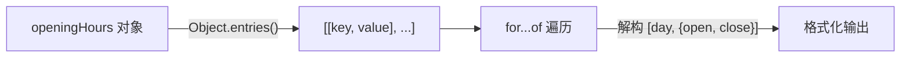

# 遍历对象（Looping Objects: Object Keys, Values, and Entries）

> 📺 来源：015 Looping Objects Object Keys, Values, and Entries.en.srt
> 📂 章节：第 09 章

## 📌 知识脉络
- **前置知识**：`for...of` 循环、对象基础、解构赋值
- **后续扩展**：Set、Map 数据结构、`for...in` 循环

## 🎯 概述

对象不是可迭代对象，不能直接用 `for...of`。但通过 `Object.keys()`、`Object.values()` 和 `Object.entries()` 可以将对象转为数组，再用 `for...of` 遍历。

## 核心知识点

### 1. Object.keys() — 遍历属性名

> 🧩 **生活类比**：`Object.keys()` 就像查看文件柜上所有抽屉的标签——你拿到的是一份标签名单，而不是抽屉内容。

```js {runnable} {title="object_keys.js"}
const openingHours = {
  thu: { open: 12, close: 22 },
  fri: { open: 11, close: 23 },
  sat: { open: 0, close: 24 },
};

const properties = Object.keys(openingHours);
console.log(properties); // ["thu", "fri", "sat"]

let openStr = `We are open on ${properties.length} days: `;
for (const day of properties) {
  openStr += `${day}, `;
}
console.log(openStr); // "We are open on 3 days: thu, fri, sat, "
```

---

### 2. Object.values() — 遍历属性值

```js {runnable} {title="object_values.js"}
const openingHours = {
  thu: { open: 12, close: 22 },
  fri: { open: 11, close: 23 },
  sat: { open: 0, close: 24 },
};

const values = Object.values(openingHours);
console.log(values);
// [{ open: 12, close: 22 }, { open: 11, close: 23 }, { open: 0, close: 24 }]
```

---

### 3. Object.entries() — 遍历键值对

> 🧩 **生活类比**：`Object.entries()` 就像同时拿到抽屉的标签**和**里面的东西——键值配对一目了然。

```js {runnable} {title="object_entries.js"}
const openingHours = {
  thu: { open: 12, close: 22 },
  fri: { open: 11, close: 23 },
  sat: { open: 0, close: 24 },
};

const entries = Object.entries(openingHours);

for (const [day, { open, close }] of entries) {
  console.log(`On ${day} we open at ${open} and close at ${close}`);
}
// On thu we open at 12 and close at 22
// On fri we open at 11 and close at 23
// On sat we open at 0 and close at 24
```



**🔍 执行追踪：**

| 迭代 | `day` | `open` | `close` |
|:----:|-------|:------:|:------:|
| 1 | `'thu'` | `12` | `22` |
| 2 | `'fri'` | `11` | `23` |
| 3 | `'sat'` | `0` | `24` |

> 💡 注意数组的 `.entries()` 返回 `[索引, 值]`，而 `Object.entries()` 返回 `[键, 值]`。

**📊 三种方法对比：**

| 方法 | 返回内容 | 返回类型 |
|------|---------|---------|
| `Object.keys(obj)` | 属性名 | `string[]` |
| `Object.values(obj)` | 属性值 | `any[]` |
| `Object.entries(obj)` | `[键, 值]` 对 | `[string, any][]` |

---

## 🛠️ 代码实战与真实场景

> **💼 业务场景**：统计各部门员工人数。

```js {runnable} {title="dept_stats.js"}
const departments = {
  engineering: { headcount: 42, budget: 500000 },
  marketing: { headcount: 15, budget: 200000 },
  design: { headcount: 8, budget: 120000 },
};

let totalStaff = 0;
for (const [dept, { headcount, budget }] of Object.entries(departments)) {
  console.log(`${dept}: ${headcount}人, 预算¥${budget}`);
  totalStaff += headcount;
}
console.log(`公司总人数: ${totalStaff}`);
// engineering: 42人, 预算¥500000
// marketing: 15人, 预算¥200000
// design: 8人, 预算¥120000
// 公司总人数: 65
```

**📊 输入输出示例：**

| 部门 | 人数 | 预算 |
|------|:----:|-----:|
| engineering | 42 | ¥500,000 |
| marketing | 15 | ¥200,000 |
| design | 8 | ¥120,000 |

---

## 💡 关键要点
- ✅ `Object.keys(obj)` → 属性名数组
- ✅ `Object.values(obj)` → 属性值数组
- ✅ `Object.entries(obj)` → `[键, 值]` 对数组
- ✅ 结合 `for...of` + 解构可以优雅遍历对象
- ✅ 注意区分数组 `.entries()` 和 `Object.entries(obj)` 的调用方式

## ⚠️ 常见误区
- ⚠️ **在对象上直接调用 `.entries()`**：`obj.entries()` 报错！必须用 `Object.entries(obj)`
- ⚠️ **混淆 `for...of` 和 `for...in`**：`for...in` 可以直接遍历对象键，但它也会遍历继承属性

## 🐛 报错实验室

**❌ 错误写法：**
```js
const obj = { a: 1, b: 2 };
for (const [k, v] of obj) { } // ❌ obj is not iterable
```
**✅ 正确写法：**
```js
for (const [k, v] of Object.entries(obj)) { }
```
**🔑 解读**：对象本身不是可迭代的，必须先用 `Object.entries()` 转为数组。

---

## 📖 词汇速查表 (Cheat Sheet)

| 中文术语 | 英文术语 | 简明释义 | 速查代码 | 📚 官方文档 |
|---------|---------|---------|---------|-----------|
| Object.keys | Object.keys() | 返回属性名数组 | `Object.keys(obj)` | [MDN](https://developer.mozilla.org/zh-CN/docs/Web/JavaScript/Reference/Global_Objects/Object/keys) |
| Object.values | Object.values() | 返回属性值数组 | `Object.values(obj)` | [MDN](https://developer.mozilla.org/zh-CN/docs/Web/JavaScript/Reference/Global_Objects/Object/values) |
| Object.entries | Object.entries() | 返回键值对数组 | `Object.entries(obj)` | [MDN](https://developer.mozilla.org/zh-CN/docs/Web/JavaScript/Reference/Global_Objects/Object/entries) |

---

## 🧪 学习验证

### 📝 动手练习

**练习 1：用 Object.entries 遍历并筛选**
```js {runnable} {title="exercise1.js"}
const scores = { Alice: 92, Bob: 78, Charlie: 85, Diana: 95 };
// 用 Object.entries + for...of 打印所有分数 >= 90 的学生
```
<details><summary>💡 参考答案</summary>

```js
for (const [name, score] of Object.entries(scores)) {
  if (score >= 90) console.log(`${name}: ${score}分 ⭐`);
}
// Alice: 92分 ⭐
// Diana: 95分 ⭐
```
</details>

### ❓ 理解检测

:::quiz {correct="B"}
**1. `Object.entries({ a: 1, b: 2 })` 返回什么？**
- A) `{ a: 1, b: 2 }`
- B) `[['a', 1], ['b', 2]]`
- C) `['a', 'b', 1, 2]`

> **解析**：`Object.entries()` 返回一个由 `[键, 值]` 对组成的二维数组。
:::

:::quiz {correct="C"}
**2. 以下哪种方式可以直接遍历对象？**
- A) `for (const x of obj)`
- B) `obj.forEach()`
- C) `for (const x of Object.keys(obj))`

> **解析**：对象不可迭代，必须先用 `Object.keys/values/entries` 转为数组。
:::

:::quiz {correct="A"}
**3. `Object.keys(obj).length` 可以用来做什么？**
- A) 计算对象有多少个属性
- B) 获取对象的内存大小
- C) 计算属性值的总和

> **解析**：`Object.keys()` 返回属性名数组，`.length` 就是属性的数量。
:::

### 🔧 代码填空

:::fill-blank
// 遍历对象的键值对
for (const [key, value] of ___Object.entries(obj)___) {
  console.log(`${key}: ${value}`);
}
:::
