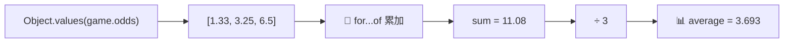
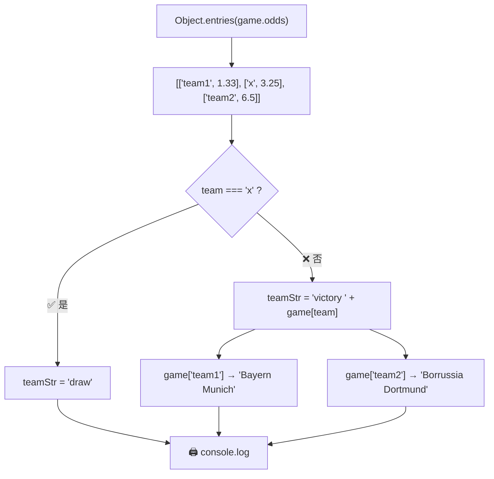
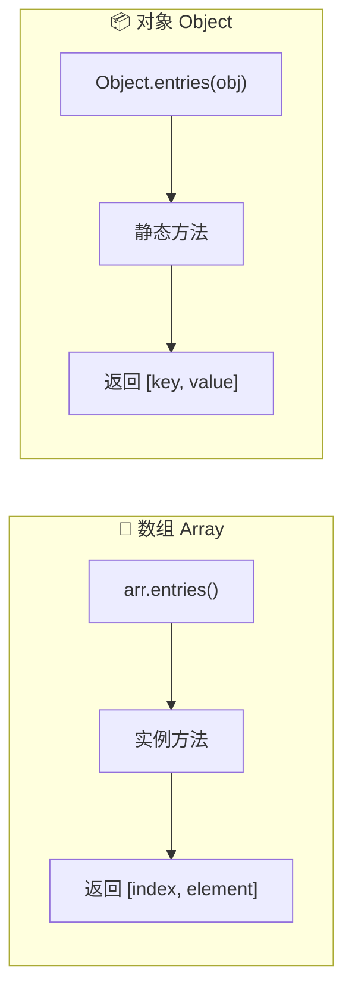
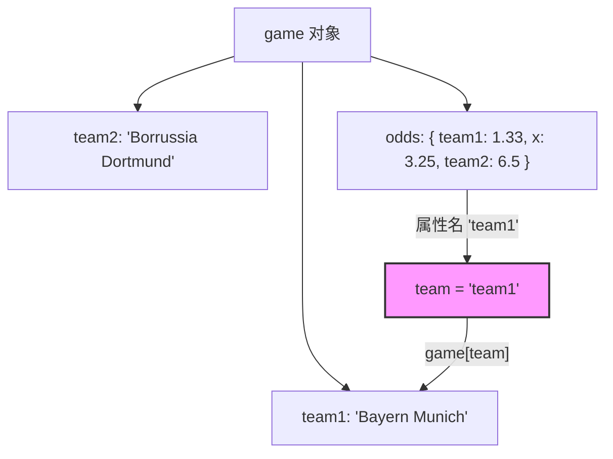
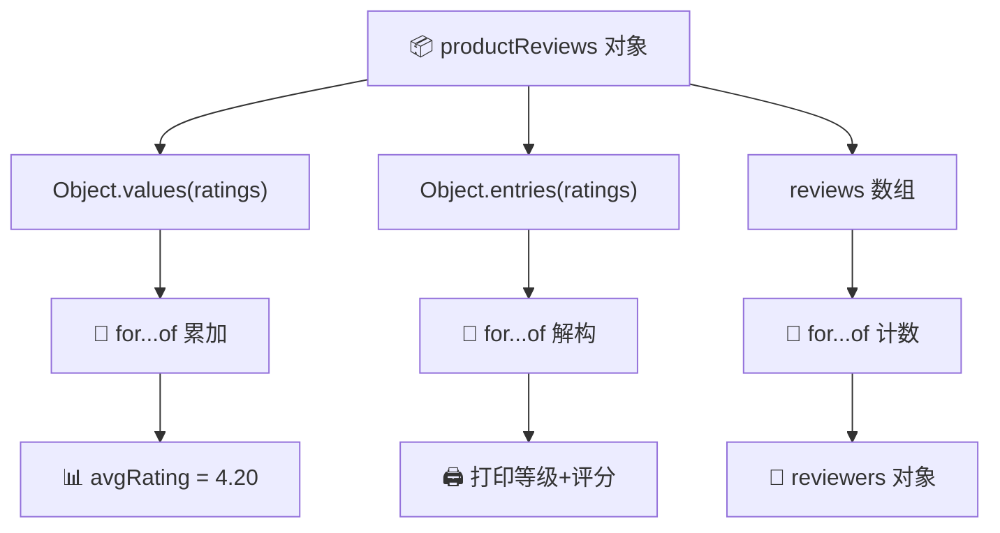

# 编码挑战 #2（Coding Challenge #2）

> 📺 来源：016 CHALLENGE #2.en.srt
> 📂 章节：第 09 章

## 📌 知识脉络
- **前置知识**：for-of 循环遍历数组、`Object.keys()`/`Object.values()`/`Object.entries()` 遍历对象、解构赋值（Destructuring）、增强对象字面量（Enhanced Object Literals）
- **后续扩展**：Sets 和 Maps 数据结构、字符串操作方法（Working With Strings）、更复杂的数据结构嵌套与解构

## 🎯 概述

本节是第 09 章的第二个编码挑战，综合运用 **for-of 循环**、**`Object.entries()`** 和 **对象属性动态访问** 等知识点，围绕一个足球比赛数据对象进行实战练习。挑战包含三道核心题目和一道高难度 Bonus 题。

---

## 📋 挑战数据

```js {runnable} {title="challenge2_data.js"}
const game = {
  team1: 'Bayern Munich',
  team2: 'Borrussia Dortmund',
  players: [
    [
      'Neuer', 'Pavard', 'Martinez', 'Alaba', "Davies",
      'Kimmich', 'Goretzka', 'Coman', 'Muller', 'Gnarby', 'Lewandowski',
    ],
    [
      'Burki', 'Schulz', 'Hummels', 'Akanji', 'Hakimi',
      'Weigl', 'Witsel', 'Hazard', 'Brandt', 'Sancho', 'Gotze',
    ],
  ],
  score: '4:0',
  scored: ['Lewandowski', 'Gnarby', 'Lewandowski', 'Hummels'],
  date: 'Nov 9th, 2037',
  odds: {
    team1: 1.33,
    x: 3.25,
    team2: 6.5,
  },
};
```

---

## 🏆 挑战任务 (Tasks)

### 任务 1
循环 `game.scored` 数组，将每个进球球员及其进球编号打印到控制台，格式如下：
```
"Goal 1: Lewandowski"
"Goal 2: Gnarby"
"Goal 3: Lewandowski"
"Goal 4: Hummels"
```

### 任务 2
使用循环计算 `game.odds` 对象中所有赔率（odds）的**平均值**。

### 任务 3
将赔率打印到控制台，格式如下：
```
"Odd of victory Bayern Munich: 1.33"
"Odd of draw: 3.25"
"Odd of victory Borrussia Dortmund: 6.5"
```

> 💡 **提示**：注意 `odds` 对象和 `game` 对象拥有**相同的属性名**（`team1`、`team2`），利用这一点动态获取球队名。

### BONUS（高难度）
创建一个名为 `scorers` 的对象，键为进球球员名字，值为该球员的进球数。例如：
```js
{ Gnarby: 1, Hummels: 1, Lewandowski: 2 }
```

---

## 🧪 实战沙盒

> ⚡ 先独立完成再查看答案！

```js {runnable} {title="challenge2.js"}
const game = {
  team1: 'Bayern Munich',
  team2: 'Borrussia Dortmund',
  players: [
    [
      'Neuer', 'Pavard', 'Martinez', 'Alaba', "Davies",
      'Kimmich', 'Goretzka', 'Coman', 'Muller', 'Gnarby', 'Lewandowski',
    ],
    [
      'Burki', 'Schulz', 'Hummels', 'Akanji', 'Hakimi',
      'Weigl', 'Witsel', 'Hazard', 'Brandt', 'Sancho', 'Gotze',
    ],
  ],
  score: '4:0',
  scored: ['Lewandowski', 'Gnarby', 'Lewandowski', 'Hummels'],
  date: 'Nov 9th, 2037',
  odds: {
    team1: 1.33,
    x: 3.25,
    team2: 6.5,
  },
};

// =============================================
// 任务 1: 打印每个进球球员及编号
// 提示: 使用 game.scored.entries() 获取 [index, player]
// =============================================


// =============================================
// 任务 2: 计算所有赔率的平均值
// 提示: 使用 Object.values() 获取赔率数值数组
// =============================================


// =============================================
// 任务 3: 打印赔率信息（含球队名 / draw）
// 提示: 使用 Object.entries(game.odds) 和三元运算符
//       利用 odds 和 game 的相同属性名动态获取队名
// =============================================


// =============================================
// BONUS: 创建 scorers 对象 { 球员名: 进球数 }
// 提示: 遍历 scored 数组，用短路 || 处理初始值
// =============================================

```

---

<details><summary>💡 Jonas 官方解法拆解</summary>

### 任务 1 解法：打印进球球员

**核心思路**：使用 `game.scored.entries()` 同时获取索引和球员名。

```js
for (const [i, player] of game.scored.entries()) {
  console.log(`Goal ${i + 1}: ${player}`);
}
```

**🔍 执行追踪：**

| 迭代 | `i` | `player` | 输出 |
|------|-----|----------|------|
| 1 | `0` | `'Lewandowski'` | `"Goal 1: Lewandowski"` |
| 2 | `1` | `'Gnarby'` | `"Goal 2: Gnarby"` |
| 3 | `2` | `'Lewandowski'` | `"Goal 3: Lewandowski"` |
| 4 | `3` | `'Hummels'` | `"Goal 4: Hummels"` |

> 📌 `entries()` 返回 `[index, element]` 对，索引从 0 开始，因此需要 `i + 1`。

---

### 任务 2 解法：计算赔率平均值

**核心思路**：用 `Object.values()` 提取数值数组 → 累加 → 除以元素个数。

```js
const odds = Object.values(game.odds);
let average = 0;
for (const odd of odds) {
  average += odd;
}
average /= odds.length;
console.log(average); // 3.6933333333333334
```

**🔍 执行追踪：**

| 迭代 | `odd` | `average`（累加后） |
|------|-------|-------------------|
| 1 | `1.33` | `1.33` |
| 2 | `3.25` | `4.58` |
| 3 | `6.5`  | `11.08` |
| 最终 | — | `11.08 / 3 = 3.6933...` |

> 📌 `/=` 是**除法赋值运算符**，等价于 `average = average / odds.length`。



---

### 任务 3 解法：打印赔率信息

**核心思路**：使用 `Object.entries()` 获取键值对 → 三元运算符判断是否为 draw → 动态访问 `game[team]` 获取队名。

```js
for (const [team, odd] of Object.entries(game.odds)) {
  const teamStr = team === 'x' ? 'draw' : `victory ${game[team]}`;
  console.log(`Odd of ${teamStr}: ${odd}`);
}
```

**🔍 执行追踪：**

| 迭代 | `team` | `odd` | `game[team]` | `teamStr` | 输出 |
|------|--------|-------|-------------|-----------|------|
| 1 | `'team1'` | `1.33` | `'Bayern Munich'` | `'victory Bayern Munich'` | `"Odd of victory Bayern Munich: 1.33"` |
| 2 | `'x'` | `3.25` | — | `'draw'` | `"Odd of draw: 3.25"` |
| 3 | `'team2'` | `6.5` | `'Borrussia Dortmund'` | `'victory Borrussia Dortmund'` | `"Odd of victory Borrussia Dortmund: 6.5"` |



> 🔑 **关键洞察**：`odds` 的属性名（`team1`、`team2`）恰好也是 `game` 对象的属性名。利用 `game[team]` 动态读取队名，这就是**方括号属性访问**的威力。

---

### BONUS 解法：统计进球数

```js
const scorers = {};
for (const player of game.scored) {
  scorers[player] = (scorers[player] || 0) + 1;
}
console.log(scorers);
// { Lewandowski: 2, Gnarby: 1, Hummels: 1 }
```

**🔍 执行追踪：**

| 迭代 | `player` | `scorers[player]` 旧值 | 计算 | `scorers` 状态 |
|------|----------|----------------------|------|---------------|
| 1 | `'Lewandowski'` | `undefined` | `(undefined \|\| 0) + 1 = 1` | `{ Lewandowski: 1 }` |
| 2 | `'Gnarby'` | `undefined` | `(undefined \|\| 0) + 1 = 1` | `{ Lewandowski: 1, Gnarby: 1 }` |
| 3 | `'Lewandowski'` | `1` | `(1 \|\| 0) + 1 = 2` | `{ Lewandowski: 2, Gnarby: 1 }` |
| 4 | `'Hummels'` | `undefined` | `(undefined \|\| 0) + 1 = 1` | `{ Lewandowski: 2, Gnarby: 1, Hummels: 1 }` |

> 📌 `||` 短路运算：当 `scorers[player]` 为 `undefined`（falsy）时，返回 `0`。

</details>

---

## 🧠 核心知识点回顾

### 1. `Array.entries()` vs `Object.entries()`

> 🧩 **生活类比**：数组的 `entries()` 就像电影院的座位号——**内置在每张票上**，你直接刷票就知道第几排第几座；对象的 `Object.entries()` 则像图书馆的索引卡——需要**去前台查询**（调用静态方法），才能拿到书名和位置的对应关系。



**📊 对比表格：**

| 特性 | `array.entries()` | `Object.entries(obj)` |
|------|-------------------|----------------------|
| 调用方式 | 实例方法 | 静态方法 |
| 参数 | 无 | 目标对象 |
| 返回值 | `[index, element]` | `[key, value]` |
| 适用于 | 数组 | 普通对象 |
| 📚 官方文档 | [MDN - Array.entries()](https://developer.mozilla.org/zh-CN/docs/Web/JavaScript/Reference/Global_Objects/Array/entries) | [MDN - Object.entries()](https://developer.mozilla.org/zh-CN/docs/Web/JavaScript/Reference/Global_Objects/Object/entries) |

---

### 2. 动态属性访问 —— 方括号语法的威力

> 🧩 **生活类比**：点语法（`.`）就像你叫一个人的固定名字——"张三"；方括号语法（`[]`）就像用变量名牌——你手上拿着什么名牌，就叫什么名字，灵活切换对象。

```js
// 点语法 → 固定属性名
game.team1; // 'Bayern Munich'

// 方括号语法 → 动态属性名
const key = 'team1';
game[key]; // 'Bayern Munich' ← 运行时计算
```



---

### 3. 除法赋值运算符 `/=`

```js
let avg = 11.08;
avg /= 3;        // 等价于 avg = avg / 3
console.log(avg); // 3.6933333333333334
```

**📊 复合赋值运算符家族：**

| 运算符 | 等价于 | 示例 |
|--------|--------|------|
| `+=` | `a = a + b` | `avg += 3` → 加 3 |
| `-=` | `a = a - b` | `avg -= 1` → 减 1 |
| `*=` | `a = a * b` | `avg *= 2` → 乘 2 |
| `/=` | `a = a / b` | `avg /= 3` → 除 3 |

---

## 🛠️ 代码实战与真实场景

> **💼 业务场景**：电商平台需要统计用户评分数据——计算平均评分、按评分等级分类统计数量、打印分析报告。

```js {runnable} {title="review_analysis.js"}
const productReviews = {
  productName: 'JavaScript 权威指南',
  category: 'programming-books',
  ratings: {
    fiveStar: 4.9,
    fourStar: 4.2,
    threeStar: 3.5,
  },
  reviews: ['Alice', 'Bob', 'Alice', 'Charlie', 'Bob', 'Alice'],
};

// 1️⃣ 计算平均评分
const ratingValues = Object.values(productReviews.ratings);
let avgRating = 0;
for (const rating of ratingValues) {
  avgRating += rating;
}
avgRating /= ratingValues.length;
console.log(`📊 平均评分：${avgRating.toFixed(2)}`);

// 2️⃣ 打印各评分等级
for (const [level, score] of Object.entries(productReviews.ratings)) {
  const label = level.replace('Star', ' 星');
  console.log(`⭐ ${label}：${score}`);
}

// 3️⃣ 统计每个用户的评论次数
const reviewers = {};
for (const name of productReviews.reviews) {
  reviewers[name] = (reviewers[name] || 0) + 1;
}
console.log('👥 用户评论统计：', reviewers);
```

**📊 输入输出示例：**

| 输入（数据） | 输出 | 说明 |
|-------------|------|------|
| `ratings: { fiveStar: 4.9, fourStar: 4.2, threeStar: 3.5 }` | `平均评分：4.20` | 三项求和再除以 3 |
| `reviews: ['Alice', 'Bob', 'Alice', ...]` | `{ Alice: 3, Bob: 2, Charlie: 1 }` | 统计每人出现次数 |



---

## 💡 关键要点
- ✅ 数组用 `arr.entries()` 实例方法获取 `[index, element]`，对象用 `Object.entries(obj)` 静态方法获取 `[key, value]`
- ✅ 方括号语法 `obj[variable]` 可以用**变量值**作为属性名动态访问属性
- ✅ 计算平均值模式：先累加所有值，再除以元素个数（`/=` 运算符）
- ✅ 统计频次技巧：`obj[key] = (obj[key] || 0) + 1`，利用 `||` 短路处理 `undefined`

## ⚠️ 常见误区
- ⚠️ **忘记 `i + 1`**：`entries()` 索引从 `0` 开始，显示给用户时通常需要 +1
- ⚠️ **混淆实例方法和静态方法**：数组直接调用 `.entries()`，而对象必须 `Object.entries(obj)`，不能 `obj.entries()`
- ⚠️ **除以数组而非数组长度**：`average /= odds` 是错的，必须 `average /= odds.length`

## 🐛 报错实验室

> 主动展示错误写法及报错信息

**❌ 错误写法：**
```js
const game = { odds: { team1: 1.33, x: 3.25, team2: 6.5 } };
// 试图在对象上调用 .entries()
for (const [k, v] of game.odds.entries()) {
  console.log(k, v);
}
```

**浏览器报错：**
```
Uncaught TypeError: game.odds.entries is not a function
```

**🔑 解读**：普通对象没有 `.entries()` 实例方法。必须使用静态方法 `Object.entries(game.odds)`。数组有 `.entries()`，但对象没有——这是数组和对象在 API 设计上的根本差异。

---

## 📖 词汇速查表 (Cheat Sheet)

| 中文术语 | 英文术语 | 简明释义 | 速查代码 | 📚 官方文档 |
|---------|---------|---------|---------|-----------|
| 数组条目 | Array entries | 返回包含索引和元素的迭代器 | `arr.entries()` | [MDN](https://developer.mozilla.org/zh-CN/docs/Web/JavaScript/Reference/Global_Objects/Array/entries) |
| 对象条目 | Object entries | 返回对象键值对数组 | `Object.entries(obj)` | [MDN](https://developer.mozilla.org/zh-CN/docs/Web/JavaScript/Reference/Global_Objects/Object/entries) |
| 对象值 | Object values | 返回对象所有值的数组 | `Object.values(obj)` | [MDN](https://developer.mozilla.org/zh-CN/docs/Web/JavaScript/Reference/Global_Objects/Object/values) |
| 除法赋值 | Division assignment | 将变量除以某值并赋回 | `a /= b` | [MDN](https://developer.mozilla.org/zh-CN/docs/Web/JavaScript/Reference/Operators/Division_assignment) |
| 三元运算符 | Ternary operator | 简洁的条件表达式 | `x ? a : b` | [MDN](https://developer.mozilla.org/zh-CN/docs/Web/JavaScript/Reference/Operators/Conditional_operator) |
| 方括号访问 | Bracket notation | 用变量动态访问属性 | `obj[key]` | [MDN](https://developer.mozilla.org/zh-CN/docs/Web/JavaScript/Reference/Operators/Property_accessors) |

---

## 🧪 学习验证

### 📝 动手练习

**练习 1：统计字符频率**
```js {runnable} {title="exercise1.js"}
// 统计字符串中每个字符出现的次数
const str = 'javascript';
// 在这里写你的代码

```
<details><summary>💡 参考答案</summary>

```js
const str = 'javascript';
const charCount = {};
for (const char of str) {
  charCount[char] = (charCount[char] || 0) + 1;
}
console.log(charCount);
// { j: 1, a: 2, v: 1, s: 1, c: 1, r: 1, i: 1, p: 1, t: 1 }
```
**解题思路**：与 BONUS 题的 `scorers` 统计逻辑完全一致——遍历可迭代对象，用 `||` 短路处理初始值，逐步累加。
</details>

**练习 2：格式化对象输出**
```js {runnable} {title="exercise2.js"}
// 将下面的价格对象格式化输出为：
// "The price of apple is ¥5.50"
const prices = { apple: 5.5, banana: 3.2, cherry: 12.0 };
// 在这里写你的代码

```
<details><summary>💡 参考答案</summary>

```js
const prices = { apple: 5.5, banana: 3.2, cherry: 12.0 };
for (const [fruit, price] of Object.entries(prices)) {
  console.log(`The price of ${fruit} is ¥${price.toFixed(2)}`);
}
```
**解题思路**：使用 `Object.entries()` 解构出键（水果名）和值（价格），配合模板字符串格式化输出。
</details>

### ❓ 理解检测

:::quiz {correct="B"}
**1. 如何获取对象 `{a: 1, b: 2}` 的所有键值对？**
- A) `{a: 1, b: 2}.entries()`
- B) `Object.entries({a: 1, b: 2})`
- C) `{a: 1, b: 2}.keys()`

> **解析**：对象没有 `.entries()` 实例方法，必须使用 `Object.entries()` 静态方法。A 和 C 都会抛出 TypeError。
:::

:::quiz {correct="C"}
**2. `const arr = ['x', 'y', 'z']; for (const [i, v] of arr.entries()) {}` 中，第二次迭代时 `i` 和 `v` 分别是？**
- A) `i = 2, v = 'y'`
- B) `i = 1, v = 'z'`
- C) `i = 1, v = 'y'`

> **解析**：`entries()` 返回从 0 开始的索引。第二次迭代取第二个元素，索引为 1，值为 `'y'`。
:::

:::quiz {correct="A"}
**3. 以下代码的输出是什么？`let x = 10; x /= 5; console.log(x);`**
- A) `2`
- B) `5`
- C) `50`

> **解析**：`/=` 是除法赋值，等价于 `x = x / 5 = 10 / 5 = 2`。
:::

### 🔧 代码填空

:::fill-blank
// 使用 Object.entries 遍历对象
for (const [key, value] of ___Object.entries___(myObj)) {
  console.log(`${key}: ${value}`);
}

// 统计出现次数
const count = {};
for (const item of items) {
  count[item] = (count[item] ___||___ 0) + 1;
}
:::
