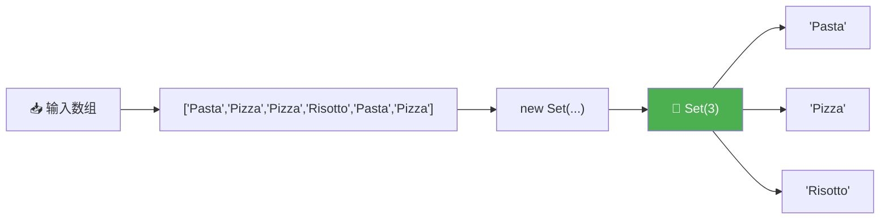
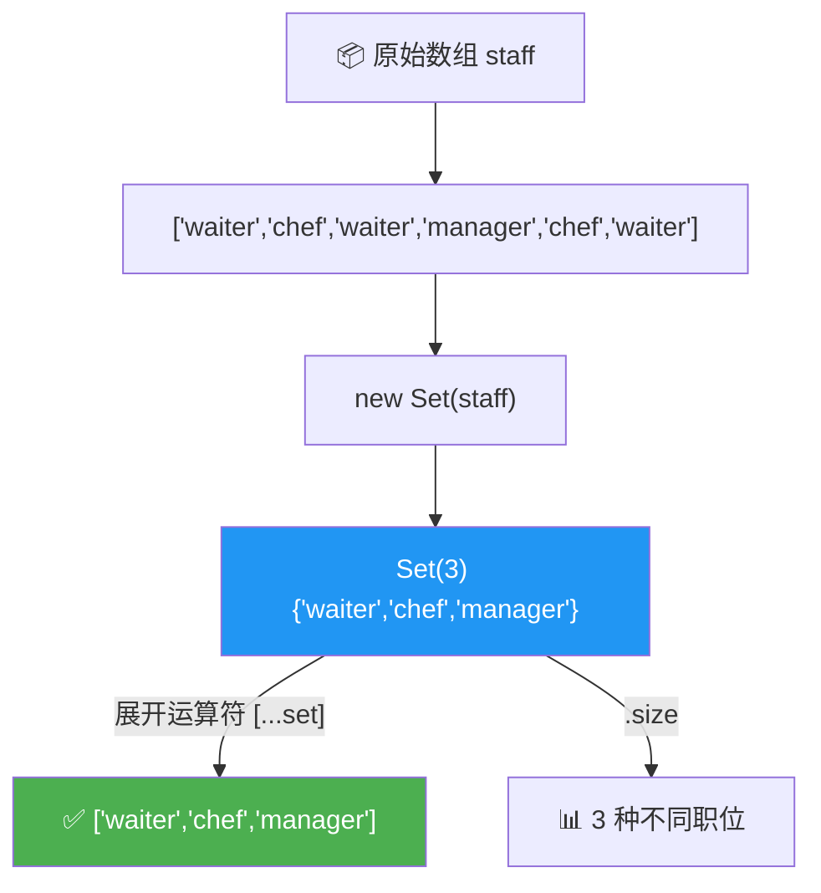
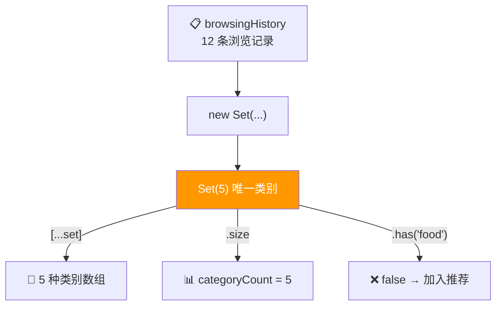

# 集合（Sets）

> 📺 来源：017 Sets.en.srt
> 📂 章节：第 09 章

## 📌 知识脉络
- **前置知识**：数组基本操作（Array）、for-of 循环、展开运算符（Spread Operator）、可迭代对象（Iterables）概念
- **后续扩展**：Maps 数据结构、Set 的新操作方法（intersection / union 等）、WeakSet、数组去重的最佳实践

## 🎯 概述

Set（集合）是 ES6 引入的全新数据结构，它的核心特征是**所有元素必须唯一**。与数组不同，Set 中没有索引，元素的顺序无关紧要。Set 最常用的场景就是**去除数组中的重复值**。

---

## 核心知识点

### 1. Set 的创建与基本特性

> 🧩 **生活类比**：Set 就像一个门卫只允许持**不同号码牌**的人进入的 VIP 区域——如果你的号码牌已有人持有，即使你出示两次，门卫也只会放行一次。

```js {runnable} {title="set_basics.js"}
// 从数组创建 Set —— 自动去除重复值
const ordersSet = new Set([
  'Pasta', 'Pizza', 'Pizza', 'Risotto', 'Pasta', 'Pizza'
]);
console.log(ordersSet); // Set(3) {'Pasta', 'Pizza', 'Risotto'}

// 字符串也是可迭代对象，可以直接传入
const charSet = new Set('Jonas');
console.log(charSet); // Set(5) {'J', 'o', 'n', 'a', 's'}

// 空 Set
const emptySet = new Set();
console.log(emptySet); // Set(0) {}
```



**🔍 执行追踪：**

| 步骤 | 处理元素 | Set 状态 | 操作 |
|------|---------|---------|------|
| 1 | `'Pasta'` | `{'Pasta'}` | ✅ 新增 |
| 2 | `'Pizza'` | `{'Pasta', 'Pizza'}` | ✅ 新增 |
| 3 | `'Pizza'` | `{'Pasta', 'Pizza'}` | ❌ 已存在，跳过 |
| 4 | `'Risotto'` | `{'Pasta', 'Pizza', 'Risotto'}` | ✅ 新增 |
| 5 | `'Pasta'` | `{'Pasta', 'Pizza', 'Risotto'}` | ❌ 已存在，跳过 |
| 6 | `'Pizza'` | `{'Pasta', 'Pizza', 'Risotto'}` | ❌ 已存在，跳过 |

> 💡 **记忆口诀**：Set = **独一无二**的收藏柜，重复品一律拒收！

---

### 2. Set 的常用方法

> 🧩 **生活类比**：Set 的方法就像一个俱乐部的管理操作——`.size` 查人数、`.has()` 核实会员资格、`.add()` 注册新会员、`.delete()` 注销会员、`.clear()` 全员清退。

```js {runnable} {title="set_methods.js"}
const ordersSet = new Set(['Pasta', 'Pizza', 'Risotto', 'Pasta', 'Pizza']);

// 📏 获取 Set 大小（注意是 size 不是 length！）
console.log(ordersSet.size); // 3

// 🔍 检查元素是否存在（类似数组的 includes）
console.log(ordersSet.has('Pizza'));  // true
console.log(ordersSet.has('Bread')); // false

// ➕ 添加元素
ordersSet.add('Garlic Bread');
ordersSet.add('Garlic Bread'); // 重复添加会被忽略
console.log(ordersSet); // Set(4) {'Pasta', 'Pizza', 'Risotto', 'Garlic Bread'}

// ➖ 删除元素
ordersSet.delete('Risotto');
console.log(ordersSet); // Set(3) {'Pasta', 'Pizza', 'Garlic Bread'}

// 🗑️ 清空所有元素
// ordersSet.clear();

// ❌ 无法通过索引访问！
console.log(ordersSet[0]); // undefined
```

**📊 Set vs 数组方法对比：**

| Set 方法 | 数组等价方法 | 功能 |
|---------|-----------|------|
| `.size` | `.length` | 获取元素个数 |
| `.has(val)` | `.includes(val)` | 检查是否包含 |
| `.add(val)` | `.push(val)` | 添加元素 |
| `.delete(val)` | _较复杂（splice/filter）_ | 删除特定元素 |
| `.clear()` | `arr.length = 0` | 清空所有 |
| ❌ 无索引 | `arr[i]` | 随机访问 |

> 💡 **记忆口诀**：Set 用 **size** 不用 length，用 **has** 不用 includes！

---

### 3. 遍历 Set 与实战：数组去重

> 🧩 **生活类比**：数组去重就像一群人排队时，Set 充当"复核员"，把重复的人踢出队列，只留下**每人一份**。

```js {runnable} {title="set_dedup.js"}
// 🔄 Set 是可迭代对象，可以用 for-of 遍历
const ordersSet = new Set(['Pasta', 'Pizza', 'Risotto']);
for (const order of ordersSet) {
  console.log(order);
}

// 🎯 核心应用：数组去重
const staff = ['waiter', 'chef', 'waiter', 'manager', 'chef', 'waiter'];

// Set + Spread 运算符 → 去重后的新数组
const staffUnique = [...new Set(staff)];
console.log(staffUnique); // ['waiter', 'chef', 'manager']

// 只想知道有多少种不同职位？直接取 size
console.log(new Set(staff).size); // 3

// 字符串也适用：统计不同字母数
console.log(new Set('Mississippi').size); // 4 (M, i, s, p)
```



**🔍 执行追踪（`[...new Set(staff)]`）：**

| 步骤 | 操作 | 结果 |
|------|------|------|
| 1 | `new Set(staff)` | `Set(3) {'waiter', 'chef', 'manager'}` |
| 2 | `...` 展开 Set | `'waiter', 'chef', 'manager'` |
| 3 | `[...]` 包裹为数组 | `['waiter', 'chef', 'manager']` |

> 💡 **记忆口诀**：去重三连——`[...new Set(arr)]`！

---

## 🛠️ 代码实战与真实场景

> **💼 业务场景**：电商平台需要统计用户浏览过的商品类别数量，并展示一个去重后的类别列表。

```js {runnable} {title="ecommerce_categories.js"}
// 用户浏览历史（含大量重复类别）
const browsingHistory = [
  'electronics', 'clothing', 'electronics', 'books',
  'clothing', 'electronics', 'sports', 'books',
  'clothing', 'electronics', 'home', 'books'
];

// 去重获取唯一类别列表
const uniqueCategories = [...new Set(browsingHistory)];
console.log('📂 浏览过的类别：', uniqueCategories);
// ['electronics', 'clothing', 'books', 'sports', 'home']

// 统计浏览的不同类别数量
const categoryCount = new Set(browsingHistory).size;
console.log(`📊 共浏览了 ${categoryCount} 种不同类别`);

// 检查用户是否浏览过某类别（用于推荐系统）
const browsedSet = new Set(browsingHistory);
console.log('是否看过电子产品？', browsedSet.has('electronics')); // true
console.log('是否看过食品？', browsedSet.has('food'));             // false

// 基于浏览数据生成推荐
const allCategories = ['electronics', 'clothing', 'books', 'sports', 'home', 'food', 'toys'];
const notBrowsed = allCategories.filter(cat => !browsedSet.has(cat));
console.log('🎯 推荐探索：', notBrowsed); // ['food', 'toys']
```



**📊 输入输出示例：**

| 输入 | 操作 | 输出 |
|------|------|------|
| `['a','b','a','c','b']` | `[...new Set(arr)]` | `['a','b','c']` |
| `['a','b','a','c','b']` | `new Set(arr).size` | `3` |
| Set: `{'a','b','c'}` | `.has('b')` | `true` |
| Set: `{'a','b','c'}` | `.has('d')` | `false` |

---

## 💡 关键要点
- ✅ Set 存储**唯一值**，自动去除所有重复
- ✅ 用 `.size` 获取元素数量（不是 `.length`），用 `.has()` 检查成员
- ✅ Set 是可迭代对象，支持 `for-of` 循环和展开运算符 `...`
- ✅ 数组去重一行搞定：`[...new Set(arr)]`
- ✅ Set 无法通过索引访问——如果需要按位置取值，请用数组

## ⚠️ 常见误区
- ⚠️ **用 `.length` 代替 `.size`**：Set 没有 `.length` 属性，只有 `.size`
- ⚠️ **试图通过索引访问元素**：`mySet[0]` 永远返回 `undefined`，Set 没有索引概念
- ⚠️ **误以为 Set 可以替代数组**：Set 适合去重和唯一性检查，但不支持排序、索引访问等操作——需要这些功能时请用数组

## 🐛 报错实验室

> 主动展示错误写法及报错信息

**❌ 错误写法：**
```js
const mySet = new Set([1, 2, 3]);
console.log(mySet.length); // 想获取 Set 大小
```

**浏览器输出：**
```
undefined
```

**🔑 解读**：Set 没有 `.length` 属性（那是数组的），应使用 `.size`：

```js
console.log(mySet.size); // 3 ✅
```

---

**❌ 错误写法 2：**
```js
const mySet = new Set([1, 2, 3]);
console.log(mySet[0]); // 想通过索引获取第一个元素
```

**浏览器输出：**
```
undefined
```

**🔑 解读**：Set 没有索引概念，不能像数组那样用 `[0]` 访问。如果确实需要取值，先转换为数组：`[...mySet][0]`。

---

## 📖 词汇速查表 (Cheat Sheet)

| 中文术语 | 英文术语 | 简明释义 | 速查代码 | 📚 官方文档 |
|---------|---------|---------|---------|-----------|
| 集合 | Set | 存储唯一值的数据结构 | `new Set([1,2,3])` | [MDN](https://developer.mozilla.org/zh-CN/docs/Web/JavaScript/Reference/Global_Objects/Set) |
| 大小 | size | 获取 Set 中元素个数 | `set.size` | [MDN](https://developer.mozilla.org/zh-CN/docs/Web/JavaScript/Reference/Global_Objects/Set/size) |
| 包含检查 | has | 检查 Set 是否包含某值 | `set.has(val)` | [MDN](https://developer.mozilla.org/zh-CN/docs/Web/JavaScript/Reference/Global_Objects/Set/has) |
| 添加 | add | 向 Set 中添加元素 | `set.add(val)` | [MDN](https://developer.mozilla.org/zh-CN/docs/Web/JavaScript/Reference/Global_Objects/Set/add) |
| 删除 | delete | 从 Set 中删除指定元素 | `set.delete(val)` | [MDN](https://developer.mozilla.org/zh-CN/docs/Web/JavaScript/Reference/Global_Objects/Set/delete) |
| 清空 | clear | 移除 Set 中所有元素 | `set.clear()` | [MDN](https://developer.mozilla.org/zh-CN/docs/Web/JavaScript/Reference/Global_Objects/Set/clear) |

---

## 🧪 学习验证

### 📝 动手练习

**练习 1：统计不同单词数**
```js {runnable} {title="exercise1.js"}
// 统计句子中有多少个不同的单词（不区分大小写）
const sentence = 'The the THE cat sat on the mat the cat';
// 在这里写你的代码

```
<details><summary>💡 参考答案</summary>

```js
const sentence = 'The the THE cat sat on the mat the cat';
const words = sentence.toLowerCase().split(' ');
const uniqueWords = new Set(words);
console.log(`不同单词数：${uniqueWords.size}`); // 5
console.log('唯一单词列表：', [...uniqueWords]); // ['the', 'cat', 'sat', 'on', 'mat']
```
**解题思路**：先 `toLowerCase()` 统一大小写，再 `split(' ')` 拆成数组，最后用 Set 去重。
</details>

**练习 2：找出两个数组的共同元素**
```js {runnable} {title="exercise2.js"}
// 找出 arr1 和 arr2 中共同存在的元素
const arr1 = [1, 2, 3, 4, 5];
const arr2 = [3, 4, 5, 6, 7];
// 在这里写你的代码

```
<details><summary>💡 参考答案</summary>

```js
const arr1 = [1, 2, 3, 4, 5];
const arr2 = [3, 4, 5, 6, 7];
const set2 = new Set(arr2);
const common = arr1.filter(item => set2.has(item));
console.log(common); // [3, 4, 5]
```
**解题思路**：将第二个数组转为 Set（`.has()` 查找效率 O(1)），然后用 `filter` 筛选第一个数组中存在于 Set 的元素。
</details>

### ❓ 理解检测

:::quiz {correct="B"}
**1. 以下代码的输出是什么？`console.log(new Set([1, 1, 2, 3, 3]).size);`**
- A) `5`
- B) `3`
- C) `2`

> **解析**：Set 自动去重，`[1, 1, 2, 3, 3]` 去重后只剩 `{1, 2, 3}`，size 为 3。
:::

:::quiz {correct="C"}
**2. 如何将 Set 转换为数组？**
- A) `set.toArray()`
- B) `Array(set)`
- C) `[...set]`

> **解析**：Set 没有 `.toArray()` 方法。利用展开运算符 `[...set]` 可以将任何可迭代对象展开为数组。也可以用 `Array.from(set)`。
:::

:::quiz {correct="A"}
**3. 以下说法正确的是？**
- A) Set 中的元素没有索引，不能用 `set[0]` 访问
- B) Set 用 `.length` 获取元素个数
- C) Set 可以存储重复值

> **解析**：Set 没有索引概念（A 正确），用 `.size` 而非 `.length`（B 错误），核心特性就是唯一性即不能存储重复值（C 错误）。
:::

### 🔧 代码填空

:::fill-blank
// 数组去重
const unique = [...new ___Set___(arr)];

// 检查元素是否存在
const exists = mySet.___has___('hello');

// 获取 Set 大小
const count = mySet.___size___;
:::
