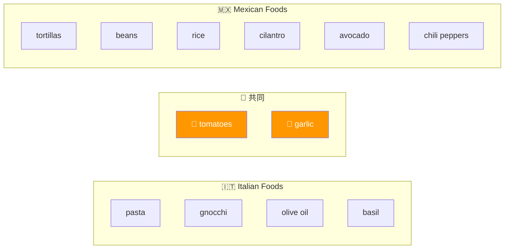
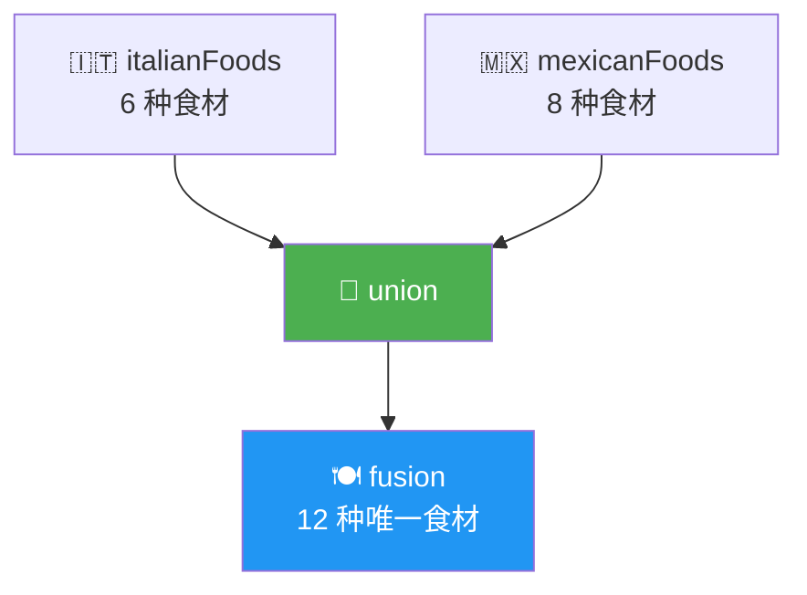
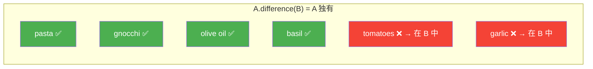
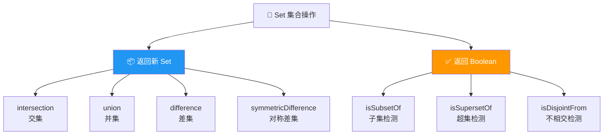
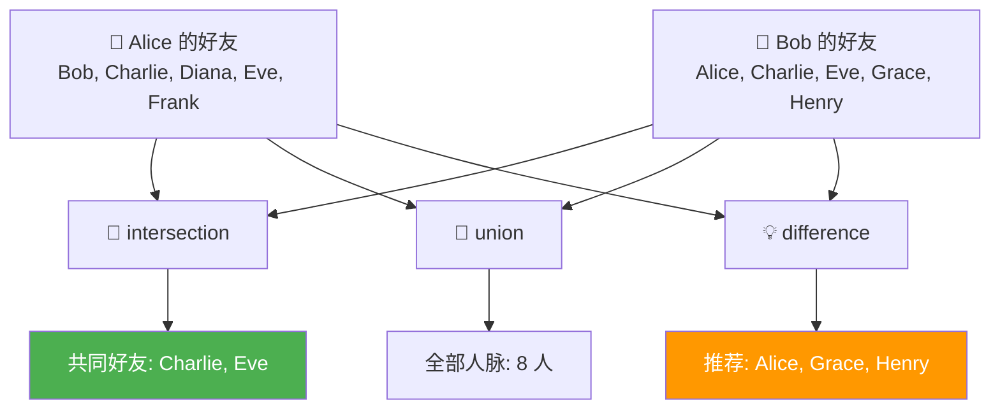

# 让 Set 更强大的新操作（New Operations to Make Sets Useful!）

> 📺 来源：018 New Operations to Make Sets Useful!.en.srt
> 📂 章节：第 09 章

## 📌 知识脉络
- **前置知识**：Set 基础（`new Set()`、`.add()`、`.has()`、`.delete()`、`.size`）、展开运算符（Spread Operator）、for-of 循环
- **后续扩展**：Maps（映射）数据结构、数组高阶方法（`filter`、`map`）、数学集合论在算法中的应用

## 🎯 概述

ES2025 为 Set 引入了一组**数学集合操作方法**——交集（intersection）、并集（union）、差集（difference）、对称差集（symmetricDifference）等。这些方法让 Set 从"只能去重"升级为真正强大的集合运算工具，能够优雅地处理两组数据之间的比较和合并。

---

## 核心知识点

### 1. 交集（Intersection）—— 找出共同元素

> 🧩 **生活类比**：交集就像两个朋友圈的"共同好友"——只有**同时出现在两个集合中**的元素才会被保留。

```js {runnable} {title="intersection.js"}
const italianFoods = new Set([
  'pasta', 'gnocchi', 'tomatoes', 'olive oil', 'garlic', 'basil'
]);
const mexicanFoods = new Set([
  'tortillas', 'beans', 'rice', 'cilantro', 'avocado', 'tomatoes', 'chili peppers', 'garlic'
]);

// 交集：同时出现在两个集合中的元素
const commonFoods = italianFoods.intersection(mexicanFoods);
console.log(commonFoods); // Set(2) {'tomatoes', 'garlic'}
```



**🔍 执行追踪：**

| `italianFoods` 中的元素 | 是否在 `mexicanFoods` 中 | 结果 |
|------------------------|------------------------|------|
| `'pasta'` | ❌ | 不包含 |
| `'gnocchi'` | ❌ | 不包含 |
| `'tomatoes'` | ✅ | → 加入交集 |
| `'olive oil'` | ❌ | 不包含 |
| `'garlic'` | ✅ | → 加入交集 |
| `'basil'` | ❌ | 不包含 |

> 💡 **记忆口诀**：交集 = 两圆**重叠**的部分！

---

### 2. 并集（Union）—— 合并所有元素

> 🧩 **生活类比**：并集就像超市把两家供应商的商品目录**合并成一份**——所有商品都列出，但不会重复列。

```js {runnable} {title="union.js"}
const italianFoods = new Set([
  'pasta', 'gnocchi', 'tomatoes', 'olive oil', 'garlic', 'basil'
]);
const mexicanFoods = new Set([
  'tortillas', 'beans', 'rice', 'cilantro', 'avocado', 'tomatoes', 'chili peppers', 'garlic'
]);

// 并集：两个集合的所有元素（自动去重）
const fusion = italianFoods.union(mexicanFoods);
console.log(fusion);
// Set(12) {'pasta','gnocchi','tomatoes','olive oil','garlic','basil','tortillas','beans','rice','cilantro','avocado','chili peppers'}

// ⚡ 替代方案：用展开运算符实现并集
const fusionArray = [...new Set([...italianFoods, ...mexicanFoods])];
console.log(fusionArray); // 同样的 12 个元素，但作为数组
```

**📊 两种实现方式对比：**

| 方式 | 代码 | 返回类型 | 可读性 |
|------|------|---------|--------|
| `.union()` | `setA.union(setB)` | Set | ⭐⭐⭐ 最清晰 |
| 展开运算符 | `[...new Set([...a, ...b])]` | Array | ⭐⭐ 略冗长 |



---

### 3. 差集（Difference）—— 找出独有元素

> 🧩 **生活类比**：差集就像比较两个人的歌单——"你有但我没有的歌"。**顺序很重要**：A 相对 B 的差集 ≠ B 相对 A 的差集。

```js {runnable} {title="difference.js"}
const italianFoods = new Set([
  'pasta', 'gnocchi', 'tomatoes', 'olive oil', 'garlic', 'basil'
]);
const mexicanFoods = new Set([
  'tortillas', 'beans', 'rice', 'cilantro', 'avocado', 'tomatoes', 'chili peppers', 'garlic'
]);

// 意大利独有（在 Italian 中但不在 Mexican 中）
const uniqueItalian = italianFoods.difference(mexicanFoods);
console.log('🇮🇹 独有：', uniqueItalian);
// Set(4) {'pasta', 'gnocchi', 'olive oil', 'basil'}

// 墨西哥独有（在 Mexican 中但不在 Italian 中）
const uniqueMexican = mexicanFoods.difference(italianFoods);
console.log('🇲🇽 独有：', uniqueMexican);
// Set(6) {'tortillas', 'beans', 'rice', 'cilantro', 'avocado', 'chili peppers'}
```



> ⚠️ **注意**：差集操作中**顺序很重要**！`A.difference(B)` ≠ `B.difference(A)`。

---

### 4. 对称差集（Symmetric Difference）与不相交检测（isDisjointFrom）

> 🧩 **生活类比**：对称差集就像两个人交换礼物清单后，**只保留各自独有的礼物**——共同的部分被去掉了。

```js {runnable} {title="symmetric_disjoint.js"}
const italianFoods = new Set([
  'pasta', 'gnocchi', 'tomatoes', 'olive oil', 'garlic', 'basil'
]);
const mexicanFoods = new Set([
  'tortillas', 'beans', 'rice', 'cilantro', 'avocado', 'tomatoes', 'chili peppers', 'garlic'
]);

// 对称差集：各自独有的元素（交集的反面）
const uniqueAll = italianFoods.symmetricDifference(mexicanFoods);
console.log('对称差集：', uniqueAll);
// = 意大利独有 + 墨西哥独有（不含 tomatoes 和 garlic）

// 不相交检测：两个集合是否完全没有共同元素？
console.log(italianFoods.isDisjointFrom(mexicanFoods)); // false（有共同元素）

const fruits = new Set(['apple', 'banana']);
console.log(fruits.isDisjointFrom(mexicanFoods)); // true（完全不相交）
```

**📊 Set 集合运算总结表：**

| 方法 | 描述 | 顺序是否影响结果 | 返回类型 |
|------|------|:---------------:|---------|
| `.intersection(B)` | A ∩ B —— 共同元素 | ❌ 无影响 | Set |
| `.union(B)` | A ∪ B —— 所有元素 | ❌ 无影响 | Set |
| `.difference(B)` | A − B —— A 独有 | ✅ 有影响 | Set |
| `.symmetricDifference(B)` | A △ B —— 各自独有 | ❌ 无影响 | Set |
| `.isSubsetOf(B)` | A ⊆ B？ | ✅ 有影响 | Boolean |
| `.isSupersetOf(B)` | A ⊇ B？ | ✅ 有影响 | Boolean |
| `.isDisjointFrom(B)` | A ∩ B = ∅？ | ❌ 无影响 | Boolean |



> 💡 **记忆口诀**：交 = 重叠，并 = 全部，差 = 你有我没有，对称差 = 各自独有！

---

## 🛠️ 代码实战与真实场景

> **💼 业务场景**：社交平台的"共同好友"和"推荐好友"功能——使用集合操作分析两个用户的好友关系。

```js {runnable} {title="friend_analysis.js"}
// 两个用户的好友列表
const aliceFriends = new Set(['Bob', 'Charlie', 'Diana', 'Eve', 'Frank']);
const bobFriends = new Set(['Alice', 'Charlie', 'Eve', 'Grace', 'Henry']);

// 1️⃣ 共同好友（交集）
const mutualFriends = aliceFriends.intersection(bobFriends);
console.log('🤝 共同好友：', mutualFriends);
// Set(2) {'Charlie', 'Eve'}

// 2️⃣ 所有人脉（并集）
const allContacts = aliceFriends.union(bobFriends);
console.log('📇 全部人脉：', allContacts);

// 3️⃣ 推荐给 Alice 的新好友（Bob 有但 Alice 没有的）
const recommendForAlice = bobFriends.difference(aliceFriends);
console.log('💡 推荐给 Alice：', recommendForAlice);
// Set(3) {'Alice', 'Grace', 'Henry'}

// 4️⃣ 各自的独有好友（对称差集）
const uniqueFriends = aliceFriends.symmetricDifference(bobFriends);
console.log('🔀 各自独有：', uniqueFriends);
```



**📊 输入输出示例：**

| 操作 | 方法 | 结果 |
|------|------|------|
| 共同好友 | `alice.intersection(bob)` | `{'Charlie', 'Eve'}` |
| 全部人脉 | `alice.union(bob)` | 8 人（去重后） |
| 推荐给 Alice | `bob.difference(alice)` | `{'Alice', 'Grace', 'Henry'}` |
| 是否完全没有交集 | `alice.isDisjointFrom(bob)` | `false` |

---

## 💡 关键要点
- ✅ `.intersection()` 返回两集合的**共同元素**（交集）
- ✅ `.union()` 返回两集合的**所有元素**（并集，自动去重）
- ✅ `.difference()` 返回"我有你没有"的**差集**，顺序影响结果
- ✅ `.symmetricDifference()` 返回"各自独有"的**对称差集**
- ✅ 这些方法均为 ES2025 新增，需要较新的浏览器版本

## ⚠️ 常见误区
- ⚠️ **忽略 `difference()` 的顺序性**：`A.difference(B)` 和 `B.difference(A)` 结果不同！前者是"A 独有"，后者是"B 独有"
- ⚠️ **以为需要最新浏览器才能用所有 Set 方法**：基础方法（`add`/`has`/`delete`）从 ES6 就支持，只有 `intersection`/`union` 等是 ES2025 新增

## 🐛 报错实验室

> 主动展示错误写法及报错信息

**❌ 错误写法：**
```js
const setA = new Set([1, 2, 3]);
const arr = [3, 4, 5];
// 直接传入数组而不是 Set
const result = setA.intersection(arr);
```

**浏览器报错：**
```
Uncaught TypeError: Set.prototype.intersection requires that 'this' and the argument both have [[SetData]]
```

**🔑 解读**：`intersection()` 等集合操作方法的参数必须是一个**类 Set 对象**（实现了 `has` 方法和 `size` 属性的对象）。如果传入普通数组，需要先转为 Set：`setA.intersection(new Set(arr))`。

---

## 📖 词汇速查表 (Cheat Sheet)

| 中文术语 | 英文术语 | 简明释义 | 速查代码 | 📚 官方文档 |
|---------|---------|---------|---------|-----------|
| 交集 | intersection | 两集合的共同元素 | `setA.intersection(setB)` | [MDN](https://developer.mozilla.org/zh-CN/docs/Web/JavaScript/Reference/Global_Objects/Set/intersection) |
| 并集 | union | 两集合的所有元素 | `setA.union(setB)` | [MDN](https://developer.mozilla.org/zh-CN/docs/Web/JavaScript/Reference/Global_Objects/Set/union) |
| 差集 | difference | A 有但 B 没有的元素 | `setA.difference(setB)` | [MDN](https://developer.mozilla.org/zh-CN/docs/Web/JavaScript/Reference/Global_Objects/Set/difference) |
| 对称差集 | symmetric difference | 各自独有的元素 | `setA.symmetricDifference(setB)` | [MDN](https://developer.mozilla.org/zh-CN/docs/Web/JavaScript/Reference/Global_Objects/Set/symmetricDifference) |
| 子集 | subset | A 是否包含于 B | `setA.isSubsetOf(setB)` | [MDN](https://developer.mozilla.org/zh-CN/docs/Web/JavaScript/Reference/Global_Objects/Set/isSubsetOf) |
| 超集 | superset | A 是否包含 B | `setA.isSupersetOf(setB)` | [MDN](https://developer.mozilla.org/zh-CN/docs/Web/JavaScript/Reference/Global_Objects/Set/isSupersetOf) |
| 不相交 | disjoint | 两集合是否无交集 | `setA.isDisjointFrom(setB)` | [MDN](https://developer.mozilla.org/zh-CN/docs/Web/JavaScript/Reference/Global_Objects/Set/isDisjointFrom) |

---

## 🧪 学习验证

### 📝 动手练习

**练习 1：权限系统的集合操作**
```js {runnable} {title="exercise1.js"}
// 用户 A 拥有的权限
const userPermissions = new Set(['read', 'write', 'comment', 'share']);
// 管理员所需权限
const adminPermissions = new Set(['read', 'write', 'delete', 'manage-users', 'comment']);

// 1. 找出用户已拥有的管理员权限（交集）
// 2. 找出用户还缺少的管理员权限（差集）
// 3. 检查用户是否已是管理员的子集
// 在这里写你的代码

```
<details><summary>💡 参考答案</summary>

```js
const userPermissions = new Set(['read', 'write', 'comment', 'share']);
const adminPermissions = new Set(['read', 'write', 'delete', 'manage-users', 'comment']);

// 1. 已拥有的管理员权限
const overlap = userPermissions.intersection(adminPermissions);
console.log('已有权限：', overlap); // {'read', 'write', 'comment'}

// 2. 还缺少的管理员权限
const missing = adminPermissions.difference(userPermissions);
console.log('缺少权限：', missing); // {'delete', 'manage-users'}

// 3. 检查是否为子集
console.log('是否已是管理员？', userPermissions.isSubsetOf(adminPermissions)); // false
```
**解题思路**：交集找已有的，差集找缺少的（注意顺序：admin - user = 用户缺少的），子集检查用户权限是否完全包含于管理员权限中。
</details>

**练习 2：用展开运算符实现并集**
```js {runnable} {title="exercise2.js"}
// 不使用 .union()，用展开运算符实现两个数组的去重合并
const frontend = ['React', 'Vue', 'Angular', 'Svelte'];
const fullstack = ['React', 'Next.js', 'Nuxt', 'Angular', 'SvelteKit'];
// 在这里写你的代码

```
<details><summary>💡 参考答案</summary>

```js
const frontend = ['React', 'Vue', 'Angular', 'Svelte'];
const fullstack = ['React', 'Next.js', 'Nuxt', 'Angular', 'SvelteKit'];

const allFrameworks = [...new Set([...frontend, ...fullstack])];
console.log(allFrameworks);
// ['React', 'Vue', 'Angular', 'Svelte', 'Next.js', 'Nuxt', 'SvelteKit']
```
**解题思路**：先用 `...` 展开两个数组合并为一个，再用 `new Set()` 去重，最后再 `[...]` 转回数组。
</details>

### ❓ 理解检测

:::quiz {correct="B"}
**1. `new Set([1,2,3]).difference(new Set([2,3,4]))` 的结果是？**
- A) `Set(2) {2, 3}`
- B) `Set(1) {1}`
- C) `Set(1) {4}`

> **解析**：`difference` 返回"第一个集合有但第二个没有的元素"。`{1,2,3}` 中只有 `1` 不在 `{2,3,4}` 中。
:::

:::quiz {correct="A"}
**2. 以下哪个操作的结果**受**集合顺序影响？**
- A) `difference`
- B) `intersection`
- C) `union`

> **解析**：`difference` 是"A 有 B 没有"，顺序不同结果不同。`intersection` 和 `union` 无论顺序如何结果相同。
:::

:::quiz {correct="C"}
**3. `new Set([1,2]).isDisjointFrom(new Set([3,4]))` 返回什么？**
- A) `Set(0) {}`
- B) `undefined`
- C) `true`

> **解析**：`isDisjointFrom` 检查两集合是否完全没有共同元素。`{1,2}` 和 `{3,4}` 没有任何交集，返回 `true`。
:::

### 🔧 代码填空

:::fill-blank
// 找出两个集合的共同元素
const common = setA.___intersection___(setB);

// 检查集合 A 是否包含于集合 B
const isSubset = setA.___isSubsetOf___(setB);

// A 有但 B 没有的元素
const onlyInA = setA.___difference___(setB);
:::
