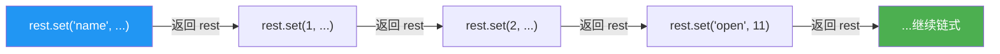
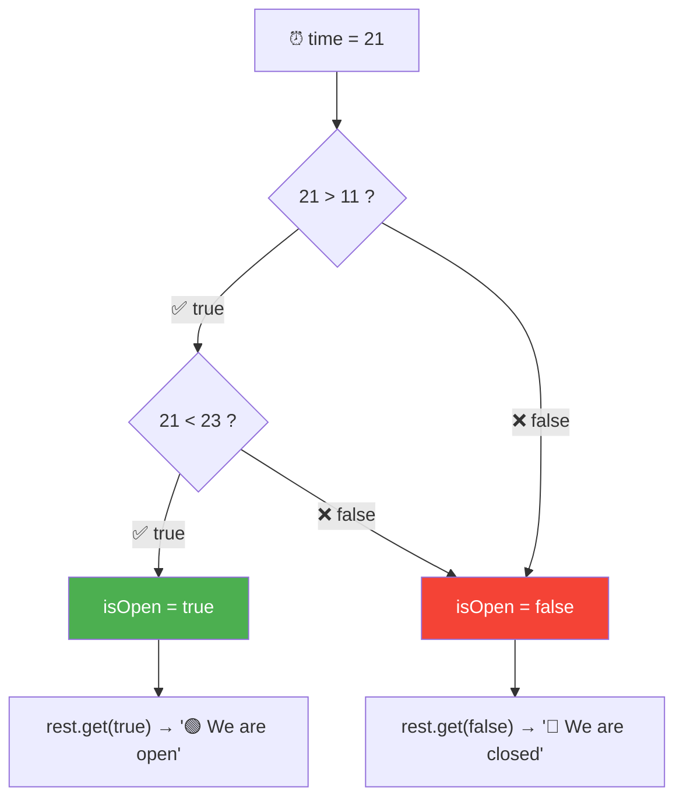
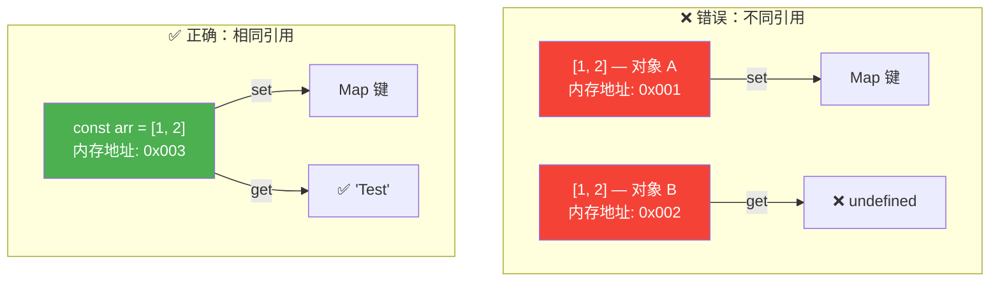
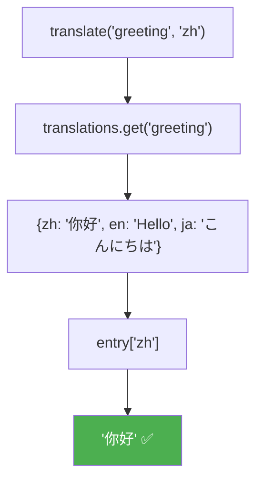

# Map 基础（Maps Fundamentals）

> 📺 来源：019 Maps Fundamentals.en.srt
> 📂 章节：第 09 章

## 📌 知识脉络
- **前置知识**：对象（Object）基本操作、Set 数据结构、布尔值（Boolean）、数组引用与堆内存概念
- **后续扩展**：Map 迭代方法、数据结构选型（何时用 Object vs Map）、WeakMap、DOM 元素作为 Map 键的高级应用

## 🎯 概述

Map（映射）是 ES6 引入的键值对数据结构。与普通对象不同，Map 的**键可以是任意数据类型**——不仅是字符串，还可以是数字、布尔值、数组甚至 DOM 元素。本节介绍 Map 的创建、`set()`/`get()` 核心方法以及键类型的灵活运用。

---

## 核心知识点

### 1. 创建 Map 与 `set()` 方法

> 🧩 **生活类比**：Map 就像一本"万能词典"——普通词典只能用**文字**作为索引，但 Map 词典允许你用**任何东西**作为索引：数字、图片、甚至实物！

```js {runnable} {title="map_create.js"}
// 创建空 Map
const rest = new Map();

// 使用 set() 添加键值对
rest.set('name', 'Classico Italiano');
rest.set(1, 'Firenze, Italy');
rest.set(2, 'Lisbon, Portugal');

console.log(rest);
// Map(3) {'name' => 'Classico Italiano', 1 => 'Firenze, Italy', 2 => 'Lisbon, Portugal'}
```

**关键特性：`set()` 返回更新后的 Map，因此可以链式调用**

```js {runnable} {title="map_chaining.js"}
const rest = new Map();

// 链式调用 set() —— 优雅地批量添加键值对
rest
  .set('name', 'Classico Italiano')
  .set(1, 'Firenze, Italy')
  .set(2, 'Lisbon, Portugal')
  .set('categories', ['Italian', 'Pizzeria', 'Vegetarian', 'Organic'])
  .set('open', 11)
  .set('close', 23)
  .set(true, 'We are open 🟢')
  .set(false, 'We are closed 🔴');

console.log(rest);
console.log(rest.size); // 8
```



**🔍 执行追踪：**

| 步骤 | 操作 | Map 大小 | 返回值 |
|------|------|---------|--------|
| 1 | `set('name', 'Classico Italiano')` | 1 | Map 自身 |
| 2 | `set(1, 'Firenze, Italy')` | 2 | Map 自身 |
| 3 | `set(true, 'We are open')` | — | Map 自身 |

> 💡 **记忆口诀**：`set()` 不仅"设"值，还"返"自身——链式写法一气呵成！

---

### 2. `get()` 方法与键类型的重要性

> 🧩 **生活类比**：`get()` 就像用**正确的钥匙**开对应的锁——钥匙的材质（数据类型）必须和锁孔完全匹配才能打开。数字钥匙 `1` 和字符串钥匙 `'1'` 是**不同的锁**！

```js {runnable} {title="map_get.js"}
const rest = new Map();
rest.set('name', 'Classico Italiano');
rest.set(1, 'Firenze, Italy');
rest.set(true, 'We are open 🟢');

// 读取数据
console.log(rest.get('name')); // 'Classico Italiano'
console.log(rest.get(true));   // 'We are open 🟢'
console.log(rest.get(1));      // 'Firenze, Italy'

// ⚠️ 键的数据类型必须严格匹配！
console.log(rest.get('true')); // undefined ← 字符串 'true' ≠ 布尔值 true
console.log(rest.get('1'));    // undefined ← 字符串 '1' ≠ 数字 1
```

**📊 键类型匹配规则：**

| 存储的键 | 取值方式 | 结果 |
|---------|---------|------|
| `1`（数字） | `get(1)` | ✅ `'Firenze, Italy'` |
| `1`（数字） | `get('1')` | ❌ `undefined` |
| `true`（布尔） | `get(true)` | ✅ `'We are open'` |
| `true`（布尔） | `get('true')` | ❌ `undefined` |

---

### 3. 布尔值作为 Map 键的巧妙应用

```js {runnable} {title="map_boolean_keys.js"}
const rest = new Map();
rest.set('open', 11);
rest.set('close', 23);
rest.set(true, 'We are open 🟢');
rest.set(false, 'We are closed 🔴');

// 巧妙利用布尔键
const time = 21; // 当前时间 21:00
const isOpen = time > rest.get('open') && time < rest.get('close');
// 21 > 11 && 21 < 23 → true
console.log(rest.get(isOpen)); // 'We are open 🟢'

const time2 = 8; // 凌晨 8:00
const isOpen2 = time2 > rest.get('open') && time2 < rest.get('close');
// 8 > 11 → false
console.log(rest.get(isOpen2)); // 'We are closed 🔴'
```



> 💡 **巧妙但需谨慎**：布尔键模式虽然炫酷，但可读性较差。实际项目中建议使用更明确的条件判断。

---

### 4. 其他常用方法与数组/对象作为键

```js {runnable} {title="map_methods.js"}
const rest = new Map();
rest.set('name', 'Classico Italiano');
rest.set(1, 'Firenze, Italy');
rest.set(2, 'Lisbon, Portugal');

// has() —— 检查键是否存在
console.log(rest.has('name'));  // true
console.log(rest.has('address')); // false

// delete() —— 按键删除
rest.delete(2);
console.log(rest.size); // 2（Lisbon 被删除）

// size —— 获取键值对数量
console.log(rest.size); // 2

// clear() —— 清空所有键值对
// rest.clear(); // Map(0) {}
```

**📊 Map vs Object 方法对比：**

| Map 方法 | Object 等价操作 | 说明 |
|---------|---------------|------|
| `map.set(k, v)` | `obj[k] = v` | 添加/修改 |
| `map.get(k)` | `obj[k]` | 读取 |
| `map.has(k)` | `k in obj` | 检查存在 |
| `map.delete(k)` | `delete obj[k]` | 删除（Map 更高效） |
| `map.size` | `Object.keys(obj).length` | Map 直接取，Object 需计算 |
| `map.clear()` | ❌ 无直接方法 | 清空 |

---

### 5. 数组/对象作为 Map 键：引用陷阱

> 🧩 **生活类比**：两个长得一模一样的钥匙，如果不是**同一把**物理钥匙，是打不开同一把锁的。JavaScript 中两个相同内容的数组也是如此——它们是不同的对象！

```js {runnable} {title="map_reference_keys.js"}
const rest = new Map();

// ❌ 错误做法：两个 [1, 2] 是不同的对象引用
rest.set([1, 2], 'Test');
console.log(rest.get([1, 2])); // undefined! 不同的数组对象

// ✅ 正确做法：保存引用，用同一个引用读取
const arr = [1, 2];
rest.set(arr, 'Test');
console.log(rest.get(arr)); // 'Test' ✅ 同一个数组引用

// 🌟 DOM 元素也可以作为键
// rest.set(document.querySelector('h1'), 'Heading');
```



> 💡 **记忆口诀**：对象当键要**存引用**，写两遍就变两个！

---

## 🛠️ 代码实战与真实场景

> **💼 业务场景**：多语言翻译系统——使用 Map 存储不同语言的翻译映射。Map 支持任意键类型，非常适合构建配置驱动的系统。

```js {runnable} {title="translation_system.js"}
// 翻译配置 Map
const translations = new Map();
translations
  .set('greeting', { zh: '你好', en: 'Hello', ja: 'こんにちは' })
  .set('farewell', { zh: '再见', en: 'Goodbye', ja: 'さようなら' })
  .set('thanks', { zh: '谢谢', en: 'Thank you', ja: 'ありがとう' });

// 动态获取翻译
function translate(key, lang) {
  const entry = translations.get(key);
  return entry ? entry[lang] || `[未翻译: ${key}]` : `[未知键: ${key}]`;
}

console.log(translate('greeting', 'zh'));  // '你好'
console.log(translate('greeting', 'ja'));  // 'こんにちは'
console.log(translate('farewell', 'en'));  // 'Goodbye'
console.log(translate('unknown', 'zh'));   // '[未知键: unknown]'

// Map 的优势：可以快速检查键是否存在
console.log(`是否有 greeting 翻译？${translations.has('greeting')}`);
console.log(`翻译条目总数：${translations.size}`);
```



**📊 输入输出示例：**

| 输入（key, lang） | Map 中的值 | 输出 |
|------------------|-----------|------|
| `'greeting', 'zh'` | `{zh: '你好', ...}` | `'你好'` |
| `'farewell', 'en'` | `{en: 'Goodbye', ...}` | `'Goodbye'` |
| `'unknown', 'zh'` | `undefined`（不存在） | `'[未知键: unknown]'` |

---

## 💡 关键要点
- ✅ Map 的键可以是**任意数据类型**（字符串、数字、布尔值、数组、对象、DOM 元素）
- ✅ `set()` 返回 Map 自身，支持**链式调用**批量设值
- ✅ `get()` 读值时，键的**数据类型必须完全匹配**
- ✅ 用数组/对象做键时，必须**保存引用**——两个内容相同但不是同一引用的对象不匹配
- ✅ Map 的 `has()`/`delete()`/`size`/`clear()` 与 Set 方法命名一致

## ⚠️ 常见误区
- ⚠️ **混淆键的类型**：数字 `1` 和字符串 `'1'` 是完全不同的键
- ⚠️ **忘记引用问题**：`map.set([1,2], 'x')` 后，`map.get([1,2])` 返回 `undefined`——因为两个 `[1,2]` 是不同对象

## 🐛 报错实验室

> 主动展示错误写法及报错信息

**❌ 错误写法：**
```js
const myMap = new Map();
myMap.set('key1', 'value1');

// 试图用对象字面量访问 Map
console.log(myMap.key1);      // 想像对象一样访问
console.log(myMap['key1']);    // 想用方括号访问
```

**浏览器输出：**
```
undefined
undefined
```

**🔑 解读**：Map 不像普通对象，不能用点语法或方括号访问值。必须使用 `myMap.get('key1')`。Map 和 Object 是**完全不同的数据结构**，各有各的 API。

---

## 📖 词汇速查表 (Cheat Sheet)

| 中文术语 | 英文术语 | 简明释义 | 速查代码 | 📚 官方文档 |
|---------|---------|---------|---------|-----------|
| 映射 | Map | 键值对数据结构，键可为任意类型 | `new Map()` | [MDN](https://developer.mozilla.org/zh-CN/docs/Web/JavaScript/Reference/Global_Objects/Map) |
| 设置 | set | 向 Map 中添加键值对 | `map.set(k, v)` | [MDN](https://developer.mozilla.org/zh-CN/docs/Web/JavaScript/Reference/Global_Objects/Map/set) |
| 获取 | get | 根据键读取 Map 中的值 | `map.get(k)` | [MDN](https://developer.mozilla.org/zh-CN/docs/Web/JavaScript/Reference/Global_Objects/Map/get) |
| 包含 | has | 检测 Map 中是否存在某键 | `map.has(k)` | [MDN](https://developer.mozilla.org/zh-CN/docs/Web/JavaScript/Reference/Global_Objects/Map/has) |
| 删除 | delete | 按键删除键值对 | `map.delete(k)` | [MDN](https://developer.mozilla.org/zh-CN/docs/Web/JavaScript/Reference/Global_Objects/Map/delete) |
| 大小 | size | Map 中键值对的数量 | `map.size` | [MDN](https://developer.mozilla.org/zh-CN/docs/Web/JavaScript/Reference/Global_Objects/Map/size) |

---

## 🧪 学习验证

### 📝 动手练习

**练习 1：创建一个颜色映射 Map**
```js {runnable} {title="exercise1.js"}
// 创建一个 Map，将数字映射到颜色名
// 1 → 'red', 2 → 'green', 3 → 'blue'
// 使用链式 set() 添加所有键值对
// 然后打印 Map 的大小和键 2 对应的颜色
// 在这里写你的代码

```
<details><summary>💡 参考答案</summary>

```js
const colors = new Map();
colors
  .set(1, 'red')
  .set(2, 'green')
  .set(3, 'blue');

console.log(`大小：${colors.size}`); // 3
console.log(`键 2 的颜色：${colors.get(2)}`); // 'green'
```
**解题思路**：利用 `set()` 链式调用一口气设置多个键值对，然后用 `get()` 读取指定键对应的值。
</details>

**练习 2：用 Map 实现简单缓存**
```js {runnable} {title="exercise2.js"}
// 实现一个简单的缓存：
// - 第一次调用 getData(key) 时，模拟"计算"并存入 Map
// - 第二次调用同一 key 时，直接从 Map 返回
const cache = new Map();

function getData(key) {
  // 在这里写你的代码
}

console.log(getData('user_1')); // 第一次：计算并缓存
console.log(getData('user_1')); // 第二次：命中缓存
```
<details><summary>💡 参考答案</summary>

```js
const cache = new Map();

function getData(key) {
  if (cache.has(key)) {
    console.log('📦 缓存命中！');
    return cache.get(key);
  }
  console.log('⏳ 计算中...');
  const result = `Data for ${key}`; // 模拟耗时计算
  cache.set(key, result);
  return result;
}

console.log(getData('user_1')); // ⏳ 计算中... → 'Data for user_1'
console.log(getData('user_1')); // 📦 缓存命中！→ 'Data for user_1'
```
**解题思路**：用 `has()` 检查缓存中是否存在，存在直接 `get()` 返回，否则计算后 `set()` 存入。
</details>

### ❓ 理解检测

:::quiz {correct="C"}
**1. Map 和 Object 的最大区别是什么？**
- A) Map 比 Object 性能更好
- B) Map 的值可以是任意类型
- C) Map 的键可以是任意类型，Object 的键只能是字符串或 Symbol

> **解析**：Object 的键会自动转为字符串（或 Symbol），而 Map 的键可以是任何数据类型，包括数字、布尔值、对象等。
:::

:::quiz {correct="B"}
**2. 以下代码的输出是什么？**
```js
const m = new Map();
m.set(1, 'a');
console.log(m.get('1'));
```
- A) `'a'`
- B) `undefined`
- C) `TypeError`

> **解析**：存储的键是数字 `1`，但用字符串 `'1'` 读取。Map 严格区分类型，因此返回 `undefined`。
:::

:::quiz {correct="A"}
**3. 为什么 `map.set([1,2], 'x'); map.get([1,2])` 返回 `undefined`？**
- A) 因为两个 `[1,2]` 是不同的对象引用，在内存中占不同位置
- B) 因为 Map 不支持数组作为键
- C) 因为 `set()` 没有正确执行

> **解析**：每次写 `[1,2]` 都会创建一个新的数组对象。虽然内容相同，但它们是不同的引用。Map 用引用（内存地址）来匹配键。
:::

### 🔧 代码填空

:::fill-blank
// 创建 Map 并链式添加
const myMap = new ___Map___();
myMap.___set___('name', 'Alice').set('age', 25);

// 读取值
const name = myMap.___get___('name');

// 检查键是否存在
if (myMap.___has___('age')) {
  console.log('有 age 键');
}
:::
