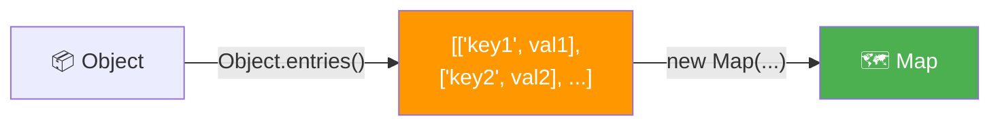
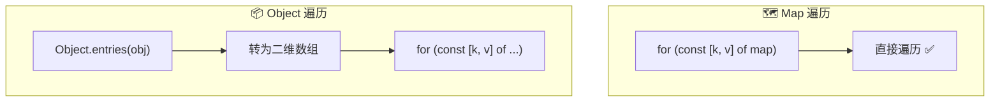
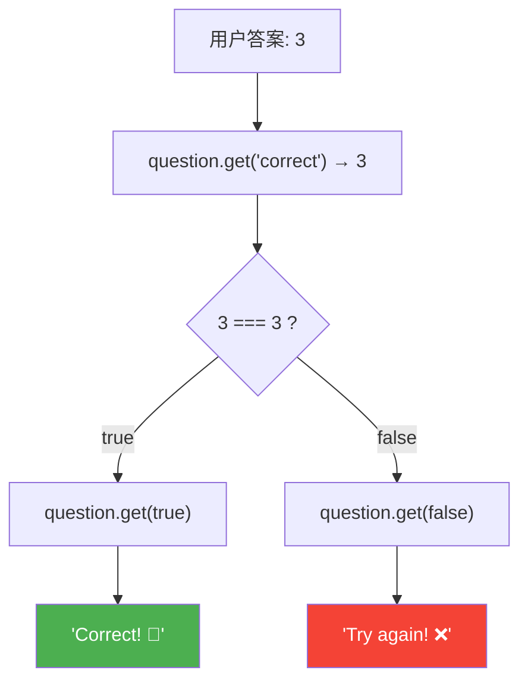
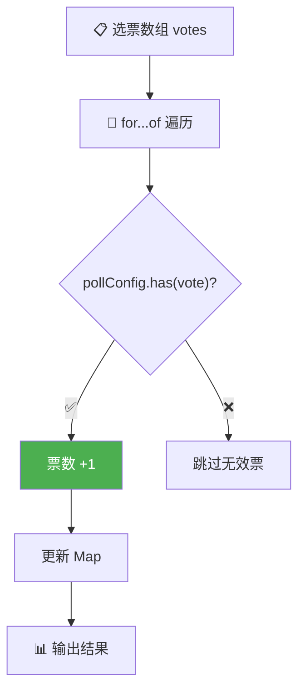

# Map 迭代（Maps Iteration）

> 📺 来源：020 Maps Iteration.en.srt
> 📂 章节：第 09 章

## 📌 知识脉络
- **前置知识**：Map 基础（`set()`/`get()`/`has()`）、`Object.entries()` 返回值结构、for-of 循环与解构赋值
- **后续扩展**：数据结构选型总结（Object vs Map vs Array vs Set）、Map 在实际项目中的高级用法

## 🎯 概述

本节介绍创建 Map 的另一种方式——**直接传入二维数组**，并深入讲解 Map 的迭代方法。由于 `Object.entries()` 返回的结构与 Map 构造器接受的结构完全一致，因此可以轻松将**对象转换为 Map**。最后通过一个小型 Quiz 应用展示 Map 的实际运用。

---

## 核心知识点

### 1. 通过二维数组创建 Map

> 🧩 **生活类比**：如果 `set()` 链式调用像"一个一个手动贴标签"，那么传入二维数组就像"一次性导入一份清单"——把所有标签-物品的对应关系批量录入系统。

```js {runnable} {title="map_from_array.js"}
// 直接传入二维数组创建 Map
const question = new Map([
  ['question', 'What is the best programming language in the world?'],
  [1, 'C'],
  [2, 'Java'],
  [3, 'JavaScript'],
  ['correct', 3],
  [true, 'Correct! 🎉'],
  [false, 'Try again! ❌'],
]);

console.log(question);
// Map(7) {'question' => '...', 1 => 'C', 2 => 'Java', ...}
```

**结构对比——二维数组 vs `Object.entries()` 返回值：**

```js {runnable} {title="map_vs_entries.js"}
// Object.entries() 返回的结构
const openingHours = {
  thu: { open: 12, close: 22 },
  fri: { open: 11, close: 23 },
  sat: { open: 0, close: 24 },
};

console.log(Object.entries(openingHours));
// [['thu', {open:12,close:22}], ['fri', {...}], ['sat', {...}]]
// ↑ 和 Map 构造器接受的格式完全一致！

// ✅ 因此可以直接从对象转为 Map
const hoursMap = new Map(Object.entries(openingHours));
console.log(hoursMap);
```



**🔍 执行追踪：**

| 步骤 | 操作 | 结果 |
|------|------|------|
| 1 | `Object.entries(openingHours)` | `[['thu', {...}], ['fri', {...}], ['sat', {...}]]` |
| 2 | `new Map(...)` 接收二维数组 | `Map(3) {'thu' => {...}, 'fri' => {...}, 'sat' => {...}}` |

> 💡 **记忆口诀**：`Object.entries()` 的输出 = `new Map()` 的输入，天生一对！

---

### 2. 遍历 Map —— for-of 与解构

> 🧩 **生活类比**：遍历 Map 就像翻阅一本有索引标签的文件夹——每次翻开一页，你同时看到**标签（key）**和**内容（value）**。

```js {runnable} {title="map_iteration.js"}
const question = new Map([
  ['question', 'What is the best programming language?'],
  [1, 'C'],
  [2, 'Java'],
  [3, 'JavaScript'],
  ['correct', 3],
  [true, 'Correct! 🎉'],
  [false, 'Try again! ❌'],
]);

// 打印问题
console.log(question.get('question'));

// 只打印数字键对应的选项
for (const [key, value] of question) {
  if (typeof key === 'number') {
    console.log(`Answer ${key}: ${value}`);
  }
}
// Answer 1: C
// Answer 2: Java
// Answer 3: JavaScript
```

**📊 Map 遍历 vs Object 遍历对比：**

| 特性 | Map 遍历 | Object 遍历 |
|------|---------|------------|
| 语法 | `for (const [k, v] of map)` | `for (const [k, v] of Object.entries(obj))` |
| 是否需要转换 | ❌ 直接遍历 | ✅ 需先调用 `Object.entries()` |
| 原因 | Map 本身就是可迭代对象 | Object 不是可迭代对象 |



---

### 3. 实战：Quiz 应用

```js {runnable} {title="quiz_app.js"}
const question = new Map([
  ['question', 'What is the best programming language?'],
  [1, 'C'],
  [2, 'Java'],
  [3, 'JavaScript'],
  ['correct', 3],
  [true, 'Correct! 🎉'],
  [false, 'Try again! ❌'],
]);

// 1️⃣ 显示问题
console.log(question.get('question'));

// 2️⃣ 显示选项（只打印数字键）
for (const [key, value] of question) {
  if (typeof key === 'number') {
    console.log(`  ${key}: ${value}`);
  }
}

// 3️⃣ 获取用户答案（这里用硬编码模拟）
const answer = 3; // 模拟用户输入
// 实际中可用: const answer = Number(prompt('Your answer?'));

// 4️⃣ 利用布尔键巧妙获取反馈信息
const isCorrect = answer === question.get('correct'); // 3 === 3 → true
console.log(question.get(isCorrect)); // question.get(true) → 'Correct! 🎉'
```

**🔍 执行追踪：**

| 步骤 | 表达式 | 值 |
|------|--------|-----|
| 1 | `question.get('correct')` | `3` |
| 2 | `answer === 3` | `true` |
| 3 | `question.get(true)` | `'Correct! 🎉'` |



---

### 4. Map 转换为数组

```js {runnable} {title="map_to_array.js"}
const question = new Map([
  ['question', 'Best language?'],
  [1, 'C'],
  [2, 'Java'],
  [3, 'JavaScript'],
]);

// Map → 二维数组
console.log([...question]);
// [['question', 'Best language?'], [1, 'C'], [2, 'Java'], [3, 'JavaScript']]

// 获取所有键
console.log([...question.keys()]);
// ['question', 1, 2, 3]

// 获取所有值
console.log([...question.values()]);
// ['Best language?', 'C', 'Java', 'JavaScript']
```

**📊 Map 解构方法对比：**

| 方法 | 返回 | 示例输出 |
|------|------|---------|
| `[...map]` | 键值对二维数组 | `[['a', 1], ['b', 2]]` |
| `[...map.keys()]` | 键数组 | `['a', 'b']` |
| `[...map.values()]` | 值数组 | `[1, 2]` |
| `[...map.entries()]` | 等同于 `[...map]` | `[['a', 1], ['b', 2]]` |

> 💡 **记忆口诀**：Map 转数组用 `[...map]`，取键用 `.keys()`，取值用 `.values()`！

---

## 🛠️ 代码实战与真实场景

> **💼 业务场景**：构建一个简易投票系统——使用 Map 统计候选项票数，并显示最终结果。

```js {runnable} {title="voting_system.js"}
// 从配置数据创建 Map
const pollConfig = new Map([
  ['title', '你最喜欢哪种前端框架？'],
  ['React', 0],
  ['Vue', 0],
  ['Angular', 0],
  ['Svelte', 0],
]);

// 模拟投票
const votes = ['React', 'Vue', 'React', 'Angular', 'Vue', 'React', 'Svelte', 'Vue', 'React'];

for (const vote of votes) {
  if (pollConfig.has(vote)) {
    pollConfig.set(vote, pollConfig.get(vote) + 1);
  }
}

// 输出投票结果
console.log(`📊 ${pollConfig.get('title')}\n`);
for (const [framework, count] of pollConfig) {
  // 只显示有票数的选项（排除标题键）
  if (typeof count === 'number') {
    const bar = '█'.repeat(count);
    console.log(`${framework.padEnd(10)} ${bar} (${count})`);
  }
}
```



**📊 输入输出示例：**

| 操作 | Map 状态变化 |
|------|------------|
| 初始 | `React: 0, Vue: 0, Angular: 0, Svelte: 0` |
| 投票 `'React'` | `React: 1` |
| 投票 `'Vue'` | `Vue: 1` |
| 投票 `'React'` | `React: 2` |
| ... | ... |
| 最终 | `React: 4, Vue: 3, Angular: 1, Svelte: 1` |

---

## 💡 关键要点
- ✅ 用二维数组 `new Map([['key', 'val'], ...])` 一次性初始化 Map
- ✅ `Object.entries()` 的输出格式与 Map 构造器的输入格式**完全一致**，可直接转换
- ✅ Map 是可迭代对象，`for-of` 直接遍历，无需额外转换
- ✅ Map 转数组：`[...map]`（含键值对）、`[...map.keys()]`（仅键）、`[...map.values()]`（仅值）
- ✅ 布尔值作为 Map 键可以实现优雅的条件映射（但注意可读性）

## ⚠️ 常见误区
- ⚠️ **混淆 Map 遍历和 Object 遍历**：Map 直接 `for-of`；Object 必须先 `Object.entries()` 转换
- ⚠️ **忘记 `prompt()` 返回字符串**：与数字键比较时需要 `Number()` 转换

## 🐛 报错实验室

> 主动展示错误写法及报错信息

**❌ 错误写法：**
```js
const obj = { a: 1, b: 2 };
// 试图直接 for-of 遍历对象
for (const [k, v] of obj) {
  console.log(k, v);
}
```

**浏览器报错：**
```
Uncaught TypeError: obj is not iterable
```

**🔑 解读**：普通对象不是可迭代对象，不能直接用 `for-of`。必须先用 `Object.entries(obj)` 转换。而 Map 本身就是可迭代的，可以直接遍历。

---

## 📖 词汇速查表 (Cheat Sheet)

| 中文术语 | 英文术语 | 简明释义 | 速查代码 | 📚 官方文档 |
|---------|---------|---------|---------|-----------|
| Map 构造器 | Map constructor | 通过二维数组创建 Map | `new Map([['k','v']])` | [MDN](https://developer.mozilla.org/zh-CN/docs/Web/JavaScript/Reference/Global_Objects/Map/Map) |
| 键迭代器 | keys | 返回所有键的迭代器 | `map.keys()` | [MDN](https://developer.mozilla.org/zh-CN/docs/Web/JavaScript/Reference/Global_Objects/Map/keys) |
| 值迭代器 | values | 返回所有值的迭代器 | `map.values()` | [MDN](https://developer.mozilla.org/zh-CN/docs/Web/JavaScript/Reference/Global_Objects/Map/values) |
| 条目迭代器 | entries | 返回所有键值对的迭代器 | `map.entries()` | [MDN](https://developer.mozilla.org/zh-CN/docs/Web/JavaScript/Reference/Global_Objects/Map/entries) |
| 对象条目 | Object.entries | 将对象转为二维数组 | `Object.entries(obj)` | [MDN](https://developer.mozilla.org/zh-CN/docs/Web/JavaScript/Reference/Global_Objects/Object/entries) |

---

## 🧪 学习验证

### 📝 动手练习

**练习 1：对象转 Map 并遍历**
```js {runnable} {title="exercise1.js"}
// 将对象转为 Map，然后用 for-of 遍历输出 "科目: 分数" 的格式
const scores = { math: 95, english: 88, science: 92 };
// 在这里写你的代码

```
<details><summary>💡 参考答案</summary>

```js
const scores = { math: 95, english: 88, science: 92 };
const scoresMap = new Map(Object.entries(scores));

for (const [subject, score] of scoresMap) {
  console.log(`${subject}: ${score}`);
}
// math: 95
// english: 88
// science: 92
```
**解题思路**：`Object.entries()` 返回的二维数组结构恰好与 `Map` 构造器匹配，因此可以一步转换。
</details>

**练习 2：用 Map 构建计数器**
```js {runnable} {title="exercise2.js"}
// 用 Map 统计数组中每个元素出现的次数
const fruits = ['apple', 'banana', 'apple', 'cherry', 'banana', 'apple'];
// 在这里写你的代码

```
<details><summary>💡 参考答案</summary>

```js
const fruits = ['apple', 'banana', 'apple', 'cherry', 'banana', 'apple'];
const counter = new Map();

for (const fruit of fruits) {
  counter.set(fruit, (counter.get(fruit) || 0) + 1);
}

for (const [fruit, count] of counter) {
  console.log(`${fruit}: ${count}`);
}
// apple: 3, banana: 2, cherry: 1
```
**解题思路**：与之前用普通对象统计频次的模式类似，但这里用 Map 的 `get()`/`set()` 替代了对象的属性赋值。
</details>

### ❓ 理解检测

:::quiz {correct="B"}
**1. 以下哪种方式可以将对象转为 Map？**
- A) `new Map(obj)`
- B) `new Map(Object.entries(obj))`
- C) `Map.from(obj)`

> **解析**：`new Map()` 接受二维数组 `[[key, value], ...]`。`Object.entries()` 恰好返回这种格式，完美匹配。
:::

:::quiz {correct="C"}
**2. Map 和 Object 在遍历上的最大区别是什么？**
- A) Map 不支持 for-of 循环
- B) Object 支持直接 for-of 遍历
- C) Map 本身是可迭代对象，可直接 for-of；Object 需要先调用 Object.entries()

> **解析**：Map 是 iterable，可以直接 `for-of`；Object 不是 iterable，必须用 `Object.entries()` 等方法先转换。
:::

:::quiz {correct="A"}
**3. `[...new Map([['a',1],['b',2]]).values()]` 的结果是？**
- A) `[1, 2]`
- B) `['a', 'b']`
- C) `[['a',1], ['b',2]]`

> **解析**：`.values()` 返回所有值的迭代器，展开后得到 `[1, 2]`。`.keys()` 才会返回 `['a', 'b']`。
:::

### 🔧 代码填空

:::fill-blank
// 从对象创建 Map
const myMap = new Map(Object.___entries___(myObj));

// 遍历 Map（解构键和值）
for (const [___key___, value] of myMap) {
  console.log(key, value);
}

// Map 转为数组
const arr = [___...___myMap];
:::
