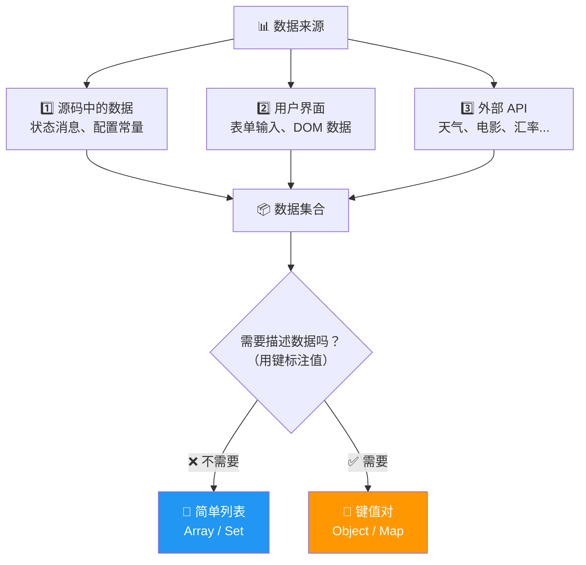
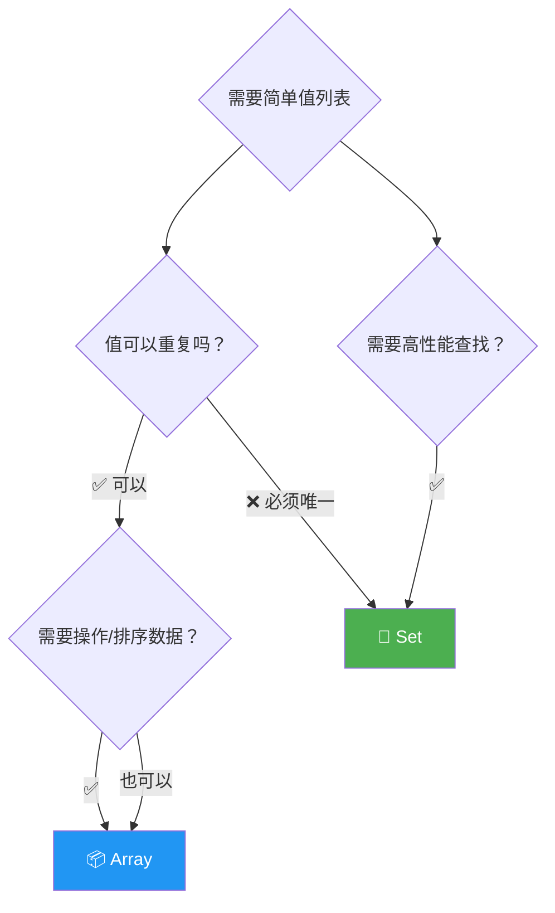
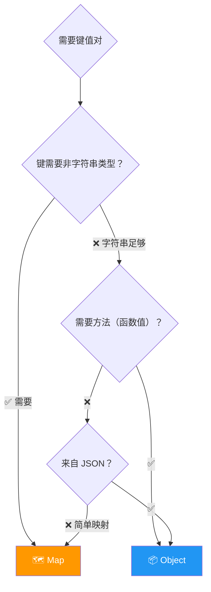
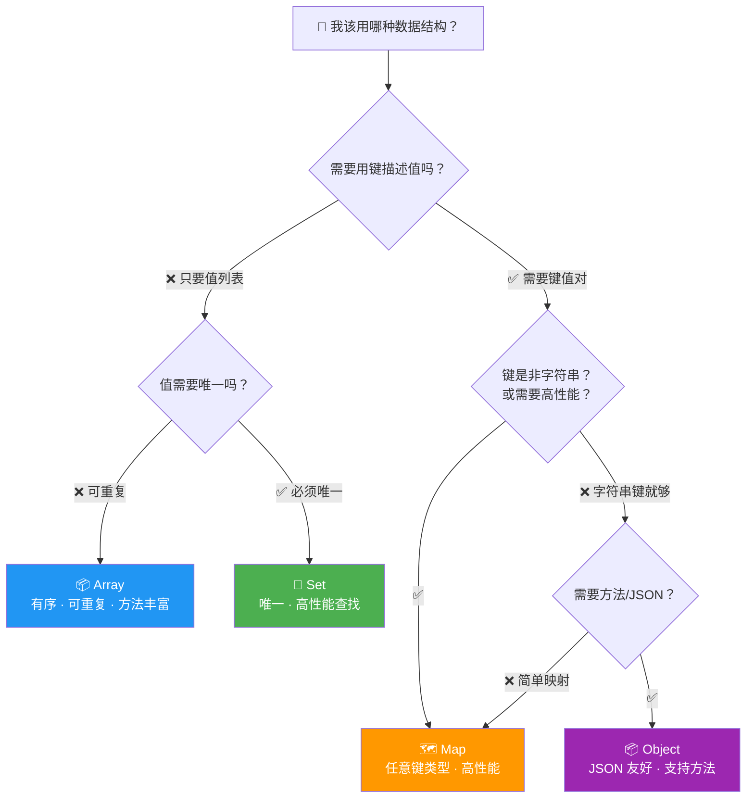
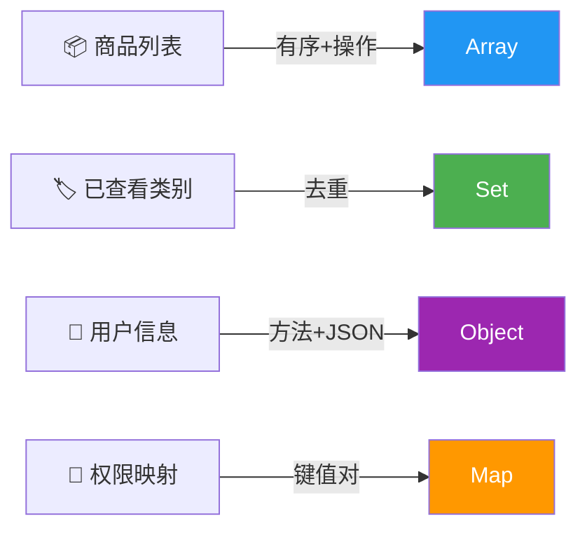

# 数据结构选型总结（Summary: Which Data Structure to Use?）

> 📺 来源：021 Summary Which Data Structure to Use.en.srt
> 📂 章节：第 09 章

## 📌 知识脉络
- **前置知识**：数组（Array）、对象（Object）、集合（Set）、映射（Map）的基本操作
- **后续扩展**：Web API 与 JSON 数据处理、高阶数组方法（map/filter/reduce）、WeakSet 与 WeakMap

## 🎯 概述

本节是对 JavaScript 四种内建数据结构的**选型总结**。作为开发者，处理数据是核心工作，而选择正确的数据结构直接影响代码的可读性和性能。本节帮助你建立清晰的**决策框架**：什么时候用数组、什么时候用 Set、什么时候用对象、什么时候用 Map。

---

## 核心知识点

### 1. 数据从哪里来？

> 🧩 **生活类比**：数据就像食材——可以从**自家花园**种（源码中硬编码）、从**市场**买（用户输入/DOM）、或者**外卖**送来（Web API）。不管食材从哪来，都需要合适的**容器**来存放。



**Web API 数据示例（JSON 格式）：**

```js
// JSON 数据通常是"对象数组"的形式
const recipes = [
  { title: 'Pizza', publisher: 'Jonas', id: 1 },    // 对象 → 键值对描述
  { title: 'Pasta', publisher: 'Jonas', id: 2 },     // 数组 → 简单列表
  { title: 'Risotto', publisher: 'Jonas', id: 3 },
];
```

> 💡 **记忆口诀**：JSON 数据 = 对象数组！对象描述"是什么"，数组收集"有哪些"。

---

### 2. Array vs Set —— 简单值列表的选择

> 🧩 **生活类比**：数组像一个**有编号的抽屉柜**——每个抽屉有编号（索引），可以放重复的东西；Set 像一个**VIP 签到本**——每个名字只能出现一次，且没有页码。

**📊 Array vs Set 详细对比：**

| 特性 | Array 数组 | Set 集合 |
|------|-----------|---------|
| 元素是否可重复 | ✅ 可重复 | ❌ 自动去重 |
| 有无索引/顺序 | ✅ 有索引，保序 | ❌ 无索引，顺序不重要 |
| 数据操作方法 | ⭐⭐⭐ 丰富（push/pop/splice/map/filter...） | ⭐ 少量（add/delete/has） |
| 查找性能 | O(n)（`includes` 需遍历） | O(1)（`has` 近似常数时间） |
| **适用场景** | 需要有序、可重复、需要操作数据 | 需要唯一值、高性能查找/删除 |



---

### 3. Object vs Map —— 键值对的选择

> 🧩 **生活类比**：Object 像一本**老式地址簿**——每页只能用人名（字符串）索引，但翻起来很顺手、人人都会用；Map 像一本**数字通讯录**——可以用号码、照片、指纹等**任何东西**索引，查找更快，功能更强。

**📊 Object vs Map 详细对比：**

| 特性 | Object 对象 | Map 映射 |
|------|-----------|---------|
| 键的类型 | 仅字符串 / Symbol | ⭐ 任意类型（数字、布尔、对象...） |
| 迭代方式 | 需 `Object.entries()` | 直接 `for-of`  |
| 获取大小 | `Object.keys(obj).length`（需计算） | `map.size`（直接读取） |
| 性能 | 一般 | ⭐ 频繁增删时更优 |
| 可作 JSON | ✅ 原生支持 | ❌ 需手动转换 |
| 可含方法 | ✅ 支持（`this` 关键字） | ❌ 不支持 |
| 书写便利性 | ⭐⭐⭐ 字面量语法 `{}` | ⭐⭐ 需 `new Map()` |



---

### 4. 终极选型决策树



**🔍 各数据结构的"一句话定位"：**

| 数据结构 | 一句话 |
|---------|--------|
| **Array** | 需要有序列表、支持重复、需要丰富的数据操作方法 |
| **Set** | 需要唯一值集合、需要高性能的存在性检查 |
| **Object** | 需要字符串键值对、需要方法、需要 JSON 兼容 |
| **Map** | 需要任意类型键值对、需要高性能增删查、需要简单遍历 |

> 💡 **实际开发中**：数组和对象依然是最常用的。Set 用于去重场景，Map 用于需要非字符串键或高性能键值存储的场景。

---

## 🛠️ 代码实战与真实场景

> **💼 业务场景**：电商后台数据展示——根据不同数据需求选择合适的数据结构。

```js {runnable} {title="data_structure_choice.js"}
// 1️⃣ 商品列表 → Array（有序、可重复、需要操作）
const products = [
  { id: 1, name: 'iPhone', price: 999, category: 'electronics' },
  { id: 2, name: 'MacBook', price: 1999, category: 'electronics' },
  { id: 3, name: '围巾', price: 29, category: 'clothing' },
];
console.log('商品数量:', products.length);

// 2️⃣ 用户已查看的类别 → Set（去重）
const viewedCategories = new Set();
for (const p of products) viewedCategories.add(p.category);
console.log('浏览类别:', [...viewedCategories]); // ['electronics', 'clothing']

// 3️⃣ 用户信息 → Object（字符串键、含方法、JSON 友好）
const user = {
  name: 'Alice',
  email: 'alice@example.com',
  getDisplayName() {
    return `👤 ${this.name}`;
  },
};
console.log(user.getDisplayName());

// 4️⃣ 权限到描述的映射 → Map（可能需要非字符串键）
const permissions = new Map([
  ['read', '可以查看内容'],
  ['write', '可以编辑内容'],
  ['admin', '拥有完全控制权'],
]);
console.log('read 权限:', permissions.get('read'));
```



**📊 输入输出示例：**

| 数据需求 | 选用结构 | 理由 |
|---------|---------|------|
| 存储商品列表 | Array | 需要有序、可操作（排序/筛选） |
| 记录浏览过的类别 | Set | 只需唯一值 |
| 用户信息含方法 | Object | 需要 `this` 关键字 |
| 配置映射 | Map | 纯键值映射，无需方法 |

---

## 💡 关键要点
- ✅ **Array**：有序列表 + 可重复 + 丰富的操作方法——最常用
- ✅ **Set**：唯一值 + 高性能查找——用于去重和存在性检查
- ✅ **Object**：字符串键值对 + 支持方法 + JSON 兼容——最传统
- ✅ **Map**：任意键类型 + 高性能 + 直接迭代——现代键值存储首选
- ✅ JSON 数据几乎总是"**对象数组**"的形式

## ⚠️ 常见误区
- ⚠️ **所有键值对都用 Object**：简单的键值映射考虑用 Map（性能更好、键类型灵活）
- ⚠️ **所有列表都用 Array**：如果只关心"某值是否存在"且不需要索引，Set 更合适
- ⚠️ **忽视 WeakSet / WeakMap**：它们允许垃圾回收，适合临时缓存和私有数据存储

## 🐛 报错实验室

> 主动展示错误写法及报错信息

**❌ 错误写法：**
```js
// 试图在 Map 上调用 JSON.stringify
const myMap = new Map([['a', 1], ['b', 2]]);
const json = JSON.stringify(myMap);
console.log(json);
```

**浏览器输出：**
```
"{}"
```

**🔑 解读**：`JSON.stringify()` 不知道如何序列化 Map。它只会串行化普通对象的属性。如需序列化 Map，先转为对象或二维数组：`JSON.stringify([...myMap])` 或 `JSON.stringify(Object.fromEntries(myMap))`。

---

## 📖 词汇速查表 (Cheat Sheet)

| 中文术语 | 英文术语 | 简明释义 | 速查代码 | 📚 官方文档 |
|---------|---------|---------|---------|-----------|
| 数组 | Array | 有序可重复的值列表 | `[1, 2, 3]` | [MDN](https://developer.mozilla.org/zh-CN/docs/Web/JavaScript/Reference/Global_Objects/Array) |
| 集合 | Set | 唯一值的无序集合 | `new Set([1, 2])` | [MDN](https://developer.mozilla.org/zh-CN/docs/Web/JavaScript/Reference/Global_Objects/Set) |
| 对象 | Object | 字符串键值对 + 方法 | `{ key: value }` | [MDN](https://developer.mozilla.org/zh-CN/docs/Web/JavaScript/Reference/Global_Objects/Object) |
| 映射 | Map | 任意类型键值对 | `new Map()` | [MDN](https://developer.mozilla.org/zh-CN/docs/Web/JavaScript/Reference/Global_Objects/Map) |
| JSON | JSON | JavaScript 对象表示法 | `JSON.parse(str)` | [MDN](https://developer.mozilla.org/zh-CN/docs/Web/JavaScript/Reference/Global_Objects/JSON) |
| Web API | Web API | 从外部获取数据的接口 | `fetch(url)` | [MDN](https://developer.mozilla.org/zh-CN/docs/Web/API/Fetch_API) |

---

## 🧪 学习验证

### 📝 动手练习

**练习 1：为场景选择合适的数据结构**
```js {runnable} {title="exercise1.js"}
// 根据注释中的场景，选择合适的数据结构来存储数据

// 场景 1: 存储一个班级的学生成绩（姓名 → 分数）
// 选择: ???
// 在这里写你的代码


// 场景 2: 存储用户的购物车商品（有序、可重复）
// 选择: ???
// 在这里写你的代码


// 场景 3: 记录网站访客的IP地址（不重复）
// 选择: ???
// 在这里写你的代码

```
<details><summary>💡 参考答案</summary>

```js
// 场景 1: Object 或 Map（键值对，这里用 Map 更合适因为纯映射无需方法）
const grades = new Map([
  ['Alice', 95],
  ['Bob', 88],
  ['Charlie', 92],
]);

// 场景 2: Array（有序列表，可重复——同一商品可能买多个）
const cart = [
  { name: 'iPhone', qty: 1, price: 999 },
  { name: '手机壳', qty: 2, price: 29 },
];

// 场景 3: Set（只关心唯一 IP）
const visitors = new Set(['192.168.1.1', '10.0.0.1', '192.168.1.1']);
console.log(visitors.size); // 2
```
**解题思路**：根据决策树——需要键描述值？→ Map/Object。有序可重复？→ Array。唯一值？→ Set。
</details>

**练习 2：将 Map 转为 JSON 并转回**
```js {runnable} {title="exercise2.js"}
// 将 Map 转为 JSON 字符串，再转回 Map
const config = new Map([
  ['theme', 'dark'],
  ['language', 'zh-CN'],
  ['fontSize', 16],
]);
// 在这里写你的代码

```
<details><summary>💡 参考答案</summary>

```js
const config = new Map([
  ['theme', 'dark'],
  ['language', 'zh-CN'],
  ['fontSize', 16],
]);

// Map → JSON
const json = JSON.stringify([...config]); // 先转二维数组
console.log(json); // '[["theme","dark"],["language","zh-CN"],["fontSize",16]]'

// JSON → Map
const restored = new Map(JSON.parse(json));
console.log(restored.get('theme')); // 'dark'
```
**解题思路**：Map 不能直接 `JSON.stringify`，需先 `[...map]` 展开为二维数组。恢复时 `JSON.parse` 得到二维数组，直接传入 `new Map()` 构造器。
</details>

### ❓ 理解检测

:::quiz {correct="B"}
**1. 如果你需要存储一组唯一的标签（tags），应该用什么？**
- A) Array
- B) Set
- C) Object

> **解析**：标签需要**唯一性**（不重复），且不需要键值描述——Set 是最佳选择。
:::

:::quiz {correct="C"}
**2. 以下哪种数据结构的键可以是布尔值？**
- A) Object（键会被转为字符串 `'true'`）
- B) Array
- C) Map

> **解析**：Map 的键可以是任意类型。Object 的键如果是布尔值会自动转为字符串 `'true'`/`'false'`。
:::

:::quiz {correct="A"}
**3. JSON 数据通常以什么形式组织？**
- A) 对象数组（Array of Objects）
- B) Map 的 Map
- C) Set 嵌套 Set

> **解析**：JSON 数据最常见的形式是"对象数组"——数组充当列表容器，对象充当每个条目的键值描述。
:::

### 🔧 代码填空

:::fill-blank
// 数组去重
const unique = [...new ___Set___(arr)];

// 对象转 Map
const map = new Map(___Object.entries___(obj));

// Map 转数组
const arr2 = [___...___map];
:::
