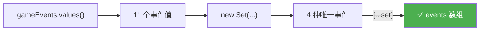
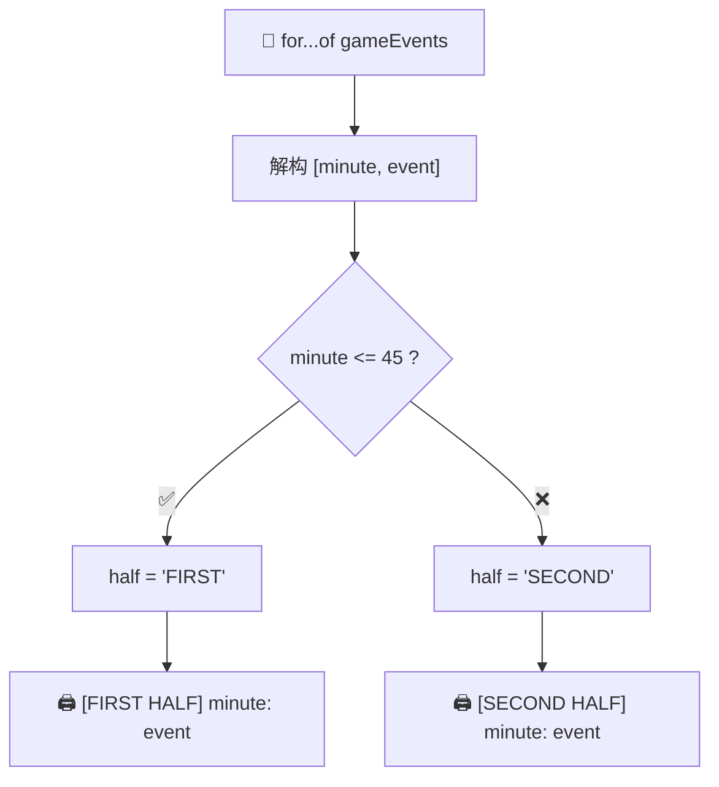
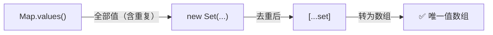

# 编码挑战 #3（Coding Challenge #3）

> 📺 来源：022 CHALLENGE #3.en.srt
> 📂 章节：第 09 章

## 📌 知识脉络
- **前置知识**：Map 数据结构（`set()`/`get()`/`delete()`/`size`/`.keys()`/`.values()`）、Set 去重、for-of 循环与解构、展开运算符
- **后续扩展**：字符串操作方法（Working With Strings）、更复杂的 Map/Set 综合应用

## 🎯 概述

本节是第 09 章的第三个编码挑战，围绕一个**足球比赛事件日志 Map** 进行实战练习。综合运用 Map 方法、Set 去重、数组操作和条件判断来分析比赛数据。

---

## 📋 挑战数据

```js {runnable} {title="challenge3_data.js"}
const gameEvents = new Map([
  [17, '⚽ GOAL'],
  [36, '🔁 Substitution'],
  [47, '⚽ GOAL'],
  [61, '🔁 Substitution'],
  [64, '🟡 Yellow card'],
  [69, '🔴 Red card'],
  [70, '🔁 Substitution'],
  [72, '🔁 Substitution'],
  [76, '⚽ GOAL'],
  [80, '⚽ GOAL'],
  [92, '🟡 Yellow card'],
]);

console.log(gameEvents);
```

---

## 🏆 挑战任务 (Tasks)

### 任务 1
创建一个名为 `events` 的数组，包含比赛中发生的所有**不同类型**的事件（无重复）。

### 任务 2
比赛结束后，发现第 64 分钟的黄牌判罚不公正。请从事件日志中**删除**该事件。

### 任务 3
将以下字符串打印到控制台（需要**计算**平均间隔分钟数）：
```
"An event happened, on average, every 9 minutes"
```
> 💡 提示：比赛时长为 90 分钟。

### 任务 4
遍历所有事件，按以下格式打印到控制台，并标注是**上半场**还是**下半场**（45 分钟为分界线）：
```
"[FIRST HALF] 17: ⚽ GOAL"
"[FIRST HALF] 36: 🔁 Substitution"
"[SECOND HALF] 47: ⚽ GOAL"
...
```

---

## 🧪 实战沙盒

> ⚡ 先独立完成再查看答案！

```js {runnable} {title="challenge3.js"}
const gameEvents = new Map([
  [17, '⚽ GOAL'],
  [36, '🔁 Substitution'],
  [47, '⚽ GOAL'],
  [61, '🔁 Substitution'],
  [64, '🟡 Yellow card'],
  [69, '🔴 Red card'],
  [70, '🔁 Substitution'],
  [72, '🔁 Substitution'],
  [76, '⚽ GOAL'],
  [80, '⚽ GOAL'],
  [92, '🟡 Yellow card'],
]);

// =============================================
// 任务 1: 创建包含所有不同事件类型的数组
// 提示: Map.values() + Set + 展开运算符
// =============================================


// =============================================
// 任务 2: 删除第 64 分钟的事件
// 提示: Map.delete()
// =============================================


// =============================================
// 任务 3: 计算并打印平均事件间隔
// 提示: 90 / gameEvents.size
// =============================================


// =============================================
// 任务 4: 按上/下半场格式打印所有事件
// 提示: for-of 遍历 Map + 三元运算符判断 <= 45
// =============================================

```

---

<details><summary>💡 Jonas 官方解法拆解</summary>

### 任务 1 解法：获取唯一事件类型

**核心思路**：`Map.values()` → `Set` 去重 → `[...spread]` 转数组。

```js
const events = [...new Set(gameEvents.values())];
console.log(events);
// ['⚽ GOAL', '🔁 Substitution', '🟡 Yellow card', '🔴 Red card']
```

**🔍 执行追踪：**

| 步骤 | 操作 | 结果 |
|------|------|------|
| 1 | `gameEvents.values()` | 11 个事件值的迭代器 |
| 2 | `new Set(...)` | `Set(4) {'⚽ GOAL', '🔁 Substitution', '🟡 Yellow card', '🔴 Red card'}` |
| 3 | `[...set]` | 4 个唯一事件的数组 |



---

### 任务 2 解法：删除不公正判罚

```js
gameEvents.delete(64);
console.log(gameEvents); // Map(10) — 第 64 分钟的事件已移除
```

---

### 任务 3 解法：计算平均事件间隔

```js
console.log(
  `An event happened, on average, every ${90 / gameEvents.size} minutes`
);
// "An event happened, on average, every 9 minutes"
```

> 📌 删除 64 分钟事件后，`gameEvents.size` 为 10。`90 / 10 = 9`。

**进阶版：用实际比赛时长（92 分钟）计算**

```js
const time = [...gameEvents.keys()].pop(); // 92
console.log(
  `An event happened, on average, every ${time / gameEvents.size} minutes`
);
// "An event happened, on average, every 9.2 minutes"
```

**🔍 执行追踪（获取最后一分钟）：**

| 步骤 | 操作 | 结果 |
|------|------|------|
| 1 | `gameEvents.keys()` | 键的迭代器 |
| 2 | `[...keys]` | `[17, 36, 47, 61, 69, 70, 72, 76, 80, 92]` |
| 3 | `.pop()` | `92`（取出最后一个并返回） |

---

### 任务 4 解法：按半场打印事件

```js
for (const [minute, event] of gameEvents) {
  const half = minute <= 45 ? 'FIRST' : 'SECOND';
  console.log(`[${half} HALF] ${minute}: ${event}`);
}
```

**🔍 执行追踪（部分）：**

| `minute` | `minute <= 45` | `half` | 输出 |
|----------|:-------------:|--------|------|
| `17` | ✅ true | `'FIRST'` | `[FIRST HALF] 17: ⚽ GOAL` |
| `36` | ✅ true | `'FIRST'` | `[FIRST HALF] 36: 🔁 Substitution` |
| `47` | ❌ false | `'SECOND'` | `[SECOND HALF] 47: ⚽ GOAL` |
| `69` | ❌ false | `'SECOND'` | `[SECOND HALF] 69: 🔴 Red card` |



</details>

---

## 🧠 核心知识点回顾

### 1. Map.values() 与 Set 的组合

> 🧩 **生活类比**：Map 的所有值就像一箱混合水果（有很多重复），`Set` 就是过滤器——只保留每种水果各一个样本。



**📊 Map 遍历方法总结：**

| 方法 | 返回内容 | 示例 |
|------|---------|------|
| `map.keys()` | 所有键的迭代器 | 分钟数 `[17, 36, 47, ...]` |
| `map.values()` | 所有值的迭代器 | 事件 `['GOAL', 'Substitution', ...]` |
| `map.entries()` | 所有键值对的迭代器 | `[[17, 'GOAL'], ...]` |
| 直接 `for-of` | 等同于 `.entries()` | `[minute, event]` |

---

### 2. Array.pop() 的双重用途

```js
const arr = [17, 36, 47, 92];

// 用途 1: 删除最后一个元素
arr.pop(); // arr 变为 [17, 36, 47]

// 用途 2: 获取最后一个元素的值
const last = [17, 36, 47, 92].pop(); // last = 92
```

> 💡 `pop()` 不仅会**删除**数组最后一个元素，还会**返回**被删除的元素。

---

## 🛠️ 代码实战与真实场景

> **💼 业务场景**：服务器日志分析——用 Map 存储带时间戳的日志事件，进行统计和筛选。

```js {runnable} {title="log_analysis.js"}
const serverLogs = new Map([
  [100, 'INFO: Server started'],
  [250, 'INFO: User login'],
  [400, 'WARN: High memory usage'],
  [550, 'ERROR: Database timeout'],
  [700, 'INFO: User login'],
  [850, 'WARN: High memory usage'],
  [1000, 'INFO: Server shutdown'],
]);

// 1️⃣ 获取所有不同类型的日志
const logTypes = [...new Set(serverLogs.values())];
console.log('📋 日志类型：', logTypes);

// 2️⃣ 计算平均事件间隔
const lastTime = [...serverLogs.keys()].pop();
console.log(`⏱️ 平均每 ${lastTime / serverLogs.size} 毫秒发生一次事件`);

// 3️⃣ 按日志级别分类
for (const [time, log] of serverLogs) {
  const level = log.startsWith('ERROR') ? '🔴' :
                log.startsWith('WARN') ? '🟡' : '🟢';
  console.log(`${level} [${time}ms] ${log}`);
}
```

**📊 输入输出示例：**

| 操作 | 输入 | 输出 |
|------|------|------|
| 唯一日志类型 | 7 条日志 | 5 种不同类型 |
| 平均间隔 | `1000 / 7` | `≈142.8ms` |
| 级别标注 | `'ERROR: ...'` | `🔴 [550ms] ERROR: ...` |

---

## 💡 关键要点
- ✅ `[...new Set(map.values())]` 是获取 Map 中唯一值的经典模式
- ✅ `map.delete(key)` 直接按键删除——比数组删除简单得多
- ✅ `[...map.keys()].pop()` 可以获取 Map 中最后一个键
- ✅ Map 可以直接用 `for-of` 遍历，每次解构得到 `[key, value]`

## ⚠️ 常见误区
- ⚠️ **忘记 `pop()` 会修改原数组**：如果需要保留原数组，应先复制再 `pop()`
- ⚠️ **混淆 `map.size` 和 `array.length`**：Map 用 `size`，Array 用 `length`

## 🐛 报错实验室

> 主动展示错误写法及报错信息

**❌ 错误写法：**
```js
const gameEvents = new Map([[17, 'GOAL'], [36, 'Sub']]);
// 试图用 length 获取 Map 大小
console.log(gameEvents.length);
```

**浏览器输出：**
```
undefined
```

**🔑 解读**：Map 没有 `.length` 属性（那是数组的）。应使用 `.size` 获取 Map 的键值对数量。

---

## 📖 词汇速查表 (Cheat Sheet)

| 中文术语 | 英文术语 | 简明释义 | 速查代码 | 📚 官方文档 |
|---------|---------|---------|---------|-----------|
| Map 删除 | delete | 按键移除键值对 | `map.delete(key)` | [MDN](https://developer.mozilla.org/zh-CN/docs/Web/JavaScript/Reference/Global_Objects/Map/delete) |
| Map 大小 | size | 键值对的数量 | `map.size` | [MDN](https://developer.mozilla.org/zh-CN/docs/Web/JavaScript/Reference/Global_Objects/Map/size) |
| Map 值 | values | 返回所有值的迭代器 | `map.values()` | [MDN](https://developer.mozilla.org/zh-CN/docs/Web/JavaScript/Reference/Global_Objects/Map/values) |
| Map 键 | keys | 返回所有键的迭代器 | `map.keys()` | [MDN](https://developer.mozilla.org/zh-CN/docs/Web/JavaScript/Reference/Global_Objects/Map/keys) |
| 弹出末尾 | pop | 移除并返回数组最后元素 | `arr.pop()` | [MDN](https://developer.mozilla.org/zh-CN/docs/Web/JavaScript/Reference/Global_Objects/Array/pop) |

---

## 🧪 学习验证

### 📝 动手练习

**练习 1：统计 Map 中某值出现的次数**
```js {runnable} {title="exercise1.js"}
const gameEvents = new Map([
  [17, 'GOAL'], [36, 'Substitution'], [47, 'GOAL'],
  [61, 'Substitution'], [69, 'Red card'], [76, 'GOAL'], [80, 'GOAL'],
]);
// 统计 'GOAL' 出现了多少次
// 在这里写你的代码

```
<details><summary>💡 参考答案</summary>

```js
let goalCount = 0;
for (const [, event] of gameEvents) {
  if (event === 'GOAL') goalCount++;
}
console.log(`进球数：${goalCount}`); // 4
```
**解题思路**：遍历 Map 时只需要值，键可以用 `,` 跳过。也可以用 `[...gameEvents.values()].filter(e => e === 'GOAL').length`。
</details>

**练习 2：找出事件间隔最长的两个相邻事件**
```js {runnable} {title="exercise2.js"}
const gameEvents = new Map([
  [17, 'GOAL'], [36, 'Substitution'], [47, 'GOAL'],
  [61, 'Substitution'], [76, 'GOAL'], [80, 'GOAL'], [92, 'Yellow card'],
]);
// 找出哪两个相邻事件之间的间隔最长
// 在这里写你的代码

```
<details><summary>💡 参考答案</summary>

```js
const times = [...gameEvents.keys()];
let maxGap = 0;
let gapBetween = '';

for (let i = 1; i < times.length; i++) {
  const gap = times[i] - times[i - 1];
  if (gap > maxGap) {
    maxGap = gap;
    gapBetween = `${times[i - 1]}' → ${times[i]}'`;
  }
}
console.log(`最长间隔：${maxGap} 分钟（${gapBetween}）`);
// 最长间隔：19 分钟（17' → 36'）
```
**解题思路**：先将所有键转为数组，然后遍历比较相邻元素的差值。
</details>

### ❓ 理解检测

:::quiz {correct="B"}
**1. 如何获取 Map 中所有唯一值？**
- A) `map.uniqueValues()`
- B) `[...new Set(map.values())]`
- C) `map.values().unique()`

> **解析**：Map 没有 `uniqueValues()` 方法。正确做法是用 `map.values()` 获取迭代器，传入 `Set` 去重，再展开为数组。
:::

:::quiz {correct="C"}
**2. `[1, 2, 3, 4].pop()` 的返回值是什么？**
- A) `[1, 2, 3]`
- B) `undefined`
- C) `4`

> **解析**：`pop()` 删除并**返回**数组的最后一个元素，所以返回 `4`。
:::

:::quiz {correct="A"}
**3. Map 的 `delete()` 方法需要传入什么参数？**
- A) 要删除的键（key）
- B) 要删除的值（value）
- C) 要删除的索引（index）

> **解析**：`map.delete(key)` 根据键来删除对应的键值对。Map 没有索引的概念。
:::

### 🔧 代码填空

:::fill-blank
// 获取 Map 的唯一值数组
const unique = [...new Set(map.___values___())];

// 删除 Map 中的特定键
map.___delete___(64);

// 获取 Map 中键值对数量
const count = map.___size___;
:::
