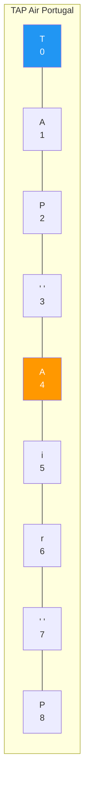
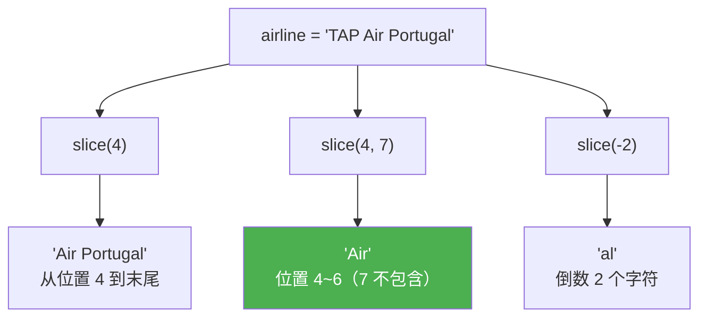
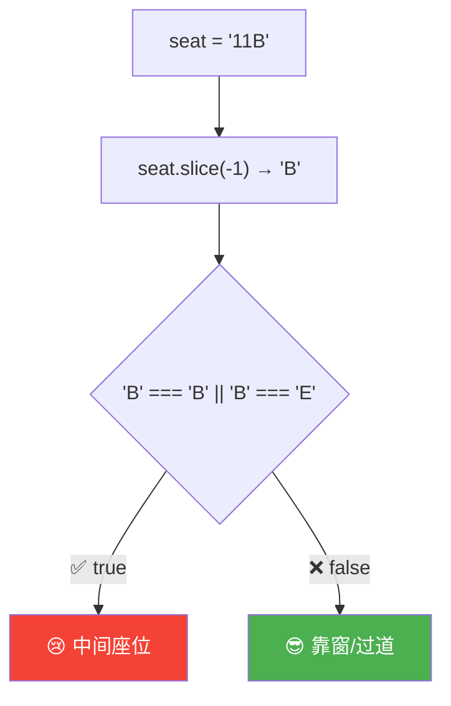
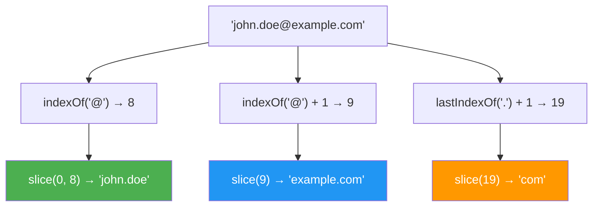

# 字符串操作 - Part 1（Working With Strings - Part 1）

> 📺 来源：023 Working With Strings - Part 1.en.srt
> 📂 章节：第 09 章

## 📌 知识脉络
- **前置知识**：基本数据类型（Primitives）、数组索引概念、方法调用语法
- **后续扩展**：字符串操作 Part 2（大小写转换、trim、replace、includes）、Part 3（split、join、padding）、模板字面量（Template Literals）

## 🎯 概述

字符串虽然是原始类型（Primitive），但 JavaScript 通过**装箱（Boxing）**机制在幕后将其临时转为对象，使我们可以在字符串上调用各种方法。本节介绍字符串的**索引访问**、**`indexOf()`/`lastIndexOf()`** 查找方法、以及最核心的 **`slice()`** 方法来提取子字符串。

---

## 核心知识点

### 1. 字符串索引与基本属性

> 🧩 **生活类比**：字符串就像一串珠子——每颗珠子（字符）都有固定的编号（索引），从 0 开始编号。你可以通过编号直接找到某颗珠子，也可以数一数总共有多少颗。

```js {runnable} {title="string_index.js"}
const airline = 'TAP Air Portugal';

// 通过索引访问字符（和数组类似）
console.log(airline[0]); // 'T'
console.log(airline[1]); // 'A'
console.log(airline[2]); // 'P'
console.log('B737'[0]);  // 'B' ← 直接在字符串字面量上访问

// 获取字符串长度
console.log(airline.length);  // 16
console.log('B737'.length);   // 4
```



---

### 2. `indexOf()` 与 `lastIndexOf()`

> 🧩 **生活类比**：`indexOf()` 像在一本书中**从前往后**找某个词第一次出现的页码；`lastIndexOf()` 则是**从后往前**找最后一次出现的页码。

```js {runnable} {title="string_indexof.js"}
const airline = 'TAP Air Portugal';

// indexOf —— 返回首次出现的位置
console.log(airline.indexOf('r'));     // 6（第一个 'r'）
console.log(airline.indexOf('Portugal')); // 8
console.log(airline.indexOf('portugal')); // -1（大小写敏感，找不到返回 -1）

// lastIndexOf —— 返回最后一次出现的位置
console.log(airline.lastIndexOf('r')); // 14（最后一个 'r'）
```

**🔍 执行追踪：**

| 方法调用 | 搜索内容 | 搜索方向 | 结果 |
|---------|---------|---------|------|
| `indexOf('r')` | `'r'` | 从左到右 | `6`（第一个 r 在 Ai**r** 中） |
| `lastIndexOf('r')` | `'r'` | 从右到左 | `14`（最后一个 r 在 Po**r**tugal 中） |
| `indexOf('Portugal')` | `'Portugal'` | 从左到右 | `8`（整个单词匹配） |
| `indexOf('portugal')` | `'portugal'` | — | `-1`（大小写不匹配） |

> 💡 **记忆口诀**：`indexOf` 找**第一个**，`lastIndexOf` 找**最后一个**，找不到都返回 **-1**！

---

### 3. `slice()` 方法 —— 提取子字符串

> 🧩 **生活类比**：`slice()` 就像一把剪刀——告诉它从哪里开始剪（begin），剪到哪里停（end），它就会把那一段"剪"下来给你。**原来的字符串不会被改变**。

```js {runnable} {title="string_slice.js"}
const airline = 'TAP Air Portugal';

// 只指定起始位置 → 从该位置到末尾
console.log(airline.slice(4));    // 'Air Portugal'

// 指定起始和结束位置 → 结束位置不包含
console.log(airline.slice(4, 7)); // 'Air'（索引 4, 5, 6）

// 提取长度 = end - begin = 7 - 4 = 3

// 负数参数：从末尾开始计数
console.log(airline.slice(-2));    // 'al'（最后 2 个字符）
console.log(airline.slice(1, -1)); // 'AP Air Portuga'（去掉首尾各 1 个字符）
```



**📊 `slice()` 参数组合速查：**

| begin | end | 含义 | 示例 | 结果 |
|-------|-----|------|------|------|
| 正数 | 无 | 从 begin 到末尾 | `'hello'.slice(2)` | `'llo'` |
| 正数 | 正数 | 从 begin 到 end-1 | `'hello'.slice(1, 3)` | `'el'` |
| 负数 | 无 | 倒数 \|begin\| 个字符 | `'hello'.slice(-2)` | `'lo'` |
| 正数 | 负数 | begin 到倒数 \|end\| | `'hello'.slice(1, -1)` | `'ell'` |

> ⚠️ **关键**：`slice()` **不会修改**原字符串！字符串是不可变的（Immutable）。

---

### 4. `slice()` + `indexOf()` 组合：动态提取

```js {runnable} {title="slice_dynamic.js"}
const airline = 'TAP Air Portugal';

// 提取第一个单词（从开头到第一个空格）
console.log(airline.slice(0, airline.indexOf(' '))); // 'TAP'

// 提取最后一个单词（从最后一个空格之后到末尾）
console.log(airline.slice(airline.lastIndexOf(' ') + 1)); // 'Portugal'
//                                                  ↑ +1 跳过空格本身
```

**🔍 执行追踪（提取最后一个单词）：**

| 步骤 | 表达式 | 值 |
|------|--------|-----|
| 1 | `airline.lastIndexOf(' ')` | `7`（Air 后面的空格） |
| 2 | `7 + 1` | `8` |
| 3 | `airline.slice(8)` | `'Portugal'` |

---

### 5. 实战：检查飞机座位

```js {runnable} {title="check_seat.js"}
// B 和 E 是中间座位（小型飞机 A-B-C 过道 D-E-F）
const checkMiddleSeat = function (seat) {
  const s = seat.slice(-1); // 提取最后一个字符
  if (s === 'B' || s === 'E') {
    console.log(`😢 ${seat}: 你坐到了中间座位！`);
  } else {
    console.log(`😎 ${seat}: 运气不错！靠窗/过道座位`);
  }
};

checkMiddleSeat('11B'); // 😢 中间座位
checkMiddleSeat('23C'); // 😎 运气不错
checkMiddleSeat('3E');  // 😢 中间座位
```



---

### 6. 装箱（Boxing）—— 为什么原始类型有方法？

> 🧩 **生活类比**：装箱就像你走进高级餐厅——你穿的是便装（原始类型），但服务员会自动给你披上一件外套（对象包装），让你能享用所有服务（方法）。吃完后外套被收回，你又变回便装（原始类型）。

```js {runnable} {title="boxing.js"}
// 字符串是原始类型
const str = 'hello';
console.log(typeof str); // 'string'

// 调用方法时，JavaScript 幕后执行「装箱」：
// new String('hello') → 临时对象 → 调用方法 → 返回原始类型
console.log(typeof str.slice(1)); // 'string' ← 返回值仍是原始类型

// 手动装箱（仅理解原理用，实际开发不这么做）
console.log(new String('hello'));           // String {'hello'} 对象
console.log(typeof new String('hello'));    // 'object'
```


---

## 🛠️ 代码实战与真实场景

> **💼 业务场景**：解析用户输入的邮箱地址——提取用户名、域名和顶级域名。

```js {runnable} {title="email_parser.js"}
const email = 'john.doe@example.com';

// 提取用户名（@ 之前的部分）
const username = email.slice(0, email.indexOf('@'));
console.log('用户名:', username); // 'john.doe'

// 提取完整域名（@ 之后的部分）
const domain = email.slice(email.indexOf('@') + 1);
console.log('域名:', domain); // 'example.com'

// 提取顶级域名（最后一个 . 之后）
const tld = email.slice(email.lastIndexOf('.') + 1);
console.log('顶级域名:', tld); // 'com'

// 组合展示
console.log(`📧 ${username} 在 ${domain} 上（.${tld}）`);
```



**📊 输入输出示例：**

| 输入邮箱 | 用户名 | 域名 | 顶级域名 |
|---------|--------|------|---------|
| `'john.doe@example.com'` | `'john.doe'` | `'example.com'` | `'com'` |
| `'alice@gmail.co.uk'` | `'alice'` | `'gmail.co.uk'` | `'uk'` |

---

## 💡 关键要点
- ✅ 字符串索引从 **0** 开始，可以像数组一样用 `str[i]` 访问
- ✅ `indexOf()` 找第一次出现位置，`lastIndexOf()` 找最后一次，找不到返回 **-1**
- ✅ `slice(begin, end)` 提取子串——end 位置**不包含**，提取长度 = end - begin
- ✅ 负数参数表示从末尾倒数计算
- ✅ 字符串是不可变的，所有方法返回**新字符串**，不修改原始值

## ⚠️ 常见误区
- ⚠️ **以为 `slice()` 会修改原字符串**：字符串是不可变的（Immutable），所有方法都返回新字符串
- ⚠️ **忘记 `indexOf` 大小写敏感**：`'Hello'.indexOf('hello')` 返回 -1

## 🐛 报错实验室

> 主动展示错误写法及报错信息

**❌ 错误写法：**
```js
const str = 'Hello';
str[0] = 'h'; // 试图修改字符串
console.log(str);
```

**浏览器输出：**
```
Hello
```

**🔑 解读**：字符串是不可变的原始类型。`str[0] = 'h'` 在非严格模式下静默失败，在严格模式下会抛出 `TypeError`。要修改字符串内容，必须创建新字符串。

---

## 📖 词汇速查表 (Cheat Sheet)

| 中文术语 | 英文术语 | 简明释义 | 速查代码 | 📚 官方文档 |
|---------|---------|---------|---------|-----------|
| 索引位置 | indexOf | 返回子串第一次出现的位置 | `str.indexOf('x')` | [MDN](https://developer.mozilla.org/zh-CN/docs/Web/JavaScript/Reference/Global_Objects/String/indexOf) |
| 最后索引 | lastIndexOf | 返回子串最后一次出现的位置 | `str.lastIndexOf('x')` | [MDN](https://developer.mozilla.org/zh-CN/docs/Web/JavaScript/Reference/Global_Objects/String/lastIndexOf) |
| 切片 | slice | 提取字符串的一部分 | `str.slice(1, 4)` | [MDN](https://developer.mozilla.org/zh-CN/docs/Web/JavaScript/Reference/Global_Objects/String/slice) |
| 装箱 | Boxing | 原始类型临时转为对象以调用方法 | 自动发生 | — |
| 子字符串 | Substring | 字符串的一部分 | `str.slice(2)` | — |

---

## 🧪 学习验证

### 📝 动手练习

**练习 1：提取文件扩展名**
```js {runnable} {title="exercise1.js"}
// 从文件名中提取扩展名
const fileName = 'report-2024.final.pdf';
// 在这里写你的代码

```
<details><summary>💡 参考答案</summary>

```js
const fileName = 'report-2024.final.pdf';
const ext = fileName.slice(fileName.lastIndexOf('.') + 1);
console.log(ext); // 'pdf'
```
**解题思路**：用 `lastIndexOf('.')` 找到最后一个点的位置，然后 `slice` 从点后一位开始提取。
</details>

**练习 2：检查 URL 协议**
```js {runnable} {title="exercise2.js"}
// 判断 URL 是 http 还是 https 协议
const url = 'https://www.example.com';
// 在这里写你的代码

```
<details><summary>💡 参考答案</summary>

```js
const url = 'https://www.example.com';
const protocol = url.slice(0, url.indexOf('://'));
console.log(`协议：${protocol}`); // 'https'
```
**解题思路**：找到 `://` 的位置，从开头到该位置之前就是协议名。
</details>

### ❓ 理解检测

:::quiz {correct="B"}
**1. `'JavaScript'.slice(4, 10)` 的结果是？**
- A) `'Scrip'`
- B) `'Script'`
- C) `'aScri'`

> **解析**：从索引 4（'S'）到索引 9（'t'），end 位置 10 不包含。J(0) a(1) v(2) a(3) **S(4) c(5) r(6) i(7) p(8) t(9)**。
:::

:::quiz {correct="C"}
**2. `'hello world'.indexOf('o')` 和 `'hello world'.lastIndexOf('o')` 分别返回？**
- A) `4, 4`
- B) `7, 4`
- C) `4, 7`

> **解析**：`indexOf` 从左到右找第一个 'o'，在位置 4（hell**o**）。`lastIndexOf` 从右到左找最后一个 'o'，在位置 7（w**o**rld）。
:::

:::quiz {correct="A"}
**3. 为什么字符串是原始类型却能调用方法？**
- A) JavaScript 自动进行装箱（Boxing），临时将字符串转为对象
- B) 字符串其实是对象，不是原始类型
- C) 只有方括号访问需要装箱

> **解析**：调用方法时，JavaScript 在幕后将 `'hello'` 临时转为 `new String('hello')` 对象，调用完方法后返回原始类型结果。
:::

### 🔧 代码填空

:::fill-blank
// 提取最后一个单词
const last = str.slice(str.___lastIndexOf___(' ') + 1);

// 提取倒数 3 个字符
const tail = str.slice(___-3___);

// 检查子串是否存在（不存在返回 -1）
if (str.___indexOf___('hello') !== -1) { ... }
:::
