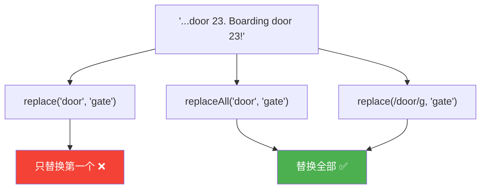
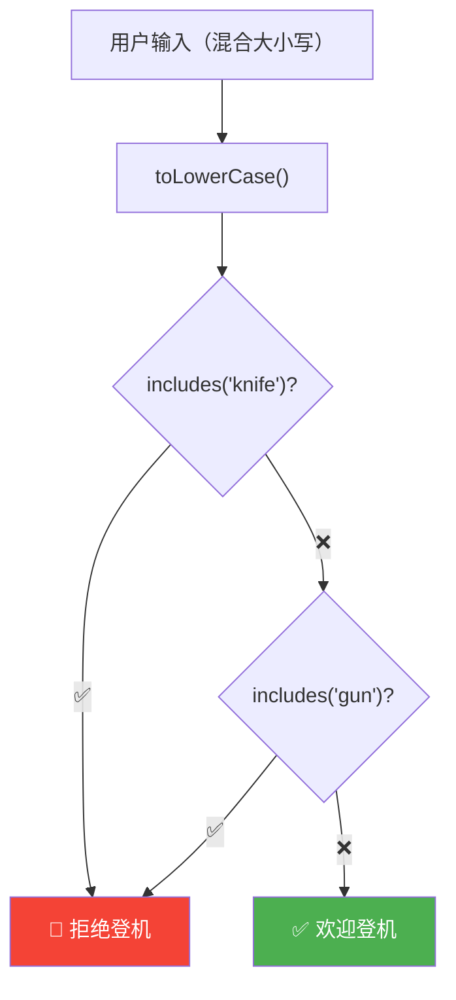

# 字符串操作 - Part 2（Working With Strings - Part 2）

> 📺 来源：024 Working With Strings - Part 2.en.srt
> 📂 章节：第 09 章

## 📌 知识脉络
- **前置知识**：字符串索引、`indexOf()`、`slice()` 方法（Part 1 内容）
- **后续扩展**：字符串操作 Part 3（`split`、`join`、`padStart`/`padEnd`、`repeat`）、正则表达式进阶

## 🎯 概述

本节深入字符串的**大小写转换**（`toLowerCase`/`toUpperCase`）、**空白清理**（`trim`）、**替换**（`replace`/`replaceAll`）以及**布尔查询**（`includes`/`startsWith`/`endsWith`）。这些都是日常开发中使用频率极高的方法，尤其在处理用户输入时不可或缺。

---

## 核心知识点

### 1. 大小写转换

> 🧩 **生活类比**：`toLowerCase()` 像把所有字母都"按下去"变小写，`toUpperCase()` 像把所有字母都"举起来"变大写。

```js {runnable} {title="case_conversion.js"}
const airline = 'TAP Air Portugal';

console.log(airline.toLowerCase());  // 'tap air portugal'
console.log(airline.toUpperCase());  // 'TAP AIR PORTUGAL'

// 实战：修正用户输入的人名格式
const passenger = 'jOnAS'; // 乱七八糟的大小写
const passengerCorrect =
  passenger[0].toUpperCase() + passenger.slice(1).toLowerCase();
console.log(passengerCorrect); // 'Jonas'
```

**🔍 执行追踪（修正人名）：**

| 步骤 | 表达式 | 值 |
|------|--------|-----|
| 1 | `passenger[0]` | `'j'` |
| 2 | `'j'.toUpperCase()` | `'J'` |
| 3 | `passenger.slice(1)` | `'OnAS'` |
| 4 | `'OnAS'.toLowerCase()` | `'onas'` |
| 5 | `'J' + 'onas'` | `'Jonas'` ✅ |

---

### 2. `trim()` —— 去除空白

> 🧩 **生活类比**：`trim()` 就像修剪草坪的边缘——只去掉两侧的杂草（空白），中间的不动。

```js {runnable} {title="trim.js"}
const email = '  Hello@Jonas.io \n';
console.log(email.trim()); // 'Hello@Jonas.io'

// 实战：比较用户输入的邮箱
const loginEmail = '  Hello@Jonas.Io \n';
const normalizedEmail = loginEmail.toLowerCase().trim();
console.log(normalizedEmail); // 'hello@jonas.io'
console.log(normalizedEmail === 'hello@jonas.io'); // true ✅
```

**📊 trim 家族对比：**

| 方法 | 作用 | 示例 |
|------|------|------|
| `trim()` | 去除两侧空白 | `' hi '.trim()` → `'hi'` |
| `trimStart()` | 只去除开头空白 | `' hi '.trimStart()` → `'hi '` |
| `trimEnd()` | 只去除结尾空白 | `' hi '.trimEnd()` → `' hi'` |

> 💡 **记忆口诀**：处理用户输入的第一步 = `toLowerCase().trim()`！

---

### 3. `replace()` 与 `replaceAll()`

> 🧩 **生活类比**：`replace()` 像"找到第一个错别字然后改正"，只改一个；`replaceAll()` 像"全局搜索替换"，一次性全改。

```js {runnable} {title="replace.js"}
// 替换单个字符
const priceGB = '288,97£';
const priceUS = priceGB.replace('£', '$').replace(',', '.');
console.log(priceUS); // '288.97$'

// replace 只替换第一个匹配项
const announcement = 'All passengers come to boarding door 23. Boarding door 23!';
console.log(announcement.replace('door', 'gate'));
// 'All passengers come to boarding gate 23. Boarding door 23!'
//                                   ✅ 改了              ❌ 没改

// replaceAll 替换所有匹配项
console.log(announcement.replaceAll('door', 'gate'));
// 'All passengers come to boarding gate 23. Boarding gate 23!'
//                                   ✅ 改了              ✅ 也改了

// 正则表达式方式（replaceAll 出现前的替代方案）
console.log(announcement.replace(/door/g, 'gate'));
// 同样效果，/g 表示全局匹配
```



**📊 replace vs replaceAll 对比：**

| 特性 | `replace()` | `replaceAll()` |
|------|-----------|---------------|
| 替换数量 | 仅第一个 | 全部 |
| 正则支持 | ✅（可用 `/g`） | ✅ |
| 链式调用 | ✅ | ✅ |
| 大小写 | 敏感 | 敏感 |

---

### 4. 布尔返回方法：`includes()`、`startsWith()`、`endsWith()`

> 🧩 **生活类比**：`includes()` 像问"包裹里有没有这个东西？"，`startsWith()` 像问"收件人姓不姓张？"，`endsWith()` 像问"文件是不是 .pdf 格式？"

```js {runnable} {title="boolean_methods.js"}
const plane = 'Airbus A320neo';

// includes —— 是否包含
console.log(plane.includes('A320'));  // true
console.log(plane.includes('Boeing')); // false

// startsWith —— 是否以...开头
console.log(plane.startsWith('Airbus')); // true
console.log(plane.startsWith('Air'));    // true（不必匹配整个单词）

// endsWith —— 是否以...结尾
console.log(plane.endsWith('neo'));     // true

// 实战：检查飞机型号
if (plane.startsWith('Airbus') && plane.endsWith('neo')) {
  console.log('✈️ Part of the NEW Airbus family');
}
```

---

### 5. 实战：机场安检系统

```js {runnable} {title="baggage_check.js"}
const checkBaggage = function (items) {
  // ⚠️ 关键：先统一转为小写，再做比较
  const baggage = items.toLowerCase();

  if (baggage.includes('knife') || baggage.includes('gun')) {
    console.log('🚫 You are NOT allowed on board!');
  } else {
    console.log('✅ Welcome aboard!');
  }
};

checkBaggage('I have a laptop, some Food and a pocket Knife'); // 🚫
checkBaggage('I have some Socks and a camera');                 // ✅
checkBaggage('Got some snacks and a gun for protection');        // 🚫
```



> 💡 **最佳实践**：处理用户输入时，**第一步永远是** `toLowerCase()`（或 `toUpperCase()`），确保大小写不影响比较逻辑。

---

## 🛠️ 代码实战与真实场景

> **💼 业务场景**：用户注册表单数据清洗——统一格式、去除多余空白、验证输入合法性。

```js {runnable} {title="form_validation.js"}
function cleanUserInput(rawName, rawEmail) {
  // 1️⃣ 清理姓名：首字母大写，其余小写，去空白
  const name = rawName.trim().split(' ').map(word =>
    word[0].toUpperCase() + word.slice(1).toLowerCase()
  ).join(' ');

  // 2️⃣ 清理邮箱：全小写 + 去空白
  const email = rawEmail.toLowerCase().trim();

  // 3️⃣ 验证邮箱格式
  const isValid = email.includes('@') && email.endsWith('.com');

  console.log(`👤 姓名：${name}`);
  console.log(`📧 邮箱：${email}`);
  console.log(`✅ 有效：${isValid}`);
  return { name, email, isValid };
}

cleanUserInput('  jOHN dOE  ', '  John@Example.COM  ');
// 👤 姓名：John Doe
// 📧 邮箱：john@example.com
// ✅ 有效：true
```

**📊 输入输出示例：**

| 原始输入 | 处理方法 | 清洗后 |
|---------|---------|--------|
| `'  jOHN dOE  '` | `trim()` + 首字母大写 | `'John Doe'` |
| `'  John@X.COM  '` | `toLowerCase().trim()` | `'john@x.com'` |
| `'288,97£'` | `replace('£','$').replace(',','.')` | `'288.97$'` |

---

## 💡 关键要点
- ✅ `toLowerCase()`/`toUpperCase()` 转换大小写——处理用户输入的第一步
- ✅ `trim()` 去除两侧空白——清理表单数据必备
- ✅ `replace()` 只替换第一个匹配，`replaceAll()` 替换全部
- ✅ `includes()`/`startsWith()`/`endsWith()` 返回布尔值——适合条件判断
- ✅ 所有方法都返回新字符串，不修改原始值

## ⚠️ 常见误区
- ⚠️ **忘记 `replace()` 只替换第一个**：需要替换全部时用 `replaceAll()` 或正则 `/g`
- ⚠️ **比较前不统一大小写**：`'Hello'.includes('hello')` 返回 `false`！

## 🐛 报错实验室

> 主动展示错误写法及报错信息

**❌ 错误写法：**
```js
const str = 'Hello World';
// 以为 replace 会替换所有匹配
const result = str.replace('l', 'L');
console.log(result);
```

**浏览器输出：**
```
HeLlo World
```

**🔑 解读**：`replace()` 默认只替换**第一个**匹配。要替换全部 `l`，使用 `str.replaceAll('l', 'L')` 或 `str.replace(/l/g, 'L')`。

---

## 📖 词汇速查表 (Cheat Sheet)

| 中文术语 | 英文术语 | 简明释义 | 速查代码 | 📚 官方文档 |
|---------|---------|---------|---------|-----------|
| 转小写 | toLowerCase | 全部字符转为小写 | `str.toLowerCase()` | [MDN](https://developer.mozilla.org/zh-CN/docs/Web/JavaScript/Reference/Global_Objects/String/toLowerCase) |
| 转大写 | toUpperCase | 全部字符转为大写 | `str.toUpperCase()` | [MDN](https://developer.mozilla.org/zh-CN/docs/Web/JavaScript/Reference/Global_Objects/String/toUpperCase) |
| 去空白 | trim | 去除字符串两侧空白 | `str.trim()` | [MDN](https://developer.mozilla.org/zh-CN/docs/Web/JavaScript/Reference/Global_Objects/String/trim) |
| 替换 | replace | 替换第一个匹配的子串 | `str.replace('a','b')` | [MDN](https://developer.mozilla.org/zh-CN/docs/Web/JavaScript/Reference/Global_Objects/String/replace) |
| 全部替换 | replaceAll | 替换所有匹配的子串 | `str.replaceAll('a','b')` | [MDN](https://developer.mozilla.org/zh-CN/docs/Web/JavaScript/Reference/Global_Objects/String/replaceAll) |
| 包含 | includes | 是否包含某子串 | `str.includes('x')` | [MDN](https://developer.mozilla.org/zh-CN/docs/Web/JavaScript/Reference/Global_Objects/String/includes) |
| 开头匹配 | startsWith | 是否以某子串开头 | `str.startsWith('x')` | [MDN](https://developer.mozilla.org/zh-CN/docs/Web/JavaScript/Reference/Global_Objects/String/startsWith) |
| 结尾匹配 | endsWith | 是否以某子串结尾 | `str.endsWith('x')` | [MDN](https://developer.mozilla.org/zh-CN/docs/Web/JavaScript/Reference/Global_Objects/String/endsWith) |

---

## 🧪 学习验证

### 📝 动手练习

**练习 1：密码强度检查**
```js {runnable} {title="exercise1.js"}
// 检查密码是否包含大写字母、小写字母和数字
const password = 'MyPass123';
// 在这里写你的代码

```
<details><summary>💡 参考答案</summary>

```js
const password = 'MyPass123';
const hasUpper = password !== password.toLowerCase();
const hasLower = password !== password.toUpperCase();
const hasNum = '0123456789'.split('').some(d => password.includes(d));
console.log(`大写：${hasUpper}, 小写：${hasLower}, 数字：${hasNum}`);
// 大写：true, 小写：true, 数字：true
```
**解题思路**：如果全转小写后和原始不同，说明有大写；全转大写后和原始不同，说明有小写。判断数字则逐个检查。
</details>

**练习 2：文本审查（敏感词替换）**
```js {runnable} {title="exercise2.js"}
// 将文本中的敏感词替换为 ***
const text = 'This is a bad and ugly message with bad words';
const badWords = ['bad', 'ugly'];
// 在这里写你的代码

```
<details><summary>💡 参考答案</summary>

```js
const text = 'This is a bad and ugly message with bad words';
const badWords = ['bad', 'ugly'];
let cleaned = text;
for (const word of badWords) {
  cleaned = cleaned.replaceAll(word, '***');
}
console.log(cleaned);
// 'This is a *** and *** message with *** words'
```
**解题思路**：遍历敏感词列表，对每个词用 `replaceAll` 全部替换。
</details>

### ❓ 理解检测

:::quiz {correct="B"}
**1. `'Hello World'.replace('o', '0')` 的结果是？**
- A) `'Hell0 W0rld'`
- B) `'Hell0 World'`
- C) `'HellO WOrld'`

> **解析**：`replace()` 只替换**第一个**匹配的 `'o'`。要替换全部需用 `replaceAll()` 或 `/o/g`。
:::

:::quiz {correct="C"}
**2. 处理用户输入邮箱时，正确顺序是？**
- A) `trim()` → `includes('@')` → `toLowerCase()`
- B) `includes('@')` → `toLowerCase()` → `trim()`
- C) `toLowerCase()` → `trim()` → `includes('@')`

> **解析**：先统一大小写，再去除空白，最后做格式验证。顺序很重要——如果先检查再转换，可能因为大小写或空白导致误判。
:::

:::quiz {correct="A"}
**3. `'Airbus A320neo'.endsWith('neo')` 返回什么？**
- A) `true`
- B) `false`
- C) `'neo'`

> **解析**：`endsWith()` 检查字符串是否以指定子串结尾，返回布尔值。字符串确实以 `'neo'` 结尾。
:::

### 🔧 代码填空

:::fill-blank
// 统一输入为小写并去空白
const clean = input.___toLowerCase___().___trim___();

// 替换所有匹配项
const result = str.___replaceAll___('old', 'new');

// 检查是否以 .pdf 结尾
const isPdf = filename.___endsWith___('.pdf');
:::
