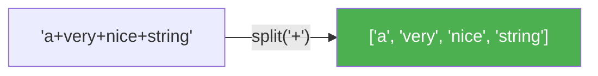
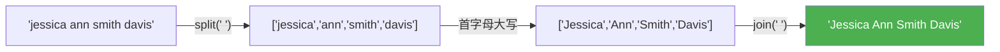
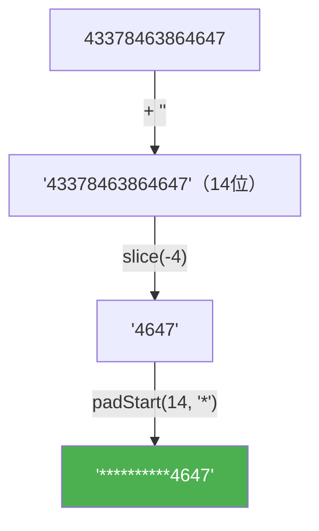
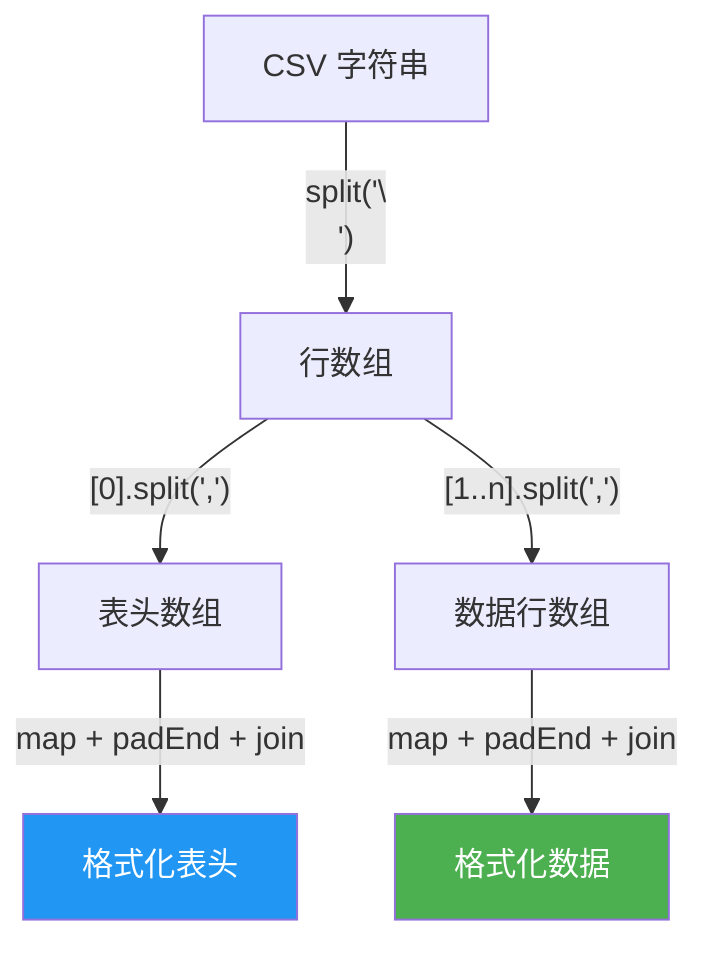

# 字符串操作 - Part 3（Working With Strings - Part 3）

> 📺 来源：025 Working With Strings - Part 3.en.srt
> 📂 章节：第 09 章

## 📌 知识脉络
- **前置知识**：字符串基础方法（`indexOf`、`slice`、`toLowerCase`、`replace`、`includes`）—— Part 1 & Part 2 内容
- **后续扩展**：编码挑战 #4（综合字符串方法应用）、正则表达式（RegExp）高级模式匹配、模板字面量（Template Literals）

## 🎯 概述

本节介绍字符串方法的最后一组核心工具：**`split()`** 将字符串拆分为数组、**`join()`** 将数组合并为字符串、**`padStart()`/`padEnd()`** 将字符串填充到指定长度、以及 **`repeat()`** 重复字符串。`split()` 和 `join()` 是一对"黄金搭档"，在处理文本数据时使用频率极高。

---

## 核心知识点

### 1. `split()` —— 字符串拆分为数组

> 🧩 **生活类比**：`split()` 就像一把刀按指定"切割线"把一根长面包切成多段——你告诉它在哪里切（分隔符），它就把字符串切成多个小块，放进一个数组里。

```js {runnable} {title="split.js"}
// 按空格拆分
console.log('a+very+nice+string'.split('+'));
// ['a', 'very', 'nice', 'string']

console.log('Jonas Schmedtmann'.split(' '));
// ['Jonas', 'Schmedtmann']

// 配合解构赋值直接提取
const [firstName, lastName] = 'Jonas Schmedtmann'.split(' ');
console.log(firstName); // 'Jonas'
console.log(lastName);  // 'Schmedtmann'
```



---

### 2. `join()` —— 数组合并为字符串

> 🧩 **生活类比**：`join()` 是 `split()` 的反操作——就像用胶水和指定"连接符"把碎片粘回一根完整的面包。

```js {runnable} {title="join.js"}
const [firstName, lastName] = 'Jonas Schmedtmann'.split(' ');

// 用 join 重新组合，插入自定义连接符
const newName = ['Mr.', firstName, lastName.toUpperCase()].join(' ');
console.log(newName); // 'Mr. Jonas SCHMEDTMANN'
```

**📊 split 与 join 对比：**

| 方法 | 方向 | 输入 | 输出 |
|------|------|------|------|
| `split(separator)` | 字符串 → 数组 | `'a-b-c'` | `['a', 'b', 'c']` |
| `join(separator)` | 数组 → 字符串 | `['a', 'b', 'c']` | `'a-b-c'` |

> 💡 **记忆口诀**：`split` 拆开，`join` 粘合，一对互逆好搭档！

---

### 3. `split()` + `join()` 实战：首字母大写

```js {runnable} {title="capitalize.js"}
const capitalizeName = function (name) {
  const names = name.split(' ');
  const namesUpper = [];

  for (const n of names) {
    // 方法 1：取首字母大写 + 拼接剩余
    // namesUpper.push(n[0].toUpperCase() + n.slice(1));

    // 方法 2：用 replace 替换首字母
    namesUpper.push(n.replace(n[0], n[0].toUpperCase()));
  }

  console.log(namesUpper.join(' '));
};

capitalizeName('jessica ann smith davis');
// 'Jessica Ann Smith Davis'

capitalizeName('jonas schmedtmann');
// 'Jonas Schmedtmann'
```

**🔍 执行追踪：**

| 步骤 | `n` | `n[0].toUpperCase()` | 拼接结果 |
|------|-----|---------------------|---------|
| 1 | `'jessica'` | `'J'` | `'Jessica'` |
| 2 | `'ann'` | `'A'` | `'Ann'` |
| 3 | `'smith'` | `'S'` | `'Smith'` |
| 4 | `'davis'` | `'D'` | `'Davis'` |



---

### 4. `padStart()` / `padEnd()` —— 字符串填充

> 🧩 **生活类比**：`padStart()` 就像在你的号码牌前面补零——把"7"变成"007"；`padEnd()` 则是在后面补字符，直到总长度达到指定值。

```js {runnable} {title="padding.js"}
const message = 'Go to gate 23!';

// padStart：在开头填充字符，直到总长度为 25
console.log(message.padStart(25, '+'));
// '+++++++++++Go to gate 23!'

// padEnd：在末尾填充字符
console.log('Jonas'.padStart(25, '+').padEnd(30, '+'));
// '++++++++++++++++++++Jonas+++++'

// 🎯 实战：信用卡号码遮罩
function maskCreditCard(number) {
  const str = number + ''; // 数字转字符串（利用 + '' 技巧）
  const last = str.slice(-4); // 取最后 4 位
  return last.padStart(str.length, '*');
}

console.log(maskCreditCard(43378463864647));   // '**********4647'
console.log(maskCreditCard('3345892834923847')); // '************3847'
```

**🔍 执行追踪（信用卡遮罩）：**

| 步骤 | 表达式 | 值 |
|------|--------|-----|
| 1 | `number + ''` | `'43378463864647'`（14 位） |
| 2 | `str.slice(-4)` | `'4647'` |
| 3 | `'4647'.padStart(14, '*')` | `'**********4647'` ✅ |



---

### 5. `repeat()` —— 重复字符串

> 🧩 **生活类比**：`repeat()` 就像复印机——告诉它复印几份，它就给你几份一模一样的副本拼在一起。

```js {runnable} {title="repeat.js"}
// 重复字符串
const message = 'Bad weather... All departures delayed... ';
console.log(message.repeat(3));

// 实战：用 emoji 可视化数量
const planesInLine = function (n) {
  console.log(`There are ${n} planes in line ${'✈️'.repeat(n)}`);
};

planesInLine(5);  // There are 5 planes in line ✈️✈️✈️✈️✈️
planesInLine(3);  // There are 3 planes in line ✈️✈️✈️
planesInLine(12); // There are 12 planes in line ✈️✈️✈️✈️✈️✈️✈️✈️✈️✈️✈️✈️
```

---

## 🛠️ 代码实战与真实场景

> **💼 业务场景**：CSV 数据解析与格式化——将逗号分隔的数据转换为格式化的报表输出。

```js {runnable} {title="csv_parser.js"}
// 模拟 CSV 行数据
const csvData = 'name,age,city,role\nAlice,30,Beijing,Engineer\nBob,25,Shanghai,Designer\nCharlie,35,Shenzhen,Manager';

const rows = csvData.split('\n'); // 按行分割
const headers = rows[0].split(','); // 提取表头

console.log('📊 员工花名册');
console.log('='.repeat(50));

// 格式化表头
console.log(
  headers.map(h => h.toUpperCase().padEnd(12)).join('│')
);
console.log('-'.repeat(50));

// 格式化数据行
for (let i = 1; i < rows.length; i++) {
  const cols = rows[i].split(',');
  console.log(
    cols.map(c => c.padEnd(12)).join('│')
  );
}
```



**📊 输入输出示例：**

| 操作 | 输入/方法 | 输出 |
|------|---------|------|
| 按行分割 | `csvData.split('\n')` | `['name,age,...', 'Alice,30,...', ...]` |
| 提取表头 | `'name,age,city'.split(',')` | `['name', 'age', 'city']` |
| 填充对齐 | `'Alice'.padEnd(12)` | `'Alice       '` |
| 拼接显示 | `['A','B'].join('│')` | `'A│B'` |

---

## 💡 关键要点
- ✅ `split(separator)` 将字符串按分隔符拆分为数组——处理 CSV、URL 等结构化文本
- ✅ `join(separator)` 将数组用连接符拼接成字符串——`split` 的逆操作
- ✅ `padStart(len, char)` / `padEnd(len, char)` 填充字符串到指定长度
- ✅ `repeat(n)` 将字符串重复 n 次
- ✅ 数字转字符串的简便技巧：`number + ''`

## ⚠️ 常见误区
- ⚠️ **混淆 `split` 和 `slice`**：`split` 按分隔符拆成**数组**，`slice` 按位置提取**子串**
- ⚠️ **忘记 `padStart` 的第一个参数是"目标总长度"而非"填充数量"**

## 🐛 报错实验室

> 主动展示错误写法及报错信息

**❌ 错误写法：**
```js
const str = 'hello';
// 以为 padStart 的第一个参数是填充数量
console.log(str.padStart(3, '*'));
```

**浏览器输出：**
```
hello
```

**🔑 解读**：`padStart(3, '*')` 的第一个参数是**目标总长度**。`'hello'` 已经有 5 个字符，大于 3，所以不会填充任何东西。应改为 `str.padStart(8, '*')` 才能在前面加 3 个星号。

---

## 📖 词汇速查表 (Cheat Sheet)

| 中文术语 | 英文术语 | 简明释义 | 速查代码 | 📚 官方文档 |
|---------|---------|---------|---------|-----------|
| 拆分 | split | 按分隔符拆分为数组 | `str.split(',')` | [MDN](https://developer.mozilla.org/zh-CN/docs/Web/JavaScript/Reference/Global_Objects/String/split) |
| 合并 | join | 将数组元素用连接符拼接 | `arr.join('-')` | [MDN](https://developer.mozilla.org/zh-CN/docs/Web/JavaScript/Reference/Global_Objects/Array/join) |
| 前填充 | padStart | 在开头填充字符到指定长度 | `str.padStart(10, '0')` | [MDN](https://developer.mozilla.org/zh-CN/docs/Web/JavaScript/Reference/Global_Objects/String/padStart) |
| 后填充 | padEnd | 在末尾填充字符到指定长度 | `str.padEnd(10, '.')` | [MDN](https://developer.mozilla.org/zh-CN/docs/Web/JavaScript/Reference/Global_Objects/String/padEnd) |
| 重复 | repeat | 将字符串重复 n 次 | `str.repeat(3)` | [MDN](https://developer.mozilla.org/zh-CN/docs/Web/JavaScript/Reference/Global_Objects/String/repeat) |

---

## 🧪 学习验证

### 📝 动手练习

**练习 1：将连字符命名转为驼峰命名**
```js {runnable} {title="exercise1.js"}
// 将 CSS 风格的连字符命名转为 JS 的驼峰命名
// 例如: 'background-color' → 'backgroundColor'
const cssProperty = 'border-bottom-width';
// 在这里写你的代码

```
<details><summary>💡 参考答案</summary>

```js
const cssProperty = 'border-bottom-width';
const parts = cssProperty.split('-');
const camel = parts[0] + parts.slice(1).map(
  w => w[0].toUpperCase() + w.slice(1)
).join('');
console.log(camel); // 'borderBottomWidth'
```
**解题思路**：先 `split('-')` 拆分，保留第一个词不变，后续每个词首字母大写，最后 `join('')` 无缝拼接。
</details>

**练习 2：生成密码进度条**
```js {runnable} {title="exercise2.js"}
// 根据密码强度（0-10）生成可视化进度条
function passwordStrength(score) {
  // 在这里写你的代码
  // 输出格式: [████████░░] 8/10
}

passwordStrength(8);
passwordStrength(3);
passwordStrength(10);
```
<details><summary>💡 参考答案</summary>

```js
function passwordStrength(score) {
  const filled = '█'.repeat(score);
  const empty = '░'.repeat(10 - score);
  console.log(`[${filled}${empty}] ${score}/10`);
}

passwordStrength(8);  // [████████░░] 8/10
passwordStrength(3);  // [███░░░░░░░] 3/10
passwordStrength(10); // [██████████] 10/10
```
**解题思路**：用 `repeat(score)` 生成填充部分，`repeat(10 - score)` 生成空白部分。
</details>

### ❓ 理解检测

:::quiz {correct="B"}
**1. `'one-two-three'.split('-').join('_')` 的结果是？**
- A) `'one-two-three'`
- B) `'one_two_three'`
- C) `['one', 'two', 'three']`

> **解析**：`split('-')` 得到 `['one','two','three']`，`join('_')` 用下划线拼接回字符串。
:::

:::quiz {correct="C"}
**2. `'Hi'.padStart(5, '*')` 的结果是？**
- A) `'*****Hi'`
- B) `'**Hi**'`
- C) `'***Hi'`

> **解析**：目标总长度是 5。`'Hi'` 已占 2 位，需要填充 3 个 `'*'` 在前面。
:::

:::quiz {correct="A"}
**3. `'abc'.repeat(0)` 的结果是？**
- A) `''`（空字符串）
- B) `'abc'`
- C) `undefined`

> **解析**：重复 0 次得到空字符串。
:::

### 🔧 代码填空

:::fill-blank
// 将字符串拆分为数组
const words = sentence.___split___(' ');

// 将数组拼接为字符串
const result = words.___join___('-');

// 信用卡遮罩：取最后 4 位并前填充
const masked = str.slice(-4).___padStart___(str.length, '*');
:::
