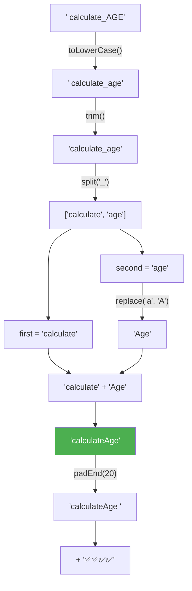

# 编码挑战 #4（Coding Challenge #4）

> 📺 来源：026 CHALLENGE #4.en.srt
> 📂 章节：第 09 章

## 📌 知识脉络
- **前置知识**：字符串方法三部曲（`split`/`join`/`slice`/`replace`/`toLowerCase`/`trim`/`padEnd`/`repeat`）、DOM 事件监听、for-of 循环与 `.entries()`
- **后续扩展**：字符串方法综合练习（String Methods Practice）、正则表达式

## 🎯 概述

本节是第 09 章的最后一个编码挑战，目标是实现一个**下划线命名 → 驼峰命名转换器**（underscore_case → camelCase）。需要综合运用字符串的 `split`/`trim`/`toLowerCase`/`replace`/`padEnd`/`repeat` 等方法，以及 DOM 事件处理。

---

## 🏆 挑战任务

编写一个程序，将文本框中的多行变量名从 `underscore_case` 格式转换为 `camelCase` 格式：

**输入：**
```
underscore_case
 first_name
Some_Variable
  calculate_AGE
delayed_departure
```

**期望输出：**
```
underscoreCase      ✅
firstName           ✅✅
someVariable        ✅✅✅
calculateAge        ✅✅✅✅
delayedDeparture    ✅✅✅✅✅
```

**要求：**
1. 将每个变量名转为驼峰命名
2. 每个变量名后面用 `padEnd` 对齐，再附加与行号对应数量的 ✅ emoji
3. 需要处理：多余空格、不规则大小写

---

## 🧪 实战沙盒

> ⚡ 先独立完成再查看答案！

```js {runnable} {title="challenge4.js"}
// 模拟输入数据（实际中从 textarea 获取）
const text = `underscore_case
 first_name
Some_Variable
  calculate_AGE
delayed_departure`;

// =============================================
// 将每行的 underscore_case 转为 camelCase
// 并在右侧添加对应数量的 ✅
// 提示:
// 1. split('\n') 按行分割
// 2. toLowerCase().trim() 统一格式
// 3. split('_') 分出两个单词
// 4. 第二个单词首字母大写
// 5. padEnd() 对齐 + repeat() 生成 ✅
// =============================================

```

---

<details><summary>💡 Jonas 官方解法拆解</summary>

### 完整解法

```js
const text = `underscore_case
 first_name
Some_Variable
  calculate_AGE
delayed_departure`;

for (const [i, row] of text.split('\n').entries()) {
  const [first, second] = row.toLowerCase().trim().split('_');
  const output = `${first}${second.replace(second[0], second[0].toUpperCase())}`;
  console.log(`${output.padEnd(20)}${'✅'.repeat(i + 1)}`);
}
```

**🔍 执行追踪（以 `'  calculate_AGE'` 为例）：**

| 步骤 | 操作 | 结果 |
|------|------|------|
| 1 | `row` = `'  calculate_AGE'` | 原始输入 |
| 2 | `.toLowerCase()` | `'  calculate_age'` |
| 3 | `.trim()` | `'calculate_age'` |
| 4 | `.split('_')` | `['calculate', 'age']` |
| 5 | 解构 | `first = 'calculate'`, `second = 'age'` |
| 6 | `second[0].toUpperCase()` | `'A'` |
| 7 | `second.replace('a', 'A')` | `'Age'` |
| 8 | 拼接 | `'calculateAge'` |
| 9 | `.padEnd(20)` | `'calculateAge        '`（20 字符） |
| 10 | `'✅'.repeat(4)` | `'✅✅✅✅'`（i=3, 3+1=4） |



### 关键技术点分解

**① 统一格式链：**
```js
row.toLowerCase().trim().split('_')
```
> 先全小写 → 去空白 → 按下划线拆分。顺序很重要！

**② 首字母大写（replace 技巧）：**
```js
second.replace(second[0], second[0].toUpperCase())
// 'age' → second[0]='a' → 'A' → 'Age'
```

**③ 获取行索引（entries 技巧）：**
```js
for (const [i, row] of text.split('\n').entries())
// entries() 返回 [index, element]，i 从 0 开始
```

**④ 对齐 + emoji：**
```js
output.padEnd(20) + '✅'.repeat(i + 1)
// padEnd(20) 保证所有变量名占 20 字符宽
// repeat(i + 1) 生成递增数量的 ✅
```

</details>

---

## 🧠 核心知识点回顾

### 方法链（Method Chaining）在字符串处理中的威力

> 🧩 **生活类比**：方法链就像工厂的流水线——每一站完成一个加工步骤，原材料从一头进去，成品从另一头出来，中间不需要临时存放半成品。


**📊 本挑战涉及的字符串方法汇总：**

| 方法 | 作用 | 本题用途 |
|------|------|---------|
| `split('\n')` | 按换行符拆分 | 将多行文本分成行数组 |
| `toLowerCase()` | 转小写 | 统一大小写格式 |
| `trim()` | 去空白 | 去除行首多余空格 |
| `split('_')` | 按下划线拆分 | 分出两个单词 |
| `replace()` | 替换字符 | 首字母大写 |
| `padEnd()` | 尾部填充 | 对齐变量名长度 |
| `repeat()` | 重复字符串 | 生成递增的 ✅ |

---

## 🛠️ 代码实战与真实场景

> **💼 业务场景**：API 响应数据的键名格式转换——后端用 snake_case，前端用 camelCase。

```js {runnable} {title="key_converter.js"}
// 将对象的 snake_case 键名转为 camelCase
function snakeToCamel(obj) {
  const result = {};
  for (const [key, value] of Object.entries(obj)) {
    const parts = key.split('_');
    const camelKey = parts[0] + parts.slice(1).map(
      w => w[0].toUpperCase() + w.slice(1)
    ).join('');
    result[camelKey] = value;
  }
  return result;
}

// 模拟 API 响应
const apiResponse = {
  user_name: 'Jonas',
  first_login_date: '2024-01-15',
  is_active_user: true,
  total_purchase_amount: 1299.99,
};

console.log(snakeToCamel(apiResponse));
// { userName: 'Jonas', firstLoginDate: '2024-01-15', ... }
```

**📊 输入输出示例：**

| 原始键名 (snake_case) | 转换后 (camelCase) |
|----------------------|-------------------|
| `user_name` | `userName` |
| `first_login_date` | `firstLoginDate` |
| `is_active_user` | `isActiveUser` |

---

## 💡 关键要点
- ✅ `toLowerCase().trim()` 是处理用户输入的标准第一步
- ✅ `split()` + 首字母大写 + `join()` 是命名格式转换的核心模式
- ✅ `padEnd()` 可以实现文本对齐——第一个参数是**目标总长度**
- ✅ `entries()` 在 for-of 中获取索引——数组直接调用 `.entries()`

## ⚠️ 常见误区
- ⚠️ **for-of 中用 `in` 而不是 `of`**：`for...in` 是遍历对象键的老语法，`for...of` 才用于遍历数组
- ⚠️ **忘记调用方法**：`str.toUpperCase` 只是方法引用，`str.toUpperCase()` 才是调用

## 🐛 报错实验室

**❌ 错误写法：**
```js
const str = 'hello';
const upper = str.toUpperCase; // 忘记加括号 ()
console.log(upper);
```

**浏览器输出：**
```
ƒ toUpperCase() { [native code] }
```

**🔑 解读**：不加 `()` 只是获取了方法的引用（函数本身），而没有**调用**它。必须写 `str.toUpperCase()` 才能得到 `'HELLO'`。

---

## 📖 词汇速查表 (Cheat Sheet)

| 中文术语 | 英文术语 | 简明释义 | 速查代码 | 📚 官方文档 |
|---------|---------|---------|---------|-----------|
| 驼峰命名 | camelCase | 首词小写，后续词首字母大写 | `firstName` | — |
| 下划线命名 | snake_case | 全小写，词间用下划线 | `first_name` | — |
| 方法链 | Method chaining | 连续调用方法 | `str.trim().split()` | — |
| 尾部填充 | padEnd | 在末尾填充到指定长度 | `str.padEnd(20)` | [MDN](https://developer.mozilla.org/zh-CN/docs/Web/JavaScript/Reference/Global_Objects/String/padEnd) |

---

## 🧪 学习验证

### 📝 动手练习

**练习 1：camelCase 转 snake_case**
```js {runnable} {title="exercise1.js"}
// 实现驼峰命名转下划线命名
// 例如: 'backgroundColor' → 'background_color'
const camelStr = 'borderBottomWidth';
// 在这里写你的代码

```
<details><summary>💡 参考答案</summary>

```js
const camelStr = 'borderBottomWidth';
let result = '';
for (const char of camelStr) {
  result += char === char.toUpperCase()
    ? '_' + char.toLowerCase()
    : char;
}
console.log(result); // 'border_bottom_width'
```
**解题思路**：遍历每个字符，遇到大写字母就在前面加 `_` 并转小写。
</details>

### ❓ 理解检测

:::quiz {correct="B"}
**1. `'  Hello_World  '.toLowerCase().trim().split('_')` 的结果是？**
- A) `['  hello', 'world  ']`
- B) `['hello', 'world']`
- C) `['Hello', 'World']`

> **解析**：先 `toLowerCase()` → `'  hello_world  '`，再 `trim()` → `'hello_world'`，最后 `split('_')` → `['hello', 'world']`。
:::

:::quiz {correct="C"}
**2. `'hi'.padEnd(5, '!').repeat(2)` 的结果是？**
- A) `'hi!!!hi!!!'`
- B) `'hi!!!hi'`
- C) `'hi!!!hi!!!'`

> **解析**：`'hi'.padEnd(5, '!')` → `'hi!!!'`（填充到 5 位），`.repeat(2)` → `'hi!!!hi!!!'`。
:::

:::quiz {correct="A"}
**3. 对数组使用 `entries()` 后，解构得到的是什么？**
- A) `[index, element]`
- B) `[element, index]`
- C) `{key, value}`

> **解析**：数组 `entries()` 返回 `[index, element]` 对，索引在前，元素在后。
:::

### 🔧 代码填空

:::fill-blank
// 下划线命名转驼峰
const [first, second] = str.split('___\___');
const camel = first + second.___replace___(second[0], second[0].toUpperCase());
:::
