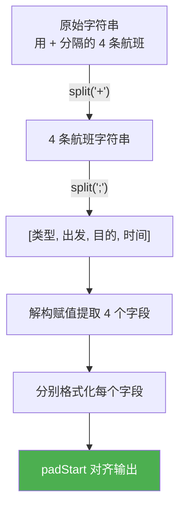

# 字符串方法综合练习（String Methods Practice）

> 📺 来源：027 String Methods Practice.en.srt
> 📂 章节：第 09 章

## 📌 知识脉络
- **前置知识**：字符串方法三部曲（Part 1/2/3）、解构赋值、for-of 循环、箭头函数
- **后续扩展**：函数进阶（闭包、高阶函数）、正则表达式（RegExp）、数组高阶方法（map/filter/reduce）

## 🎯 概述

本节是第 09 章的**收尾综合练习**，通过一个真实的航班信息格式化案例，综合运用前三节学到的所有字符串方法：`split`、`replace`/`replaceAll`、`slice`、`toUpperCase`、`startsWith`、`padStart`、模板字面量等。将杂乱的原始航班数据转换为整齐美观的输出。

---

## 📋 原始数据与目标输出

**原始数据：**
```js
const flights =
  '_Delayed_Departure;fao93766109;txl2133758440;11:25+_Arrival;bru0943384722;fao93766109;11:45+_Delayed_Arrival;hel7439299980;fao93766109;12:05+_Departure;fao93766109;lis2323639855;12:30';
```

**目标输出：**
```
🔴 Delayed Departure from FAO to TXL (11h25)
             Arrival from BRU to FAO (11h45)
  🔴 Delayed Arrival from HEL to FAO (12h05)
           Departure from FAO to LIS (12h30)
```

---

## 核心知识点

### 1. 分步拆解解题思路

> 🧩 **生活类比**：就像整理一堆杂乱的快递单据——先按"每一单"分开（`split('+')`），再把每一单的信息提取出来（`split(';')`），然后按统一格式打印出来。



---

### 2. 完整解法与执行追踪

```js {runnable} {title="flight_formatter.js"}
const flights =
  '_Delayed_Departure;fao93766109;txl2133758440;11:25+_Arrival;bru0943384722;fao93766109;11:45+_Delayed_Arrival;hel7439299980;fao93766109;12:05+_Departure;fao93766109;lis2323639855;12:30';

// 提取机场代码的辅助函数（取前 3 个字母并大写）
const getCode = str => str.slice(0, 3).toUpperCase();

for (const flight of flights.split('+')) {
  const [type, from, to, time] = flight.split(';');

  const output = `${type.startsWith('_Delayed') ? '🔴' : ''} ${type.replaceAll('_', ' ').trim()} from ${getCode(from)} to ${getCode(to)} (${time.replace(':', 'h')})`.padStart(44);

  console.log(output);
}
```

**🔍 以第一条航班为例的执行追踪：**

| 步骤 | 操作 | 结果 |
|------|------|------|
| 1 | `flights.split('+')[0]` | `'_Delayed_Departure;fao93766109;txl2133758440;11:25'` |
| 2 | `.split(';')` 解构 | `type='_Delayed_Departure'`, `from='fao93766109'`, `to='txl2133758440'`, `time='11:25'` |
| 3 | `type.startsWith('_Delayed')` | `true` → 添加 `'🔴'` |
| 4 | `type.replaceAll('_', ' ').trim()` | `'Delayed Departure'` |
| 5 | `getCode('fao93766109')` | `'FAO'` |
| 6 | `getCode('txl2133758440')` | `'TXL'` |
| 7 | `time.replace(':', 'h')` | `'11h25'` |
| 8 | 拼接 + `padStart(44)` | `'🔴 Delayed Departure from FAO to TXL (11h25)'`（右对齐） |

```mermaid
flowchart LR
    A["'_Delayed_Departure'"] -->|"replaceAll('_',' ')"| B["' Delayed Departure'"]
    B -->|"trim()"| C["'Delayed Departure'"]
    D["'fao93766109'"] -->|"slice(0,3).toUpperCase()"| E["'FAO'"]
    F["'11:25'"] -->|"replace(':','h')"| G["'11h25'"]
    C --> H["🔴 Delayed Departure from FAO to TXL &#40;11h25&#41;"]
    E --> H
    G --> H
    style H fill:#4CAF50,color:#fff
```



---

### 3. 关键技术要点

#### ① 提取机场代码 —— DRY 原则

```js
// 🚨 初版：重复代码
from.slice(0, 3).toUpperCase()
to.slice(0, 3).toUpperCase()

// ✨ 重构：提取为函数
const getCode = str => str.slice(0, 3).toUpperCase();
```

:::code-comparison
```js {title="🚨 初版冗余写法 (The Naive Way)"}
// 每次都写一遍相同的逻辑
const fromCode = from.slice(0, 3).toUpperCase();
const toCode = to.slice(0, 3).toUpperCase();
```
```js {title="✨ DRY 重构写法 (The Refactored Way)"}
// 提取为可复用的箭头函数
const getCode = str => str.slice(0, 3).toUpperCase();
const fromCode = getCode(from);
const toCode = getCode(to);
```
:::

#### ② 延误标记 —— startsWith + 三元运算符

```js
type.startsWith('_Delayed') ? '🔴' : ''
// ⚠️ 注意：原始数据中 type 以 _ 开头，所以检查 '_Delayed' 而非 'Delayed'
```

#### ③ 右对齐 —— padStart

```js
output.padStart(44) // 所有字符串填充到 44 字符宽，用空格在左侧填充
```

---

## 🛠️ 代码实战与真实场景

> **💼 业务场景**：日志系统格式化输出——将原始服务器日志字符串解析为可读的格式化报表。

```js {runnable} {title="log_formatter.js"}
// 模拟原始日志数据
const rawLogs =
  'ERROR;db_server;Connection refused;14:30|WARN;api_gateway;High latency;14:32|INFO;web_server;Request completed;14:33|ERROR;auth_service;Token expired;14:35';

const getLevel = level => {
  const icons = { ERROR: '🔴', WARN: '🟡', INFO: '🟢' };
  return icons[level] || '⚪';
};

console.log('📋 服务器日志报表');
console.log('='.repeat(50));

for (const log of rawLogs.split('|')) {
  const [level, service, message, time] = log.split(';');

  const formattedService = service
    .split('_')
    .map(w => w[0].toUpperCase() + w.slice(1))
    .join(' ');

  const output = `${getLevel(level)} [${time.replace(':', 'h')}] ${formattedService}: ${message}`;
  console.log(output.padStart(55));
}
```

**📊 输入输出示例：**

| 原始日志 | 格式化输出 |
|---------|-----------|
| `'ERROR;db_server;Connection refused;14:30'` | `🔴 [14h30] Db Server: Connection refused` |
| `'WARN;api_gateway;High latency;14:32'` | `🟡 [14h32] Api Gateway: High latency` |
| `'INFO;web_server;Request completed;14:33'` | `🟢 [14h33] Web Server: Request completed` |

---

## 💡 关键要点
- ✅ 复杂字符串处理的通用模式：**先拆分 → 再格式化 → 最后组装**
- ✅ 重复逻辑**提取为函数**（DRY 原则）——如 `getCode()` 箭头函数
- ✅ `replaceAll()` 替换所有下划线为空格，`trim()` 清理多余空白
- ✅ `padStart()` 实现右对齐——所有行从左侧填充到相同长度
- ✅ `startsWith()` + 三元运算符实现条件性前缀（如延误 emoji）

## ⚠️ 常见误区
- ⚠️ **忘记原始数据中的前导字符**：`type` 以 `_` 开头，检查 `startsWith` 时要包含前缀
- ⚠️ **在循环内定义函数**：`getCode` 应定义在循环**外面**，避免每次迭代重复创建

## 🐛 报错实验室

**❌ 错误写法：**
```js
const str = '_Delayed_Departure';
// 忘记 replaceAll 只在较新浏览器中可用
console.log(str.replaceAll('_', ' '));
```

**旧浏览器报错：**
```
TypeError: str.replaceAll is not a function
```

**🔑 解读**：`replaceAll()` 是 ES2021 新增方法。在较旧的运行环境中可用正则替代：`str.replace(/_/g, ' ')`。

---

## 📖 词汇速查表 (Cheat Sheet)

| 中文术语 | 英文术语 | 简明释义 | 速查代码 | 📚 官方文档 |
|---------|---------|---------|---------|-----------|
| 切片 | slice | 提取子字符串 | `str.slice(0, 3)` | [MDN](https://developer.mozilla.org/zh-CN/docs/Web/JavaScript/Reference/Global_Objects/String/slice) |
| 全部替换 | replaceAll | 替换所有匹配项 | `str.replaceAll('_', ' ')` | [MDN](https://developer.mozilla.org/zh-CN/docs/Web/JavaScript/Reference/Global_Objects/String/replaceAll) |
| 开头匹配 | startsWith | 是否以指定字符串开头 | `str.startsWith('Delayed')` | [MDN](https://developer.mozilla.org/zh-CN/docs/Web/JavaScript/Reference/Global_Objects/String/startsWith) |
| 前填充 | padStart | 左侧填充到指定长度 | `str.padStart(44)` | [MDN](https://developer.mozilla.org/zh-CN/docs/Web/JavaScript/Reference/Global_Objects/String/padStart) |
| 去空白 | trim | 去除两侧空白字符 | `str.trim()` | [MDN](https://developer.mozilla.org/zh-CN/docs/Web/JavaScript/Reference/Global_Objects/String/trim) |

---

## 🧪 学习验证

### 📝 动手练习

**练习 1：格式化电话号码**
```js {runnable} {title="exercise1.js"}
// 将原始电话号码格式化为 (xxx) xxx-xxxx 格式
const rawPhone = '13812345678';
// 在这里写你的代码

```
<details><summary>💡 参考答案</summary>

```js
const rawPhone = '13812345678';
const formatted = `(${rawPhone.slice(0, 3)}) ${rawPhone.slice(3, 7)}-${rawPhone.slice(7)}`;
console.log(formatted); // '(138) 1234-5678'
```
**解题思路**：使用 `slice` 按位置截取不同段，用模板字面量拼接格式化字符。
</details>

**练习 2：解析并格式化自定义数据**
```js {runnable} {title="exercise2.js"}
// 解析并格式化以下学生成绩数据
const data = 'math:95,english:88,science:92,history:78';
// 目标输出：每科一行，格式为 "📚 Math      → 95分"
// 在这里写你的代码

```
<details><summary>💡 参考答案</summary>

```js
const data = 'math:95,english:88,science:92,history:78';
for (const item of data.split(',')) {
  const [subject, score] = item.split(':');
  const formatted = subject[0].toUpperCase() + subject.slice(1);
  console.log(`📚 ${formatted.padEnd(10)} → ${score}分`);
}
```
**解题思路**：先 `split(',')` 按科目分，再 `split(':')` 提取科目名和分数，`padEnd(10)` 对齐。
</details>

### ❓ 理解检测

:::quiz {correct="B"}
**1. `'hello123world'.slice(0, 3).toUpperCase()` 的结果是？**
- A) `'Hel'`
- B) `'HEL'`
- C) `'HELLO'`

> **解析**：`slice(0, 3)` 取前 3 个字符 `'hel'`，`.toUpperCase()` 转大写 → `'HEL'`。
:::

:::quiz {correct="C"}
**2. 为什么 `getCode` 函数应该定义在循环外？**
- A) 定义在循环内会报错
- B) 定义在循环内运行更慢
- C) 避免每次迭代重复创建相同的函数

> **解析**：虽然不会报错，但每次循环都重新创建相同的函数是浪费资源。将函数提取到循环外是 DRY 原则的体现。
:::

:::quiz {correct="A"}
**3. `'hello world'.padStart(15)` 的结果是？**
- A) `'    hello world'`（前面 4 个空格）
- B) `'hello world    '`（后面 4 个空格）
- C) `'hello world'`（不变）

> **解析**：`padStart(15)` 默认用空格填充到总长度 15。`'hello world'` 有 11 个字符，所以在前面加 4 个空格。
:::

### 🔧 代码填空

:::fill-blank
// 提取前 3 个字符并大写
const code = str.___slice___(0, 3).___toUpperCase___();

// 替换所有下划线为空格
const clean = str.___replaceAll___('_', ' ');

// 右对齐到 40 字符宽
const aligned = output.___padStart___(40);
:::
